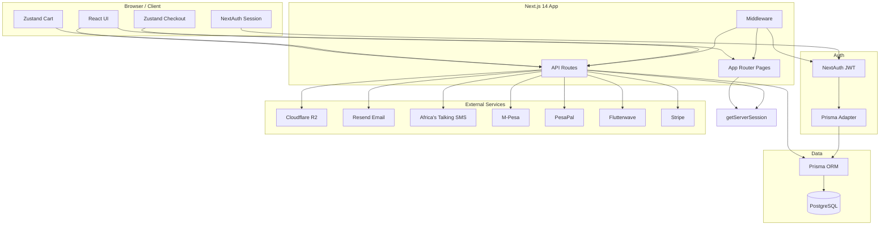
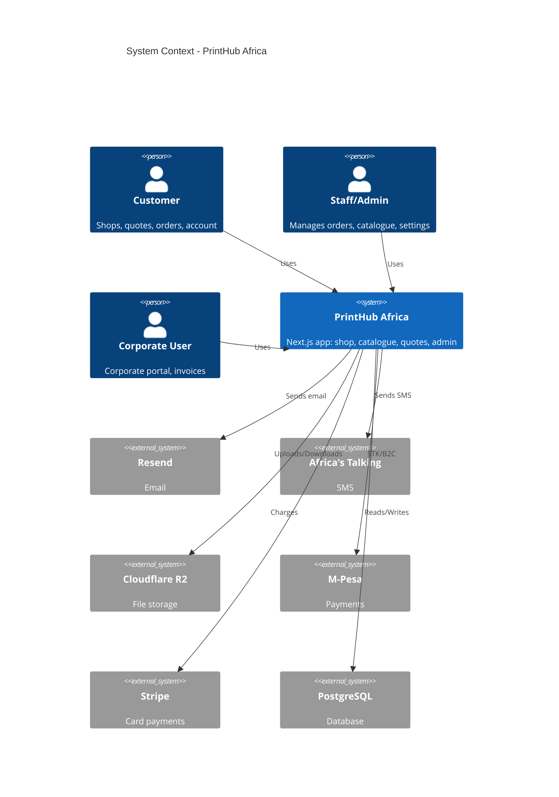
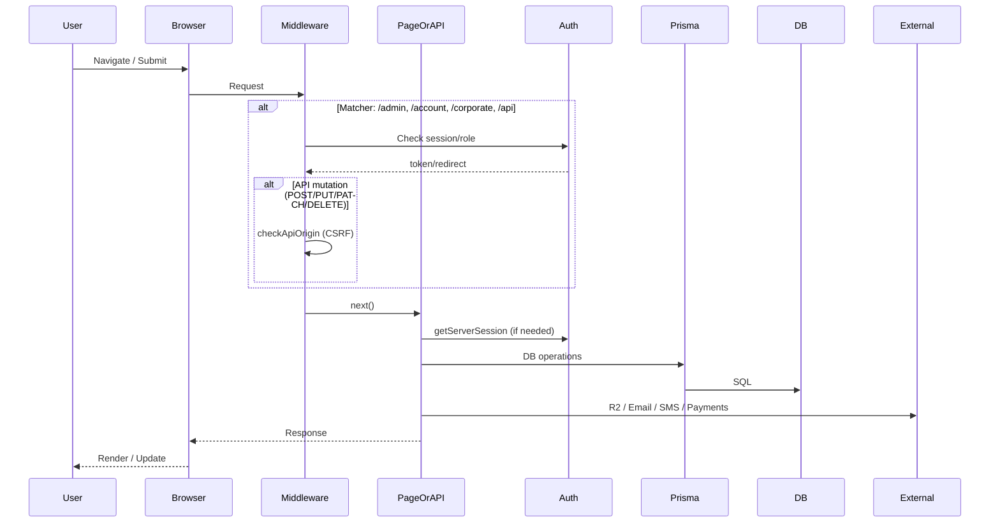
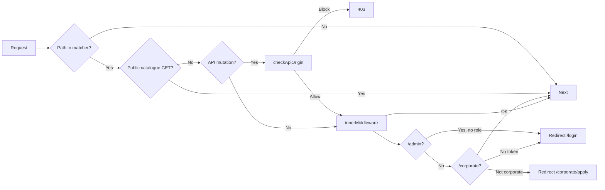
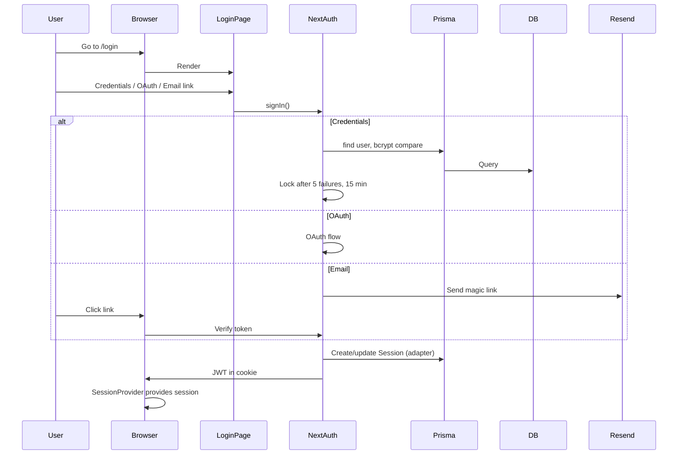
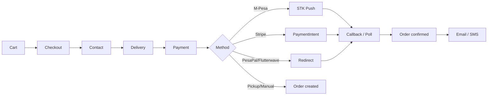
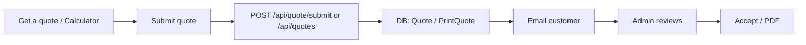

# PrintHub Africa — Complete System Architecture & Documentation

This document maps the entire system from frontend to backend: routes, APIs, data layer, external services, and connections. Nothing is omitted.

---

## Table of Contents

1. [Executive Overview](#1-executive-overview)
2. [High-Level Architecture](#2-high-level-architecture)
3. [Tech Stack](#3-tech-stack)
4. [Frontend](#4-frontend)
5. [Middleware & Request Flow](#5-middleware--request-flow)
6. [Backend & API](#6-backend--api)
7. [Data Layer](#7-data-layer)
8. [External Services](#8-external-services)
9. [Authentication Flow](#9-authentication-flow)
10. [Key User Flows](#10-key-user-flows)
11. [Environment & Configuration](#11-environment--configuration)
12. [Directory Structure](#12-directory-structure-key-folders)
13. [File Reference](#13-file-reference)

---

## 1. Executive Overview

**PrintHub Africa** is a full-stack e-commerce and print-on-demand platform (large format + 3D printing) for Nairobi/Kenya. It includes:

- **Public site**: Shop, catalogue (print-on-demand), get-a-quote, upload, track, about, services, contact, FAQ, careers, legal pages.
- **Customer account**: Orders, quotes, addresses, profile, payment methods (cards, M-Pesa), support tickets, refunds, corporate portal, uploads.
- **Admin panel**: Orders, quotes, customers, catalogue, products, inventory (hardware, LF, 3D consumables), production queue, deliveries, finance, refunds, support, careers, corporate, staff, reports, content (FAQ, legal), settings (business, payments, shipping, notifications, SEO, discounts, loyalty, referral, system, users, integrations, security, audit log).
- **Corporate**: Apply for corporate account, invite team, brand assets, invoices, checkout.

**Architecture**: Next.js 14 (App Router) monolith. Frontend (React, Tailwind, shadcn/ui), API routes under `app/api/`, PostgreSQL via Prisma, NextAuth (JWT), R2 (uploads/CDN), Resend (email), Africa's Talking (SMS), M-Pesa/PesaPal/Flutterwave/Stripe (payments).

---

## 2. High-Level Architecture



**System context (who uses what)**:



**Request path (simplified)**:



---

## 3. Tech Stack

| Layer | Technology |
|-------|------------|
| **Framework** | Next.js 14 (App Router), React 18, TypeScript |
| **Styling** | Tailwind CSS, shadcn/ui (Radix), CSS variables, Framer Motion |
| **State** | Zustand (cart, checkout), TanStack React Query (server state), NextAuth (session) |
| **Auth** | NextAuth 4 (JWT, Prisma adapter), Credentials + Google/Facebook/Apple/Email |
| **Database** | PostgreSQL (e.g. Neon), Prisma 7 with `@prisma/adapter-pg` |
| **Storage** | Cloudflare R2 (S3-compatible): private uploads bucket + public CDN bucket |
| **Email** | Resend |
| **SMS** | Africa's Talking |
| **Payments** | M-Pesa (Daraja), PesaPal, Flutterwave, Stripe (cards/Apple Pay/Google Pay) |
| **Monitoring** | Sentry, Vercel Analytics & Speed Insights, optional Google Analytics |
| **Other** | Tawk.to (chat), optional Algolia, optional VirusTotal (upload scan) |

---

## 4. Frontend

### 4.1 App Router Structure

- **Root**: `app/layout.tsx` — fonts (Syne, DM Sans, JetBrains Mono, Playfair Display), `Providers`, `ConsentGatedAnalytics`, `SpeedInsights`, `globals.css`, metadata.
- **Route groups**:
  - `(public)` — Marketing + shop + account: `AnnouncementBar`, `Header`, `Footer`, `WhatsAppFloat`, `CookieBanner`, `TawkTo`. Fetches `getBusinessPublic()` for metadata and JSON-LD.
  - `(admin)` — Admin: session + role (STAFF/ADMIN/SUPER_ADMIN), sidebar `AdminNav`, `EditableSectionProvider`, new-quotes count.
  - `(auth)` — Login/register: centered narrow layout.

### 4.2 Public Routes (summary)

| Path | Purpose |
|------|--------|
| `/` | Home |
| `/shop`, `/shop/[slug]` | Shop listing & product |
| `/catalogue`, `/catalogue/[slug]` | Print-on-demand catalogue |
| `/cart` | Cart (Zustand) |
| `/checkout` | Checkout (steps: contact → delivery → payment) |
| `/get-a-quote`, `/quote`, `/quote/3d-print` | Quote requests |
| `/upload` | File upload (presign → R2) |
| `/track` | Order tracking |
| `/about`, `/services`, `/services/large-format`, `/services/3d-printing`, `/services/large-format/calculator` | Marketing & calculators |
| `/contact`, `/faq`, `/careers`, `/careers/[slug]` | Contact, FAQ, careers |
| `/pay/[orderId]` | Payment page (M-Pesa/Stripe/etc.) |
| `/order-confirmation/[orderId]` | Order confirmation |
| `/unsubscribe/abandoned-cart/done` | Unsubscribe confirmation |
| `/[legalSlug]` | Legal pages (terms, privacy, etc.) |

### 4.3 Account Routes

| Path | Purpose |
|------|--------|
| `/account` | Dashboard |
| `/account/orders`, `/account/orders/[id]` | Order history & detail |
| `/account/quotes`, `/account/quotes/[id]` | Quotes |
| `/account/corporate`, `/account/corporate/brand-assets`, `/account/corporate/invoices` | Corporate |
| `/account/support`, `/account/support/new`, `/account/support/[id]` | Support tickets |
| `/account/uploads` | Uploaded files |
| `/account/addresses` | Saved addresses |
| `/account/profile` | Profile |
| `/account/settings/*` | Profile, security, addresses, payment-methods, notifications, privacy, corporate |
| `/account/settings/payment-methods/add-card` | Add card (Stripe) |

### 4.4 Auth & Corporate

| Path | Purpose |
|------|--------|
| `/login`, `/login/success`, `/register`, `/forgot-password`, `/reset-password`, `/verify-email` | Auth |
| `/corporate/apply`, `/corporate/apply/status` | Corporate application |

### 4.5 Admin Routes (summary)

Dashboard, orders (list, detail, **new**), quotes, customers (list, **detail**), catalogue (queue, import), categories, products, inventory (hardware/printers, LF, 3D consumables), production-queue, deliveries, finance/invoices, refunds, support, careers (listings, applications), corporate (applications, **account detail**), staff, reports (sales, lf-profitability), content (FAQ, legal), settings (business, payments, shipping, notifications, SEO, discounts, loyalty, referral, system, danger, users, integrations, security, audit-log, my-account, **my-activity**), accept-invite, access-denied, sales calculator, get-a-quote, uploads, **marketing**. Example/debug: **sentry-example-page** (app), **sentry-example-api** (API).

**Admin order creation & corporate:**

| Path | Purpose |
|------|--------|
| `/admin/orders/new` | Create order on behalf of a customer. Uses `AdminCreateOrderForm`: customer search (debounced), product search (debounced), line items, delivery (address, county, method), payment (method, PO ref, admin notes). Query params `customerId` and `corporateId` pre-select when linked from customer or corporate pages. Submit → `POST /api/admin/orders/create` → redirect to `/admin/orders/[id]`. |
| `/admin/corporate/[id]` | Corporate account detail: breadcrumb, KPIs, account details (tier, status, discount, credit, payment terms), primary contact link to customer, **Create Order** link to `/admin/orders/new?customerId=…&corporateId=…`. |

Customer detail (`/admin/customers/[id]`) shows full corporate account when applicable, **View account** → `/admin/corporate/[id]`, and **Create Order** / **Create Order for this customer** → `/admin/orders/new?customerId=…&corporateId=…`. All monetary amounts in admin customer/corporate context use **KES** via `formatKES()` from `lib/utils.ts` (e.g. "KES 1,234.00").

### 4.6 Components

| Area | Location | Notes |
|------|----------|------|
| **UI (shadcn)** | `components/ui/` | Button, input, label, card, dialog, sheet, select, switch, badge, alert-dialog, separator, skeleton, textarea |
| **Layout** | `components/layout/` | header, footer, announcement-bar, whatsapp-float |
| **Admin** | `components/admin/` | nav, orders, quotes, products, catalogue, customers, staff, coupons, settings, dashboard-charts, etc. |
| **Account** | `components/account/` | Account-specific UI |
| **Checkout** | `components/checkout/` | Checkout steps and payment UI |
| **Shop** | `components/shop/` | Shop and product UI |
| **Marketing** | `components/marketing/` | Landing/marketing |
| **Services** | `components/services/` | Services and calculators |
| **Calculators** | `components/calculators/` | LF / 3D calculator UI |
| **Settings** | `components/settings/` | Shared settings UI |
| **Upload** | `components/upload/` | Upload UI |
| **PDF** | `components/pdf/` | QuotePDF, InvoicePDF |
| **Providers** | `components/providers.tsx` | SessionProvider + SentryUserContext |
| **Other** | `ConsentGatedAnalytics`, `CookieBanner`, `TawkTo` | Analytics, cookies, chat |

### 4.7 State Management

- **Session**: NextAuth `SessionProvider`; session/role/permissions/corporate from JWT (`lib/auth.ts` callbacks).
- **Cart**: Zustand `store/cart-store.ts` — shop + catalogue items, applied coupon, persisted (e.g. localStorage).
- **Checkout**: Zustand `store/checkout-store.ts` — step, contact, delivery, payment method (M-Pesa/Stripe/etc.); not persisted.
- **Server state**: TanStack React Query for API-backed data.
- **No Redux.** No `"use server"` server actions; mutations go through API routes.

---

## 5. Middleware & Request Flow

**File**: `middleware.ts` (root).

**Matcher**: `/admin/:path*`, `/account/:path*`, `/corporate/:path*`, `/api/:path*`. Only these paths run through middleware.



### 5.1 Public Catalogue APIs (no auth, no origin check)

- `GET /api/catalogue`
- `GET /api/catalogue/categories`
- `GET /api/catalogue/featured`
- `GET /api/catalogue/*` (e.g. slug)

### 5.2 CSRF (API mutations)

For `POST`, `PUT`, `PATCH`, `DELETE` to `/api/*`:

- If `Origin` header is present, it must be in allowed list: request host, `NEXT_PUBLIC_APP_URL`/`NEXTAUTH_URL`, `http://localhost:3000`, `http://127.0.0.1:3000`.
- Otherwise respond with `403 Forbidden`.

### 5.3 Auth & Redirects

- **Admin** (`/admin/*`): Requires session and role in `ADMIN_ROLES` (STAFF, ADMIN, SUPER_ADMIN); else redirect to `/login`.
- **Corporate** (`/corporate/*`): Except `/corporate/apply` and `/corporate/invite` — requires session; if not corporate member, redirect to `/corporate/apply`.
- **Account** (`/account/*`): Requires session (via `authorized` callback).
- **Sign-in page**: `pages: { signIn: "/login" }`.

---

## 6. Backend & API

All API handlers live under `app/api/`; each segment has a `route.ts` exporting `GET`, `POST`, `PUT`, `PATCH`, `DELETE` as needed.

**Auth in API routes**:

- **Admin**: `requireAdminApi()` from `lib/admin-api-guard.ts` — `getServerSession(authOptions)`, then role (STAFF/ADMIN/SUPER_ADMIN) and permission checks via `lib/admin-permissions.ts`.
- **Account/customer**: `getServerSession(authOptions)` and session checks in the route.

### 6.1 API Endpoints (grouped)

**Auth**

| Method | Path | Purpose |
|--------|------|--------|
| * | `/api/auth/[...nextauth]` | NextAuth (sign in/out, session, OAuth, credentials) |
| POST | `/api/auth/register` | Register |
| POST | `/api/auth/forgot-password` | Forgot password |
| POST | `/api/auth/reset-password` | Reset password |
| POST | `/api/auth/verify-email` | Verify email |

**Catalogue (public GET)**

| Method | Path | Purpose |
|--------|------|--------|
| GET | `/api/catalogue` | List catalogue |
| GET | `/api/catalogue/categories` | Catalogue categories |
| GET | `/api/catalogue/featured` | Featured items |
| GET | `/api/catalogue/[slug]` | Catalogue item by slug |

**Products / Shop**

| Method | Path | Purpose |
|--------|------|--------|
| GET | `/api/products` | List products |
| GET | `/api/products/[slug]` | Product by slug |
| GET/POST | `/api/products/[slug]/reviews` | Reviews |
| GET | `/api/shop/categories`, `/api/categories` | Categories |

**Cart / Checkout**

| Method | Path | Purpose |
|--------|------|--------|
| PATCH | `/api/checkout/cart` | Update cart |
| POST | `/api/cart/add-catalogue-item` | Add catalogue item to cart |
| GET | `/api/checkout/payment-methods` | Payment methods |
| POST | `/api/coupons/validate` | Validate coupon |

**Orders**

| Method | Path | Purpose |
|--------|------|--------|
| GET/POST | `/api/orders` | List / create orders |
| GET/PATCH | `/api/orders/[id]` | Order detail / update |
| GET | `/api/orders/[id]/confirmation` | Confirmation |
| GET | `/api/orders/[id]/invoice` | Invoice |
| GET | `/api/orders/[id]/payment-status` | Payment status |
| POST | `/api/shipping/fee` | Shipping fee |
| GET | `/api/shipping/courier-locations`, `/api/shipping/pickup-locations` | Shipping options |

**Payments**

| Method | Path | Purpose |
|--------|------|--------|
| POST | `/api/payments/mpesa/stkpush` | M-Pesa STK push |
| GET | `/api/payments/mpesa/status` | M-Pesa status |
| POST | `/api/payments/mpesa/query` | M-Pesa query |
| POST | `/api/payments/mpesa/b2c-callback` | M-Pesa B2C callback |
| POST | `/api/payments/pickup` | Pay on pickup |
| POST | `/api/payments/manual` | Manual payment |
| POST | `/api/payments/pesapal/initiate` | PesaPal initiate |
| POST | `/api/payments/pesapal/callback` | PesaPal callback |
| POST | `/api/payments/flutterwave/initiate` | Flutterwave initiate |
| GET/POST | `/api/account/payment-methods/cards` | Saved cards |
| GET/POST | `/api/account/payment-methods/cards/setup-intent` | Stripe SetupIntent |
| GET/POST/DELETE/PATCH | `/api/account/payment-methods/mpesa` | Saved M-Pesa numbers |

**Quotes**

| Method | Path | Purpose |
|--------|------|--------|
| GET/POST | `/api/quotes` | List / create quotes |
| GET/PATCH/DELETE | `/api/quotes/[id]` | Quote CRUD |
| GET | `/api/quotes/[id]/pdf` | Quote PDF |
| GET | `/api/quotes/my` | My quotes |
| GET | `/api/quote/materials` | Quote materials |
| POST | `/api/quote/submit` | Submit quote |
| GET | `/api/quote/route` | Quote routing |
| GET | `/api/calculator/rates/large-format` | LF calculator rates |
| GET/POST | `/api/calculator/large-format` | LF calculator |
| GET | `/api/calculator/rates/3d-print` | 3D rates |
| GET/POST | `/api/calculator/3d-print` | 3D calculator |

**Upload**

| Method | Path | Purpose |
|--------|------|--------|
| POST | `/api/upload/presign` | Presigned PUT URL (R2) |
| POST | `/api/upload/confirm` | Confirm upload (save DB) |
| GET | `/api/upload/[id]/download` | Download (signed URL) |

**Account**

| Method | Path | Purpose |
|--------|------|--------|
| GET/PATCH | `/api/account/settings/profile` | Profile |
| POST | `/api/account/settings/avatar` | Avatar |
| GET/POST/PATCH | `/api/account/settings/addresses` | Addresses |
| PATCH | `/api/account/settings/addresses/[id]`, `.../default` | Address update/default |
| GET/PATCH | `/api/account/settings/notifications` | Notifications |
| GET | `/api/account/settings/loyalty` | Loyalty |
| GET/POST | `/api/account/settings/referral` | Referral |
| POST | `/api/account/settings/password` | Change password |
| GET | `/api/account/uploads` | Uploads list |
| GET/POST | `/api/account/support/tickets` | Support tickets |
| GET/POST/PATCH | `/api/account/support/tickets/[id]` | Ticket detail |
| GET | `/api/account/quotes/[id]` | Quote (account) |
| PATCH | `/api/account/quotes/[id]` | Update quote |
| GET/POST | `/api/account/refunds` | Refunds |
| GET/PATCH | `/api/account/refunds/[id]` | Refund detail |
| POST | `/api/account/data/export` | Export data |
| POST | `/api/account/data/delete` | Delete account data |
| GET | `/api/account/corporate/checkout` | Corporate checkout |

**Corporate**

| Method | Path | Purpose |
|--------|------|--------|
| POST | `/api/corporate/apply` | Apply for corporate |
| GET | `/api/corporate/application/status` | Application status |

**Track / Contact / Content**

| Method | Path | Purpose |
|--------|------|--------|
| GET | `/api/track` | Order tracking |
| POST | `/api/contact` | Contact form |
| GET | `/api/faq` | FAQ |
| GET | `/api/legal/[slug]` | Legal page |

**Careers**

| Method | Path | Purpose |
|--------|------|--------|
| GET | `/api/careers` | Job listings |
| GET | `/api/careers/[slug]` | Job detail |
| POST | `/api/careers/[slug]/apply` | Apply |

**Invoices**

| Method | Path | Purpose |
|--------|------|--------|
| GET | `/api/orders/[id]/invoice` | Get invoice |
| POST | `/api/invoices/[id]/send` | Send invoice email |
| GET | `/api/invoices/[id]/download` | Download invoice |

**Admin** (under `app/api/admin/`)

228 API route files total. Admin routes include: settings (business, payments, shipping, notifications, SEO, users, coupons, loyalty, referral, danger, audit-log, **couriers**, **shipping/zones**, **shipping/pickup-locations**), **settings/[...section]** (catch-all), orders (**confirm-payment**, **payment-link**, **resend-stk**, cancel, refund, timeline, tracking, **create**), quotes (cancel, restore), **customers** (**[id]**, **search**), **products** (**search**), catalogue (approve, reject, queue, import, designers, categories), products, categories, inventory (hardware-items, assets/printers, lf/items, lf/receive), production-queue, deliveries, refunds (**process-b2c**), support, careers (listings, applications, status, notes, cv), corporate (approve, reject), staff, reviews, reports, calculator (lf, 3d), lamination, 3d-consumables, machines, content (FAQ, legal, **legal restore**), and more. See `app/api/admin/**/route.ts` for the full list.

**Admin order creation & customer/product search APIs:**

| Method | Path | Purpose |
|--------|------|--------|
| GET | `/api/admin/customers/[id]` | Customer detail including full `corporateAccount` (id, accountNumber, companyName, tier, status, discountPercent, creditLimit, creditUsed, paymentTerms, kraPin, industry) and `corporateRole` (from primaryCorporateAccount or first corporateTeamMemberships). |
| GET | `/api/admin/customers/search` | Query `q` (min 2 chars). Returns customers with corporate account (primaryCorporateAccount or first membership); used by admin Create Order form. |
| GET | `/api/admin/products/search` | Query `q`. Returns active products with basePrice, category, mainImageUrl (from productImages or R2); used by admin Create Order form. |
| POST | `/api/admin/orders/create` | Body: `customerId`, optional `corporateId`, `items[]` (productId, productVariantId?, quantity, unitPrice), delivery (address, county, method), `paymentMethod`, optional `poReference`, optional `adminNotes`, amounts. Creates Order (source SHOP, unique order number), ShippingAddress, OrderItems, OrderTimeline (CONFIRMED), OrderTrackingEvent; if corporate + NET_TERMS, increments `corporateAccount.creditUsed`. |

**Cron (internal)**

| Method | Path | Purpose |
|--------|------|--------|
| POST | `/api/cron/abandoned-carts` | Abandoned cart reminders (use `CRON_SECRET`) |

**Other**

| Method | Path | Purpose |
|--------|------|--------|
| GET | `/api/health` | Health check |
| GET | `/api/settings/business-public` | Public business settings |
| GET | `/api/feeds/products` | Product feed |
| GET | `/api/sentry-example-api` | Sentry test (errors) |
| GET | `/api/finance/calculator-config` | Finance calculator config (admin) |

---

## 7. Data Layer

**Database**: PostgreSQL (e.g. `DATABASE_URL`, `DIRECT_URL` for migrations).

**ORM**: Prisma 7 with `@prisma/adapter-pg`. Client: `lib/prisma.ts` (singleton, dev global to avoid hot-reload duplicates).

### 7.1 Prisma Models (summary)

| Domain | Models |
|--------|--------|
| **Users & Auth** | User, Account, Session, VerificationToken, Address |
| **Products** | Category, Product, ProductVariant, ProductImage, ProductReview |
| **Print/LF** | PrintMaterial, PrintFinish, PrintingMedium, LaminationType, LargeFormatFinishing, DesignServiceOption, TurnaroundOption, LFPrinterSettings, LFBusinessSettings, LFStockItem, MachineType, ThreeDAddon, PricingConfig |
| **Orders** | Order, OrderItem, OrderTimeline, OrderTrackingEvent, ShippingAddress, Refund, Cancellation, Delivery, Payment, SavedMpesaNumber, SavedCard, MpesaTransaction, Invoice, Counter |
| **Uploads** | UploadedFile |
| **Quotes** | PrintQuote, Quote, QuoteCancellation, QuotePdf, Coupon, CouponUsage |
| **Other** | Newsletter, Wishlist, Cart, Notification |
| **Corporate** | CorporateAccount, CorporateTeamMember, CorporateBrandAsset, CorporatePO, CorporateInvoice, CorporateApplication, CorporateNote, CorporateInvite, BulkQuote |
| **Inventory** | Inventory, ShopInventoryMovement, ShopPurchaseOrder, ShopPurchaseOrderLine, ProductionQueue, Machine, PrinterAsset, MaintenanceLog, MaintenancePartUsed, InventoryHardwareItem, ThreeDConsumable, ThreeDConsumableMovement |
| **Staff** | Staff, AuditLog, UserPermission |
| **Support** | SupportTicket, TicketMessage |
| **Settings / Ref** | SavedAddress, ReferralCode, LoyaltyAccount, LoyaltyTransaction, UserNotificationPrefs, Courier, DeliveryZone, PickupLocation, BusinessSettings, SeoSettings, ShippingSettings, LoyaltySettings, ReferralSettings, DiscountSettings, SystemSettings |
| **Content** | FaqCategory, Faq, LegalPage, LegalPageHistory |
| **Catalogue** | CatalogueCategory, CatalogueDesigner, CatalogueItem, CatalogueItemPhoto, CatalogueItemMaterial, CatalogueImportQueue |
| **Careers** | JobListing, JobApplication |

### 7.2 Caching

- **No Redis** in the main app.
- **Staff permissions**: In-memory `Map` in `lib/auth.ts`, 5 min TTL; invalidated by `invalidateStaffPermissionsCache(userId)`.
- **Rate limiting**: In-memory (e.g. `lib/rate-limit.ts`, `app/api/track/route.ts`); comments suggest Redis for production.
- **Calculator rates**: Client-side in-memory cache in `useLFRates.ts`, `use3DRates.ts`.
- **Next.js**: `revalidatePath` / `revalidate` used where needed (e.g. sitemap, calculator).

---

## 8. External Services

| Service | Purpose | Lib / Config |
|---------|--------|--------------|
| **NextAuth** | Auth (JWT, Prisma adapter, Credentials + Google/Facebook/Apple/Email) | `lib/auth.ts`, `app/api/auth/[...nextauth]/route.ts` |
| **Cloudflare R2** | Private uploads + public CDN (presigned PUT, confirm) | `lib/r2.ts`, `docs/R2_CORS.md` |
| **Resend** | Transactional email (verification, reset, order, quote, support, refund, abandoned cart) | `lib/email.ts` |
| **Africa's Talking** | SMS | `lib/africas-talking.ts` |
| **M-Pesa (Daraja)** | STK push, status, query, B2C | `lib/mpesa.ts`, `lib/mpesa-b2c.ts` |
| **PesaPal** | Initiate + callback | `lib/pesapal.ts` |
| **Flutterwave** | Initiate | Env + API routes |
| **Stripe** | Cards, Apple Pay, Google Pay, SetupIntents for saved cards | `lib/stripe.ts` |
| **Sentry** | Error tracking | `next.config.mjs`, `components/providers/SentryUserContext.tsx` |
| **Vercel** | Analytics, Speed Insights | `app/layout.tsx` |
| **Tawk.to** | Live chat | `components/TawkTo.tsx` |
| **Algolia** | Optional search | Env only if used |
| **VirusTotal** | Optional upload scan | Env only if used |

---

## 9. Authentication Flow



**JWT contents** (from `lib/auth.ts` callbacks): `userId`, `email`, `role`, `isCorporate`, staff `permissions` (cached), etc. Used by middleware and API routes.

---

## 10. Key User Flows

### 10.1 Checkout & Order Flow



- Cart: Zustand `cart-store` (shop + catalogue items, coupon).
- Checkout: Zustand `checkout-store`; steps: contact → delivery → payment.
- Order created via `POST /api/orders`; payment via `/api/payments/*`; confirmation and notifications via Resend / Africa's Talking.

### 10.2 Upload Flow (R2)

```mermaid
sequenceDiagram
  participant User
  participant App
  participant API
  participant R2
  participant DB

  User->>App: Select file
  App->>API: POST /api/upload/presign (key, type, size)
  API->>API: generateStorageKey(), getSignedUrl()
  API->>R2: (no direct call; sign only)
  API-->>App: { putUrl, key }
  App->>R2: PUT putUrl (file body)
  R2-->>App: 200
  App->>API: POST /api/upload/confirm (key, ...)
  API->>DB: Create UploadedFile
  API-->>App: Success
```

- Presign: `lib/r2.ts` → `getSignedUrl()` for PUT.
- Client uploads directly to R2 (no file through Next.js).
- Confirm: store metadata in DB; optional VirusTotal scan if configured.

### 10.3 Quote Flow (simplified)



- Calculator: `/api/calculator/rates/large-format`, `/api/calculator/rates/3d-print`, then POST to calculator endpoints.
- Quote PDF: `GET /api/quotes/[id]/pdf` (uses `components/pdf/`).

---

## 11. Environment & Configuration

**Source**: `.env.example`, `.env.local.example` (no `.env` committed).

| Group | Variables |
|-------|------------|
| **App** | `NEXT_PUBLIC_APP_URL`, `NEXT_PUBLIC_APP_NAME` |
| **NextAuth** | `NEXTAUTH_URL`, `NEXTAUTH_SECRET` |
| **Database** | `DATABASE_URL`, `DIRECT_URL` |
| **R2** | `R2_ENDPOINT`, `R2_ACCESS_KEY_ID`, `R2_SECRET_ACCESS_KEY`, `R2_UPLOADS_BUCKET`, `R2_PUBLIC_BUCKET`, `R2_PUBLIC_URL`, `NEXT_PUBLIC_R2_PUBLIC_URL` |
| **Resend** | `RESEND_API_KEY`, `FROM_EMAIL`, `FROM_NAME`, optional `CONTACT_EMAIL` |
| **Africa's Talking** | `AT_API_KEY`, `AT_USERNAME`, `AT_SENDER_ID`, `AT_ENV` |
| **M-Pesa** | `MPESA_CONSUMER_KEY`, `MPESA_CONSUMER_SECRET`, `MPESA_SHORTCODE`, `MPESA_PASSKEY`, `MPESA_CALLBACK_URL`, `MPESA_ENV`, `MPESA_CALLBACK_IP_WHITELIST`, optional B2C vars |
| **PesaPal** | `PESAPAL_CONSUMER_KEY`, `PESAPAL_CONSUMER_SECRET`, `PESAPAL_IPN_URL`, `PESAPAL_NOTIFICATION_ID`, `PESAPAL_ENV` |
| **Flutterwave** | `FLUTTERWAVE_PUBLIC_KEY`, `FLUTTERWAVE_SECRET_KEY`, `FLUTTERWAVE_WEBHOOK_SECRET`, `FLUTTERWAVE_ENV` |
| **Stripe** | `NEXT_PUBLIC_STRIPE_PUBLISHABLE_KEY`, `STRIPE_SECRET_KEY`, `STRIPE_WEBHOOK_SECRET` |
| **OAuth** | `GOOGLE_*`, `FACEBOOK_*`, `APPLE_*` (client ID/secret, optional `NEXT_PUBLIC_*`) |
| **Tawk.to** | `NEXT_PUBLIC_TAWK_PROPERTY_ID`, `NEXT_PUBLIC_TAWK_WIDGET_ID` |
| **Analytics** | `NEXT_PUBLIC_GA_MEASUREMENT_ID` |
| **Sentry** | `NEXT_PUBLIC_SENTRY_DSN`, `SENTRY_ORG`, `SENTRY_PROJECT`, `SENTRY_AUTH_TOKEN` |
| **Algolia** | `NEXT_PUBLIC_ALGOLIA_APP_ID`, `NEXT_PUBLIC_ALGOLIA_SEARCH_KEY`, `ALGOLIA_ADMIN_KEY` |
| **Other** | `KRA_PIN`, `VIRUSTOTAL_API_KEY`, `CAREERS_NOTIFICATION_EMAIL`, `ADMIN_EMAIL`, `CRON_SECRET` |

---

## 12. Directory Structure (Key Folders)

```
Printhub_Africa_V1_claudecode_V2/
├── app/
│   ├── layout.tsx                 # Root layout (fonts, providers)
│   ├── globals.css
│   ├── (public)/                  # Public + account routes
│   │   ├── layout.tsx             # Header, footer, business data
│   │   ├── page.tsx               # Home
│   │   ├── shop/, catalogue/, cart/, checkout/, upload/, track/
│   │   ├── account/               # Customer account
│   │   ├── get-a-quote/, quote/, pay/, order-confirmation/
│   │   └── about/, services/, contact/, faq/, careers/, [legalSlug]
│   ├── (admin)/admin/             # Admin panel (protected)
│   │   ├── layout.tsx             # Sidebar, role check
│   │   └── dashboard/, orders/, quotes/, .../settings/
│   ├── (auth)/                    # login, register, forgot-password, etc.
│   ├── sentry-example-page/       # Sentry test page (debug)
│   └── api/                       # All API routes (228 route.ts files)
│       ├── auth/[...nextauth]/
│       ├── catalogue/, products/, shop/, categories/
│       ├── checkout/, cart/, coupons/, orders/, shipping/
│       ├── payments/mpesa/, pesapal/, flutterwave/, stripe/
│       ├── quotes/, quote/, calculator/, finance/
│       ├── upload/, account/, corporate/, track/
│       ├── contact/, faq/, legal/, careers/, invoices/
│       ├── cron/                  # abandoned-carts (CRON_SECRET)
│       ├── admin/                 # Admin-only API
│       └── health/, feeds/, settings/, sentry-example-api/
├── components/
│   ├── ui/                        # shadcn (button, input, card, dialog, ...)
│   ├── layout/                    # header, footer, announcement, whatsapp
│   ├── admin/                     # Admin UI
│   ├── account/, checkout/, shop/, marketing/, services/
│   ├── calculators/, settings/   # Calculator and shared settings UI
│   ├── upload/, pdf/, contact/
│   ├── providers.tsx             # SessionProvider, Sentry
│   ├── CookieBanner.tsx, TawkTo.tsx, ConsentGatedAnalytics.tsx
├── lib/
│   ├── prisma.ts                  # Prisma client
│   ├── auth.ts                    # NextAuth options, JWT callbacks
│   ├── admin-api-guard.ts         # requireAdminApi()
│   ├── admin-permissions.ts      # hasPermission(), hasFinanceAccess()
│   ├── r2.ts                      # R2 presign, confirm, delete
│   ├── s3.ts                      # S3-compatible helpers (if used)
│   ├── email.ts                   # Resend
│   ├── africas-talking.ts         # SMS
│   ├── stripe.ts, mpesa.ts, mpesa-b2c.ts, pesapal.ts
│   ├── business-public.ts        # getBusinessPublic()
│   ├── sanity.ts                  # Sanity CMS (optional)
│   ├── constants/, file-validation/  # Shared constants and file checks
│   └── utils.ts, rate-limit.ts, ...
├── store/
│   ├── cart-store.ts              # Zustand cart (persist)
│   └── checkout-store.ts          # Zustand checkout (no persist)
├── hooks/                         # useLFRates, use3DRates, ...
├── prisma/
│   ├── schema.prisma              # Full data model (~100 models)
│   └── seed.ts
├── middleware.ts                  # Auth + CSRF + redirects
├── instrumentation.ts            # Next.js instrumentation (server)
├── instrumentation-client.ts     # Client instrumentation
├── sentry.client.config.ts        # Sentry client
├── sentry.server.config.ts       # Sentry server
├── sentry.edge.config.ts          # Sentry edge
├── docs/
│   ├── SYSTEM_ARCHITECTURE.md     # This document
│   ├── R2_CORS.md
│   ├── DEPLOYMENT.md, SENTRY_SETUP.md, SETTINGS_AUDIT.md
│   ├── PAYMENT_PROCESS_AUDIT.md, PRODUCT_FEEDS.md
│   ├── PrintHub_PrinterHardware_Inventory_Spec.md
│   └── (other project docs)
├── scripts/                       # ERPNext, migrate, test scripts
├── types/                         # Shared TypeScript types
├── Logo/                          # Logo assets
└── public/                        # Static assets
```

---

## 13. File Reference

| Area | Paths |
|------|--------|
| **Root** | `package.json`, `next.config.mjs`, `tsconfig.json`, `tailwind.config.ts`, `components.json`, `middleware.ts`, `.env.example`, `instrumentation.ts`, `instrumentation-client.ts`, `sentry.*.config.ts` |
| **App layout** | `app/layout.tsx`, `app/globals.css`, `app/(public)/layout.tsx`, `app/(admin)/admin/layout.tsx`, `app/(auth)/layout.tsx` |
| **Auth** | `app/api/auth/[...nextauth]/route.ts`, `lib/auth.ts`, `lib/admin-api-guard.ts`, `lib/admin-permissions.ts` |
| **Data** | `prisma/schema.prisma`, `lib/prisma.ts`, `prisma/seed.ts` |
| **Storage** | `lib/r2.ts`, `lib/s3.ts`, `docs/R2_CORS.md` |
| **Email/SMS** | `lib/email.ts`, `lib/africas-talking.ts` |
| **Payments** | `lib/stripe.ts`, `lib/mpesa.ts`, `lib/mpesa-b2c.ts`, `lib/pesapal.ts` |
| **State** | `store/cart-store.ts`, `store/checkout-store.ts`, `components/providers.tsx` |
| **UI** | `components/ui/*`, `components/layout/*`, `components/admin/*`, `components/account/*`, `components/checkout/*`, `components/calculators/*`, `components/settings/*` |
| **API** | `app/api/**/route.ts` (228 route files) |
| **Docs** | `docs/SYSTEM_ARCHITECTURE.md`, `docs/R2_CORS.md`, `docs/DEPLOYMENT.md`, `docs/SENTRY_SETUP.md`, `docs/SETTINGS_AUDIT.md`, `docs/PAYMENT_PROCESS_AUDIT.md`, `docs/PRODUCT_FEEDS.md`, `docs/PrintHub_PrinterHardware_Inventory_Spec.md` |

---

*This document is the single source of truth for the PrintHub Africa system map from frontend to backend, APIs, data layer, and external connections. For R2 CORS and bucket setup, see `docs/R2_CORS.md`.*

---

## Quick reference: How things connect

| From | To | How |
|------|-----|-----|
| Browser | Pages | Next.js App Router (`app/*`) |
| Browser | API | `fetch()` to `app/api/*` (session cookie for auth) |
| Pages | Session | `getServerSession(authOptions)` from `next-auth` |
| API | Session | Same; admin routes use `requireAdminApi()` |
| API | DB | `prisma` from `lib/prisma.ts` |
| API | R2 | `lib/r2.ts` (presign, getObject, delete) |
| API | Email | `sendEmail()` from `lib/email.ts` (Resend) |
| API | SMS | Africa's Talking in `lib/africas-talking.ts` |
| API | Payments | `lib/mpesa.ts`, `lib/stripe.ts`, etc. |
| Middleware | All requests to matcher | `withAuth` + `checkApiOrigin` + role/redirect logic |
| Cart/Checkout | API | Zustand state → `fetch` to checkout/orders/payments APIs |
