# PrintHub Africa — Complete System Architecture & Developer Reference

**Product:** PrintHub — Large-format printing & 3D printing for Kenya  
**Company:** Ezana Group  
**Version:** V3.1 Final  
**Last Updated:** April 12, 2026  
**Author:** Codebase audit — Ezana Group Engineering

---

## Table of Contents

1. [Overview & Mission](#1-overview--mission)
2. [Tech Stack (Full Dependency Inventory)](#2-tech-stack-full-dependency-inventory)
3. [Repository Structure](#3-repository-structure)
4. [Data Model & Database Schema](#4-data-model--database-schema)
5. [API Layer — All Routes](#5-api-layer--all-routes)
6. [Authentication & Authorization](#6-authentication--authorization)
7. [Middleware — Request Lifecycle](#7-middleware--request-lifecycle)
8. [Business Logic & Core Libraries](#8-business-logic--core-libraries)
9. [Business Flows (End-to-End)](#9-business-flows-end-to-end)
10. [Pricing & Calculator Engines](#10-pricing--calculator-engines)
11. [File Storage Architecture (R2)](#11-file-storage-architecture-r2)
12. [n8n Automation Infrastructure](#12-n8n-automation-infrastructure)
13. [Marketing & Attribution Stack](#13-marketing--attribution-stack)
14. [External Integrations](#14-external-integrations)
15. [Security Architecture](#15-security-architecture)
16. [Deployment & Infrastructure](#16-deployment--infrastructure)
17. [Environment Variables Reference](#17-environment-variables-reference)
18. [Developer Scripts & Tooling](#18-developer-scripts--tooling)
19. [Frontend Component Architecture](#19-frontend-component-architecture)
20. [Related Documentation](#20-related-documentation)

---

## 1. Overview & Mission

PrintHub is a **full-stack B2C and B2B e-commerce platform** built for the Kenyan print market. It serves three distinct business verticals under a single codebase:

| Vertical | Description |
|----------|-------------|
| **Large-Format Printing** | Banners, vinyl, canvas, signage — with real-cost pricing engine |
| **3D Printing** | FDM, resin; custom uploads and ready-made POD catalogue |
| **Shop** | Ready-made products, custom print items, print-on-demand from external 3D model platforms |
| **B2B / Corporate** | Net terms, purchase orders, team accounts, brand asset management |
| **Hardware/Equipment** | Professional printers, scanners, bundles, warranties, supplier management |

### Architecture Philosophy

The system is deliberately split into two completely isolated user experiences sharing one codebase:

- **Main Storefront** (`printhub.africa`): Customer-facing shop, services, account portal, B2B portal.
- **Admin Portal** (`admin.printhub.africa`): Internal control centre with hardened access. Staff NEVER share the customer authentication context.

### Architecture Diagram

```mermaid
flowchart TB
  subgraph Clients
    Browser[Customer Browser]
    AdminBrowser[Staff Browser]
  end

  subgraph "Next.js Monorepo — Railway (web)"
    Middleware[middleware.ts\nCORS / Auth / Subdomain Routing]
    subgraph "App Router"
      PublicRoutes["(public)/ — Storefront"]
      AdminRoutes["(admin)/admin/ — Admin Portal"]
      AuthRoutes["(auth)/ — Login, Register, Reset"]
    end
    subgraph "API Routes /api/"
      CustomerAPI[Account / Orders / Quotes / Payments]
      AdminAPI[Admin — Full CRUD]
      N8nAPI[n8n Inbound Webhooks\nHMAC-verified]
      PublicAPI[Calculator / Shipping / Products / Feeds]
    end
  end

  subgraph "Automation — Railway (n8n)"
    N8nWorkflows[34 Modular Workflows]
    GlobalErrorHandler[Global Error Handler]
    subgraph "Workflow Domains"
      Auth[auth-security — 3 flows]
      Catalog[catalog-inventory — 6 flows]
      Commerce[commerce-sales — 12 flows]
      Support[customer-support — 2 flows]
      Intel[intelligence-reports — 5 flows]
      Marketing[marketing-content — 10 flows]
      Notify[notifications — 6 flows]
    end
  end

  subgraph "FFmpeg Sidecar — Railway"
    FFmpeg[Express + ffmpeg\nVideo/Image Processing]
  end

  subgraph "AI Services"
    OpenAI[OpenAI GPT-4o Vision\nDALL-E 3]
    Claude[Anthropic Claude 3.5/4.6]
    Gemini[Google Gemini 1.5 Pro]
    Stability[Stability AI Image Gen]
    ElevenLabs[ElevenLabs Voice]
    Runway[Runway ML Video]
    Perplexity[Perplexity — Trend Research]
  end

  subgraph "Data & Storage"
    DB[(Neon PostgreSQL\nPrisma ORM)]
    R2Private[Cloudflare R2\nprinthub-uploads\nPrivate Bucket]
    R2Public[Cloudflare R2\nprinthub-public\nPublic CDN Bucket]
    Redis[(Upstash Redis\nRate Limiting)]
  end

  subgraph "Communications"
    Resend[Resend Email]
    AfricasTalking[Africa's Talking SMS]
    WhatsApp[WhatsApp Cloud API]
    Klaviyo[Klaviyo Email Comms]
    Telegram[Telegram Bot]
  end

  subgraph "Payments"
    Mpesa[M-Pesa Daraja\nSTK + B2C]
    Pesapal[Pesapal — Cards]
    Flutterwave[Flutterwave]
    Stripe[Stripe]
  end

  Browser --> Middleware --> PublicRoutes
  AdminBrowser --> Middleware --> AdminRoutes
  Middleware --> CustomerAPI
  Middleware --> AdminAPI
  CustomerAPI --> DB
  AdminAPI --> DB
  AdminAPI --> R2Public
  AdminAPI --> R2Private
  N8nAPI --> DB
  N8nWorkflows --> N8nAPI
  N8nWorkflows --> OpenAI
  N8nWorkflows --> Claude
  N8nWorkflows --> Gemini
  N8nWorkflows --> Stability
  N8nWorkflows --> ElevenLabs
  N8nWorkflows --> Runway
  N8nWorkflows --> FFmpeg
  N8nWorkflows --> WhatsApp
  N8nWorkflows --> Telegram
  N8nWorkflows --> Klaviyo
  CustomerAPI --> Mpesa
  CustomerAPI --> Pesapal
  CustomerAPI --> Flutterwave
  CustomerAPI --> Stripe
  CustomerAPI --> Resend
  CustomerAPI --> AfricasTalking
  CustomerAPI --> Redis
```



---

## 2. Tech Stack (Full Dependency Inventory)

### Core Framework

| Layer | Technology | Version | Notes |
|-------|-----------|---------|-------|
| **Framework** | Next.js | `^15.5.12` | App Router, `output: "standalone"` |
| **Runtime** | React | `^18` | |
| **Language** | TypeScript | `^5` | Strict mode, path aliases via `@/` |
| **HTTP Server** | Hono | `4.12.12` | Pinned; used with `@hono/node-server` |

### UI & Styling

| Package | Version | Purpose |
|---------|---------|---------|
| `tailwindcss` | `^3.4.1` | Utility-first CSS |
| `tailwindcss-animate` | `^1.0.7` | Transition animations |
| `@radix-ui/react-*` | Various | Headless accessible primitives (accordion, alert-dialog, checkbox, dialog, dropdown, label, progress, separator, slot, switch) |
| `class-variance-authority` | `^0.7.1` | Component variant management |
| `clsx` + `tailwind-merge` | Latest | Conditional class merging |
| `lucide-react` | `^0.576.0` | Icon library |
| `framer-motion` | `^12.34.5` | Page & component animations |
| `embla-carousel-react` | `^8.6.0` | Product image carousels |
| `recharts` | `^3.7.0` | Admin dashboard analytics charts |
| `@tanstack/react-table` | `^8.21.3` | Admin data tables |
| `sonner` | `^2.0.7` | Toast notifications |
| `three` | `^0.183.2` | 3D STL model viewer in browser |
| `qrcode.react` | `^4.2.0` | QR code generation (pickup codes) |

### State Management

| Package | Purpose |
|---------|---------|
| `zustand ^5.0.11` | Cart state + Checkout store. Two stores: `store/cart` and `store/checkout-store` |

### Backend & Database

| Package | Version | Purpose |
|---------|---------|---------|
| `@prisma/client` | `^7.5.0` | Generated ORM client |
| `prisma` | `^7.5.0` | Schema, migrations, studio |
| `@prisma/adapter-pg` | `^7.4.2` | pg driver adapter for Prisma (Neon-compatible pooled connections) |
| `pg` | `^8.19.0` | PostgreSQL node driver |

### Authentication

| Package | Purpose |
|---------|---------|
| `next-auth ^4.24.13` | Split-auth: Two isolated NextAuth instances (`auth-customer.ts` + `auth-admin.ts`) |
| `@auth/prisma-adapter ^2.11.1` | Prisma session adapter for customer auth |
| `bcryptjs ^3.0.3` | Password hashing |
| `jsonwebtoken ^9.0.3` | JWT utilities |
| `otplib ^13.3.0` | TOTP 2FA code generation/verification |

### Files, Storage & Uploads

| Package | Purpose |
|---------|---------|
| `@aws-sdk/client-s3 ^3.700.0` | Cloudflare R2 (S3-compatible) client |
| `@aws-sdk/s3-request-presigner ^3.700.0` | Signed upload/download URLs |
| `sharp ^0.34.5` | Server-side image processing |
| `adm-zip ^0.5.16` | ZIP file handling (e.g., STL extraction) |

### Payments

| Package / Service | Purpose |
|--------|---------|
| Custom `lib/mpesa.ts` | M-Pesa Daraja STK Push, B2C refunds |
| Custom `lib/pesapal.ts` | Card payments redirect + IPN |
| Flutterwave inline | Card payments (redirect) |
| Stripe SDK (lib/stripe/) | Cards, Apple Pay, Google Pay |

### Email, SMS & Comms

| Package | Purpose |
|---------|---------|
| `resend ^6.9.3` | Transactional email (all system emails) |
| `lib/africas-talking.ts` | SMS 2FA + test SMS via Africa's Talking API |

### PDF Generation

| Package | Purpose |
|---------|---------|
| `@react-pdf/renderer ^4.2.0` | Invoice PDFs and Quote PDFs using React components |

### Rate Limiting & Caching

| Package | Purpose |
|---------|---------|
| `@upstash/ratelimit ^2.0.8` | API rate limiting (sliding window) |
| `@upstash/redis ^1.37.0` | Redis client for Upstash |
| `next/cache` (`unstable_cache`) | Next.js in-memory cache for database-driven business metadata |

### Rich Text / Editor

| Package | Purpose |
|---------|---------|
| `@tiptap/react ^3.20.4` | Rich text editor (email/WhatsApp template editor) |
| `@tiptap/starter-kit` | Basic editor extensions |
| `@tiptap/extension-link` | Link support |
| `@tiptap/extension-placeholder` | Placeholder text |

### Date & Utilities

| Package | Purpose |
|---------|---------|
| `date-fns ^4.1.0` | Date formatting (dashboard, timestamps) |
| `cheerio ^1.2.0` | HTML scraping (catalogue scraper, Thingiverse/Printables fallback) |
| `zod ^4.3.6` | Runtime schema validation (API inputs) |
| `algoliasearch ^5.49.2` | Optional product search (configured via Admin Settings) |

### Monitoring & Error Tracking

| Package | Purpose |
|---------|---------|
| `@sentry/nextjs ^10.43.0` | Full-stack error tracking + source maps |
| `instrumentation.ts` | Next.js instrumentation hook for Sentry SDK init |
| `instrumentation-client.ts` | Client-side Sentry config |

### Dev Tools

| Package | Purpose |
|---------|---------|
| `tsx ^4.21.0` | TypeScript script runner for seed/scripts |
| `prettier ^3.8.1` | Code formatting (`.prettierrc`) |
| `eslint ^8` | Linting (`eslint-config-next` + `eslint-config-prettier`) |

---

## 3. Repository Structure

```
Printhub_V3.1Final_Copy/
│
├── app/                             # Next.js App Router
│   ├── layout.tsx                   # Root layout: fonts, providers, Sentry
│   ├── globals.css                  # Global styles
│   ├── robots.ts                    # Dynamic robots.txt
│   ├── sitemap.ts                   # Dynamic sitemap.xml
│   ├── error.tsx                    # Global error boundary
│   ├── global-error.tsx             # Sentry error boundary (root)
│   ├── not-found.tsx                # 404 page
│   │
│   ├── (public)/                    # Customer-facing pages (main domain)
│   │   ├── page.tsx                 # Home page
│   │   ├── layout.tsx               # Public layout: Header, Footer, Providers
│   │   ├── shop/                    # Shop listing + [slug] detail
│   │   ├── services/                # Large-format, 3D printing, get-a-quote
│   │   ├── cart/                    # Shopping cart page
│   │   ├── checkout/                # Checkout flow (address, payment)
│   │   ├── order-confirmation/[orderId]/  # Post-payment confirmation
│   │   ├── pay/[orderId]/           # Payment retry / payment link landing
│   │   ├── account/                 # Customer dashboard (orders, quotes, profile, corporate, loyalty, support)
│   │   ├── quote/                   # 3D print quote form
│   │   ├── get-a-quote/             # General quote submission form
│   │   ├── catalogue/               # POD 3D catalogue (listings + [slug] detail)
│   │   ├── corporate/               # Corporate apply, application status
│   │   ├── careers/                 # Job listings + [slug] + apply
│   │   ├── contact/                 # Contact form
│   │   ├── faq/                     # FAQ accordion
│   │   ├── about/                   # About/team page
│   │   ├── blog/                    # Blog list + [slug] (AI-generated SEO posts)
│   │   ├── upload/                  # File upload portal
│   │   ├── track/                   # Order tracking (public token-based)
│   │   ├── unsubscribe/             # Email unsubscribe (abandoned cart)
│   │   ├── data-deletion/           # GDPR data deletion request
│   │   ├── ref/[code]/              # Referral code landing page
│   │   └── [legalSlug]/             # Dynamic legal pages (Privacy, Terms, etc.)
│   │
│   ├── (auth)/                      # Unauthenticated auth routes
│   │   ├── login/                   # Customer login (email/OAuth/magic link)
│   │   ├── register/                # Customer registration
│   │   ├── forgot-password/         # Password reset request
│   │   ├── reset-password/          # Password reset with token
│   │   └── verify-email/            # Email verification (magic link landing)
│   │
│   ├── (admin)/                     # Admin portal (admin.printhub.africa)
│   │   └── admin/
│   │       ├── login/               # Admin-only credentials login
│   │       ├── forgot-password/     # Admin password reset flow
│   │       ├── reset-password/      # Admin password reset with token
│   │       ├── access-denied/       # Permission denied page
│   │       └── (protected)/         # All authenticated admin pages (layout with sidebar)
│   │           ├── layout.tsx       # Admin shell: sidebar nav, permission guard
│   │           ├── dashboard/       # KPIs, revenue, recent orders, live feed
│   │           ├── orders/          # Order list + [id] detail + create
│   │           ├── quotes/          # Quote list + [id] detail + [id]/convert
│   │           ├── deliveries/      # Delivery tracking + assignment
│   │           ├── production-queue/ # Production status board
│   │           ├── refunds/         # Refund list + process
│   │           ├── products/        # Product list + [id]/edit
│   │           ├── categories/      # Category tree management
│   │           ├── reviews/         # Review moderation
│   │           ├── customers/       # Customer list + [id] profile
│   │           ├── corporate/       # Applications list
│   │           ├── corporate-accounts/ # Approved accounts + [id]
│   │           ├── catalogue/       # 3D catalogue + [slug] + import queue
│   │           ├── finance/         # Finance overview (payments, invoices, VAT)
│   │           ├── inventory/       # Stock, substrates, materials, consumables
│   │           │   └── hardware/    # Printer assets, maintenance logs
│   │           ├── staff/           # Staff list + [id] + invite
│   │           ├── careers/         # Job listings management
│   │           ├── support/         # Support ticket list + [id]
│   │           ├── uploads/         # File upload review queue
│   │           ├── content/
│   │           │   ├── legal/       # Legal page editor
│   │           │   └── templates/   # Email, WhatsApp, PDF template editor (full-page)
│   │           ├── email/           # Internal email inbox
│   │           ├── marketing/       # Marketing Hub (AI content, social, SMS broadcast)
│   │           ├── blog/            # AI blog post moderation
│   │           ├── channels/        # Multi-channel distribution config
│   │           ├── ai/              # AI Control Centre (enable/disable services)
│   │           ├── settings/        # Business, payments, shipping, SEO, notifications,
│   │           │                    # audit, users (team), danger zone
│   │           ├── reports/         # Analytics & sales reports
│   │           ├── sales/
│   │           │   └── calculator/  # Internal LF + 3D sales calculator
│   │           ├── audit-log/       # Admin audit trail viewer
│   │           └── account/         # Admin's own profile
│   │
│   └── api/                         # All API route handlers
│       ├── auth/                    # customer/ and admin/ auth routes
│       ├── account/                 # profile, addresses, settings, loyalty, corporate
│       ├── admin/                   # Full admin API (see §5)
│       ├── branding/favicon/        # Dynamic favicon with DB caching
│       ├── calculator/              # rates/lf + rates/3d (public)
│       ├── careers/                 # list, [slug], [slug]/apply
│       ├── cart/                    # Cart persistence
│       ├── catalogue/               # list, categories, featured, [slug]
│       ├── categories/              # Product categories (public)
│       ├── checkout/                # cart, payment-methods
│       ├── config/                  # Public site config
│       ├── contact/                 # Support ticket creation via contact form
│       ├── corporate/               # apply, application/status, account/checkout
│       ├── coupons/validate/        # Coupon validation at checkout
│       ├── cron/                    # abandoned-carts, backup, cancel-unpaid-orders
│       ├── email/                   # Admin email inbox proxy
│       ├── faq/                     # Public FAQ endpoint
│       ├── feeds/                   # Legacy product feeds
│       ├── finance/                 # Finance data endpoints
│       ├── health/                  # GET /api/health (Railway healthcheck)
│       ├── invoices/                # Invoice retrieval (customer-facing)
│       ├── legal/                   # Legal page content
│       ├── n8n/                     # Inbound n8n webhooks (36 endpoints, HMAC-verified)
│       ├── navigation/              # Dynamic navigation config
│       ├── notify-me/               # Back-in-stock notification opt-in
│       ├── orders/                  # create, list, [id] status/invoice
│       ├── payments/                # mpesa, pesapal, pickup, manual
│       ├── products/                # feed, google (XML), tiktok, [slug]/reviews
│       ├── proxy/                   # Image/content proxy (SSRF-protected)
│       ├── quote/                   # Contact-style quote submission
│       ├── quotes/                  # Full quote CRUD + upload + PDF
│       ├── r2/                      # R2 file management endpoints
│       ├── settings/business-public/ # Public business settings
│       ├── shipping/                # fee calculation, pickup locations
│       ├── shop/                    # Shop product endpoints
│       ├── sms/                     # SMS test (admin)
│       ├── stats/                   # Dashboard stat aggregation
│       ├── track/                   # Order tracking (public) + meta CAPI proxy
│       ├── unsubscribe/             # Abandoned-cart opt-out
│       ├── upload/                  # presign, confirm, [id]/download
│       └── user/                    # complete-profile, verify-email
│
├── components/
│   ├── ui/                          # shadcn/ui base components
│   ├── layout/                      # Header, Footer, MobileNav, Breadcrumb
│   ├── shop/                        # ProductCard, ProductDetail, ProductGallery, Reviews
│   ├── account/                     # Order history, quote list, profile form, loyalty
│   ├── admin/                       # All admin UI components
│   │   ├── admin-nav.tsx            # Sidebar navigation with permission-aware links
│   │   ├── product-form.tsx         # Full product creation/edit form
│   │   ├── product-form-sheet.tsx   # Slide-over product form
│   │   ├── admin-quotes-list.tsx    # Quote management table
│   │   └── calculator/              # Sales calculator UI components
│   │       └── ConvertToProductModal.tsx  # Calculator → Product conversion
│   ├── auth/                        # Auth forms (login, register, magic link, 2FA)
│   ├── calculators/                 # Large-format + 3D customer-facing calculators
│   ├── catalogue/                   # POD catalogue browser UI
│   ├── checkout/                    # Checkout stepper, address, payment forms
│   ├── contact/                     # Contact form
│   ├── marketing/                   # PixelTracker, ViewContentTracker, ConsentGatedAnalytics
│   ├── pdf/                         # React-PDF invoice + quote templates
│   ├── providers/                   # React context providers (session, cart, toast)
│   ├── services/                    # Large-format and 3D service pages
│   ├── settings/                    # Customer account settings UI
│   ├── stats/                       # Admin KPI stat cards
│   ├── upload/                      # File upload components with drag-drop
│   ├── ConsentGatedAnalytics.tsx    # Cookie-consent-gated analytics script loader
│   ├── CookieBanner.tsx             # GDPR cookie consent banner
│   └── TawkTo.tsx                   # Tawk.to live chat loader
│
├── lib/                             # Core server-side logic and utilities
│   ├── prisma.ts                    # Singleton Prisma client
│   ├── auth-customer.ts             # NextAuth config for customers (OAuth + magic link)
│   ├── auth-admin.ts                # NextAuth config for staff (credentials-only + 2FA + geo)
│   ├── auth-guard.ts                # Customer session guard helper
│   ├── auth-panel.ts                # Admin session helper
│   ├── admin-api-guard.ts           # requireAdminApi() — API route protector
│   ├── admin-route-guard.ts         # admin route-level guard
│   ├── admin-permissions.ts         # PERMISSION_GROUPS, canAccessRoute(), hasPermission()
│   ├── admin-utils.ts               # Admin convenience utilities
│   ├── role-permissions.ts          # Role-level permission set definitions
│   ├── corporate-auth.ts            # Centralized B2B corporate membership verification
│   ├── geo-detection.ts             # IP-to-City/Country via ip-api.com (2s timeout, fail-open)
│   ├── impossible-travel.ts         # Distance/time-based suspicious login detector
│   ├── rate-limit.ts                # Upstash Redis sliding window rate limiter
│   ├── rate-limit-wrapper.ts        # Route-level rate limiter wrapper
│   ├── db-guard.ts                  # DatabaseGuard table check (prevents wrong DB seed)
│   ├── audit.ts                     # writeAuditLog() — structured audit entry creation
│   ├── twofa-token.ts               # TOTP token generation/verification helpers
│   ├── password-utils.ts            # bcrypt hash + compare helpers
│   ├── tokens.ts                    # One-time token generation (email verify, reset)
│   ├── n8n.ts                       # triggerN8nWorkflow() + typed n8n.* trigger functions
│   ├── n8n-verify.ts                # verifyN8nWebhook() — HMAC-SHA256 + 5-min window
│   ├── n8n-prompts.ts               # Reusable AI prompt templates for n8n
│   ├── email.ts                     # sendEmail() — ALL system email templates (Resend)
│   ├── email-templates.ts           # Email template DB fetcher
│   ├── email-templates-constants.ts # Default email template HTML bodies
│   ├── email-placeholders.ts        # Variable substitution system (20+ placeholders)
│   ├── staff-email.ts               # Staff-specific email helpers
│   ├── sms.ts                       # sendSms() wrapper (Africa's Talking)
│   ├── africas-talking.ts           # Africa's Talking API integration
│   ├── r2.ts                        # Cloudflare R2 two-bucket storage client
│   ├── s3.ts                        # AWS S3 fallback client
│   ├── mpesa.ts                     # M-Pesa STK Push (Daraja API)
│   ├── mpesa-b2c.ts                 # M-Pesa B2C refund disbursement
│   ├── mpesa-callback.ts            # M-Pesa callback processing logic
│   ├── mpesa-utils.ts               # M-Pesa helpers (phone normalisation, receipt format)
│   ├── mpesa-health.ts              # M-Pesa service health check
│   ├── pesapal.ts                   # Pesapal auth, submit order, IPN helpers
│   ├── pesapal-refund.ts            # Pesapal refund flow
│   ├── order-price-calculator.ts    # Server-side price recalculation (anti-manipulation)
│   ├── order-utils.ts               # Order number generation, status helpers
│   ├── order-stock.ts               # Stock reservation and decrement on order
│   ├── cart-calculations.ts         # Cart totals, delivery fee logic
│   ├── lf-calculator-engine.ts      # 9-component large-format cost engine
│   ├── 3d-calculator-engine.ts      # 3D printing material + machine cost engine
│   ├── 3d-colour-utils.ts           # Filament colour hex mapping utilities
│   ├── calculator-config.ts         # Shared calculator config constants
│   ├── pricing.ts                   # Product pricing helpers (VAT, discounts)
│   ├── tracking.ts                  # Order tracking event creation
│   ├── production-queue.ts          # ProductionQueue entry creation
│   ├── invoice-create.ts            # Invoice creation and numbering logic
│   ├── invoice-pdf.ts               # React-PDF invoice renderer
│   ├── quote-pdf.ts                 # React-PDF quote renderer
│   ├── quote-draft.ts               # Quote draft helpers
│   ├── quote-utils.ts               # Quote number generation helpers
│   ├── quote-spec-labels.ts         # Human-readable label mapping for quote specs
│   ├── quote-status-display.tsx     # React component for quote status badge
│   ├── next-invoice-number.ts       # Atomic sequential invoice number (Counter table)
│   ├── loyalty.ts                   # Loyalty points earn/redeem logic
│   ├── referrals.ts                 # Referral code generation + reward logic
│   ├── cancellation.ts              # Order cancellation helpers
│   ├── stock.ts                     # Stock level check utilities
│   ├── product-utils.ts             # Product slug, image, variant helpers
│   ├── catalogue-scraper.ts         # Multi-platform 3D model scraper (Printables GraphQL, Thingiverse API, MyMiniFactory API, Cults3D, MakerWorld)
│   ├── import-utils.ts              # Catalogue import URL parsing, SSRF blocking, domain allowlist
│   ├── virustotal.ts                # VirusTotal API upload scanner
│   ├── backup-utils.ts              # DB backup and restore utilities
│   ├── danger.ts                    # Danger zone operations (anonymise, purge)
│   ├── corporate.ts                 # Corporate account management helpers
│   ├── legal.ts                     # Legal page content helpers
│   ├── algolia.ts                   # Algolia search indexing helpers
│   ├── sanity.ts                    # Sanity CMS client (optional, env-gated)
│   ├── settings-api.ts              # Settings fetch/update helpers
│   ├── settings-nav-config.ts       # Admin settings sidebar nav config
│   ├── site-images.ts               # Site image URL registry (DB-backed)
│   ├── business-public.ts           # Public business metadata cache
│   ├── sentry-events.ts             # Sentry custom event helpers
│   ├── internal-api.ts              # Internal server-to-server API helpers
│   ├── utils.ts                     # General utilities (cn, format, truncate)
│   ├── constants.ts                 # App-wide constants
│   ├── constants/                   # Grouped constant modules
│   ├── cache/                       # unstable_cache wrappers for business metadata
│   ├── file-validation/             # File type / size / content validation
│   └── marketing/
│       ├── event-tracker.ts         # Client-side pixel fire (Meta, TikTok, Pinterest, GA4, X, Snapchat)
│       ├── conversions-api.ts       # Server-side CAPI (Meta + TikTok via /api/track/meta)
│       ├── meta-capi.ts             # Meta Conversions API raw sender
│       ├── klaviyo.ts               # Klaviyo Events API helpers
│       ├── whatsapp.ts              # WhatsApp Cloud API message sender
│       ├── feed-utils.ts            # Product feed formatting helpers
│       └── back-in-stock.ts         # Back-in-stock notification logic
│
├── hooks/
│   └── useLFRates.ts                # Custom hook for large-format material rates
│
├── store/
│   ├── cart.ts                      # Zustand cart store (add/remove/update/clear)
│   └── checkout-store.ts            # Zustand checkout store (address, method, coupon)
│
├── types/                           # Shared TypeScript type definitions
│
├── config/                          # App-level configuration files
│
├── n8n/                             # Automation infrastructure
│   ├── workflows/
│   │   ├── auth-security/           # 3 flows
│   │   ├── catalog-inventory/       # 6 flows
│   │   ├── commerce-sales/          # 12 flows
│   │   ├── customer-support/        # 2 flows
│   │   ├── intelligence-reports/    # 5 flows
│   │   ├── marketing-content/       # 10 flows
│   │   └── notifications/           # 6 flows (incl. Global Error Handler)
│   ├── ffmpeg-service/              # Express.js FFmpeg sidecar service
│   ├── N8N_ERROR_MANAGEMENT.md      # Error architecture guide
│   ├── apply-error-handler.js       # Script to inject Global Error Handler ID into all workflows
│   ├── split_workflows.js           # Script to split monolithic export into domain files
│   ├── test-error-log.js            # Script to test /api/n8n/log-error endpoint
│   ├── docker-entrypoint.sh         # n8n Docker startup script
│   ├── Dockerfile                   # n8n Railway Docker image
│   └── railway.toml                 # n8n Railway deployment config
│
├── prisma/
│   ├── schema.prisma                # Complete DB schema (~99KB)
│   ├── seed.ts                      # Full seed (products, staff, settings, legal ~51KB)
│   ├── seed-production.ts           # Safe production seed (admin user only)
│   ├── seed-reviews.ts              # Sample product review seeder
│   ├── seed-shipping-zones.ts       # Shipping zone seeder
│   ├── legal-content.ts             # Legal page content (~97KB static data)
│   ├── migrations/                  # Prisma migration history
│   ├── seeds/                       # Domain-specific seed files
│   │   ├── email-templates.ts       # Email template seeder
│   │   ├── whatsapp-templates.ts    # WhatsApp template seeder
│   │   └── legal-pages.ts           # Legal pages seeder
│   └── scripts/
│       ├── clean-test-data.ts       # Remove test orders/users
│       └── reset-catalogue.ts       # Wipe and reseed catalogue items
│
├── scripts/                         # Utility shell + TypeScript scripts
│   ├── erpnext-setup.ts             # ERPNext initial configuration
│   ├── erpnext-migrate.ts           # ERPNext data migration
│   ├── test-erpnext-connection.ts   # ERPNext connectivity test
│   ├── convert-to-webp.ts           # Batch image WebP conversion
│   ├── check-docker.sh              # Docker environment check
│   ├── erpnext-start.sh             # ERPNext Docker start script
│   ├── erpnext-stop.sh              # ERPNext Docker stop script
│   └── erpnext-reset.sh             # ERPNext Docker reset script
│
├── public/                          # Static assets
├── middleware.ts                    # Edge middleware (CORS, auth, subdomain routing)
├── instrumentation.ts               # Sentry server SDK init (Next.js instrumentation hook)
├── instrumentation-client.ts        # Sentry client SDK init
├── sentry.client.config.ts          # Sentry client configuration
├── sentry.server.config.ts          # Sentry server configuration
├── sentry.edge.config.ts            # Sentry edge configuration
├── next.config.mjs                  # Next.js config (Sentry, CSP headers, image domains)
├── tailwind.config.ts               # Tailwind config (custom colours, fonts, animations)
├── tsconfig.json                    # TypeScript config (path aliases: `@/` → root)
├── railway.toml                     # Web service Railway deployment (Dockerfile, healthcheck)
├── Dockerfile                       # Multi-stage production Docker image
├── start.sh                         # Docker container startup (migrate → start)
├── docker-compose.yml               # Local development (PostgreSQL only)
├── docker-compose.local.yml         # Local dev variant
├── docker-compose.erpnext.yml       # ERPNext stack (optional)
├── prisma.config.ts                 # Prisma config (migrate preview features)
├── components.json                  # shadcn/ui component registry config
├── package.json                     # Dependencies + npm scripts
└── .env.example / .env.local.example  # All required environment variables documented
```

---

## 4. Data Model & Database Schema

The full schema is defined in `prisma/schema.prisma` (~99KB). Below is the complete domain-by-domain breakdown.

### 4.1 Whole-System Entity Relationship

```mermaid
erDiagram
  User ||--o{ Order : places
  User ||--o{ Address : has
  User ||--o{ Quote : requests
  User ||--o| Staff : "is"
  User ||--o| CorporateTeamMember : "is"
  User ||--o| CorporateAccount : "primaryContact"
  User ||--o{ AdminSession : logs
  User ||--o{ AuditLog : creates
  User ||--o{ SavedAddress : saves
  User ||--o{ SavedMpesaNumber : saves
  User ||--o{ SavedCard : saves
  User ||--o| LoyaltyAccount : has
  User ||--o{ UserPermission : has

  Category ||--o{ Product : contains
  Product ||--o{ ProductVariant : has
  Product ||--o{ ProductImage : has
  Product ||--o{ OrderItem : "ordered as"
  Product ||--o{ ProductReview : has
  Product ||--o{ AdCopyVariation : "ai copies"
  Product ||--o{ ProductMockup : "ai mockups"
  Product ||--o{ ProductVideo : "ai videos"
  Product ||--o| CatalogueImportQueue : "import source"

  Order ||--o{ OrderItem : contains
  Order ||--o| ShippingAddress : has
  Order ||--o{ Payment : has
  Order ||--o{ OrderTimeline : has
  Order ||--o{ OrderTrackingEvent : has
  Order ||--o| Delivery : has
  Order ||--o{ Refund : has
  Order ||--o| Invoice : has
  Order ||--o| Cancellation : has
  Order }o--o| CorporateAccount : "corporate"
  Order }o--o| CorporatePO : "PO"

  Payment ||--o| MpesaTransaction : "mpesa details"
  Payment ||--o{ Invoice : generates

  Quote ||--o{ UploadedFile : files
  Quote ||--o{ QuotePdf : pdfs
  Quote }o--o| User : customer
  Quote }o--o| User : assignedStaff

  CorporateAccount ||--o{ CorporateTeamMember : has
  CorporateAccount ||--o{ CorporatePO : has
  CorporateAccount ||--o{ CorporateInvoice : has
  CorporateAccount ||--o{ CorporateApplication : "application"
  CorporateAccount ||--o{ CorporateBrandAsset : has
  CorporateAccount ||--o{ CorporateNote : has
  CorporateAccount ||--o{ CorporateInvite : has
  CorporateAccount ||--o{ BulkQuote : has

  OrderItem ||--o{ ProductionQueue : queued
  ProductionQueue }o--o| Machine : "assigned to"

  HardwareProduct ||--o{ HardwareVariant : has
  HardwareProduct }o--|| HardwareCategory : in
  HardwareProduct }o--|| Supplier : "supplied by"
  HardwareProduct ||--o{ HardwareBundleItem : "part of"
  HardwareProduct ||--o{ WarrantyRecord : "covered by"
  HardwareBundle ||--o{ HardwareBundleItem : contains

  PrinterAsset ||--o{ MaintenanceLog : has
  MaintenanceLog ||--o{ MaintenancePartUsed : uses
  MaintenancePartUsed }o--o| LFStockItem : "stock item"
```



### 4.2 Users & Authentication Models

| Model | Key Fields | Relations |
|-------|-----------|-----------|
| **User** | id, name, **displayName**, email, phone, passwordHash, **role** (CUSTOMER/STAFF/ADMIN/SUPER_ADMIN), status (ACTIVE/DEACTIVATED), emailVerified, totpSecret, failedLoginAttempts, lockedUntil, lastLoginIp, loyaltyPoints, smsMarketingOptIn, marketingConsent, **isAnonymised** | → Account[], Session[], AdminSession[], Address[], Order[], Quote[], Staff?, CorporateAccount? (primary), CorporateTeamMember[], SupportTicket[], AuditLog[], SavedAddress[], SavedMpesaNumber[], SavedCard[], LoyaltyAccount?, UserPermission[], KnownAdminDevice[] |
| **Account** | provider, providerAccountId | → User (OAuth linked accounts for NextAuth) |
| **Session** | sessionToken, expires | → User (NextAuth customer sessions) |
| **AdminSession** | sessionToken, ipAddress, userAgent, **ipCity**, **ipCountry**, expiresAt, **revokedAt**, **suspiciousLogin** | → User (Hardened admin sessions with geo-tracking) |
| **KnownAdminDevice** | userId, fingerprint (SHA-256 of UA), lastSeenAt | → User (Device fingerprint trust registry) |
| **VerificationToken** | identifier, token, expires | Standalone (Email verify + password reset tokens) |
| **Address** | label, street, city, county, country, isDefault | → User |

### 4.3 Products & Catalogue

| Model | Key Fields | Relations |
|-------|-----------|-----------|
| **Category** | name, slug, parentId (self-referential tree), sortOrder, isActive, imageUrl | → Category[] (children), Product[] |
| **Product** | name, slug, categoryId, **productType**, basePrice, comparePrice, costPrice, sku, stock, description, shortDescription, images (JSON), weight, dimensions, **25+ multi-channel export flags** (isExportedToGoogle, isExportedToMeta, isExportedToTikTok, isExportedToLinkedIn, isExportedToPinterest, isExportedToX, isExportedToGoogleBusiness, isExportedToSnapchat, isExportedToYoutube, isExportedToInstagramStories, isExportedToInstagramReels, isExportedToYoutubeShorts, isExportedToWhatsappStatus, isExportedToWhatsappChannel, isExportedToTelegram, isExportedToGoogleDiscover, isExportedToGoogleMaps, isExportedToBingPlaces, isExportedToAppleMaps, isExportedToPigiaMe, isExportedToOlxKenya, isExportedToReddit, isExportedToLinkedinNewsletter, isExportedToMedium, isExportedToNextdoor, isExportedToJiji), **aiDescriptionGenerated**, aiGeneratedAt, socialPostsGenerated, adCopyGenerated, mocksupGenerated | → Category, ProductVariant[], ProductImage[], ProductReview[], OrderItem[], Wishlist[], Inventory[], CatalogueImportQueue?, AdCopyVariation[], ProductMockup[], ProductVideo[] |
| **ProductVariant** | name, sku, price, stock, attributes (JSON), sortOrder | → Product, OrderItem[], Inventory[] |
| **ProductImage** | url, storageKey, altText, sortOrder, isPrimary | → Product |
| **ProductMockup** | imageUrl, storageKey, platform, status (PENDING_REVIEW/APPROVED/REJECTED), generatedAt | → Product |
| **ProductVideo** | videoUrl, storageKey, platform, status (PENDING_REVIEW/APPROVED/REJECTED), durationSeconds | → Product |
| **AdCopyVariation** | platform, hook, body, cta, status (PENDING_REVIEW/APPROVED/REJECTED) | → Product |
| **ProductReview** | rating (1–5), title, body, **isVerified**, isApproved, helpfulCount | → Product, User |
| **Wishlist** | userId, productId | → User, Product |
| **BlogPost** | title, slug, content (AI-generated), status (PENDING_REVIEW/PUBLISHED), metaDescription, publishedAt | (AI SEO content, Medium/LinkedIn sync) |

### 4.4 3D & Large-Format Pricing Configuration

| Model | Key Fields | Purpose |
|-------|-----------|---------|
| **PrintMaterial** | name, type (PLA/ABS/PETG/RESIN/…), pricePerGram, density, supportDensity, leadTimeDays | 3D filament/resin cost |
| **PrintFinish** | name, priceModifier | 3D post-processing price add |
| **MachineType** | name, hourlyRateKes | 3D machine time cost |
| **ThreeDAddon** | name, flatFeeKes, perHourKes | 3D post-processing add-ons |
| **PrintingMedium** | name, pricePerSqMeter, minWidth/maxWidth/minHeight/maxHeight | Large-format substrate definition |
| **LaminationType** | name, pricePerSqm | Large-format lamination |
| **LargeFormatFinishing** | name, pricePerUnit | Eyelets, hem, pole pockets, rope |
| **DesignServiceOption** | name, flatFeeKes | Design/artwork fees |
| **TurnaroundOption** | name, type (STD/EXPRESS_1/EXPRESS_2), rushMultiplierPct | Rush surcharge |
| **LFPrinterSettings** | printerName, printSpeedSqmPerHour, setupTimeHours, purchasePriceKes, lifespanHours, annualMaintenanceKes, powerWatts, electricityRateKesKwh | Machine cost inputs for engine |
| **LFBusinessSettings** | labourRateKesPerHour, finishingTimes, monthlyRent/Utilities/Insurance/Other, workingDays/Hours, wastageBufferPercent, defaultProfitMarginPct, vatRatePct, minOrderValueKes | Business cost constants |
| **LFStockItem** | name, type (substrate/lamination/finishing/ink/packaging/parts), unit, costPerUnit, stockQuantity, reorderPoint | Material costs for calculator + maintenance |
| **PricingConfig** | key (string), valueJson | Key/value store (vatRate, minOrder, standardShippingFee, expressShippingFee) |

### 4.5 Orders & Fulfilment

| Model | Key Fields | Notes |
|-------|-----------|-------|
| **Order** | orderNumber, userId?, **status** (PENDING→PROCESSING→PRINTING→READY_FOR_COLLECTION→SHIPPED→DELIVERED / CANCELLED/REFUNDED), **type** (SHOP/LARGE_FORMAT/THREE_D_PRINT/QUOTE/POD/CUSTOM_PRINT), subtotal, deliveryFee, discountAmount, vatAmount, total, **paymentMethod**, **paymentStatus**, pickupCode, paymentLinkToken, isNetTerms, corporateId?, corporatePOId? | Central record linking all fulfilment entities |
| **OrderItem** | productId?, variantId?, quantity, **unitPrice** (server-calculated), lineTotal, customizations (JSON), uploadedFileId?, instructions, **itemType** (PRINT_SERVICE/PRODUCT), **isDeposit**, **addInstallation** | Product/service line item |
| **OrderTimeline** | status, message, updatedBy, createdAt | Internal status history log |
| **OrderTrackingEvent** | status, title, description, **isPublic**, location, courierRef | Customer-visible tracking events |
| **ShippingAddress** | fullName, email, phone, street, city, county, country, deliveryMethod (STANDARD/EXPRESS/PICKUP) | Per-order shipping snapshot |
| **Delivery** | method (STANDARD/EXPRESS), status, assignedCourier (string), trackingNumber, estimatedDelivery, **proofPhotoKey** | Physical delivery tracking |
| **Refund** | amount, reason, **status** (PENDING/APPROVED/PROCESSED/FAILED), mpesaB2cConversationId, mpesaB2cOriginatorConversationId | Refund lifecycle |
| **Cancellation** | reason, cancelledBy | Order cancellation record |
| **Invoice** | invoiceNumber, pdfKey, pdfUrl, vatAmount, totalAmount, sentAt, isProforma | Financial document |

### 4.6 Payments

| Model | Key Fields | Notes |
|-------|-----------|-------|
| **Payment** | provider (MPESA/PESAPAL/FLUTTERWAVE/STRIPE/MANUAL/PICKUP/PAYBILL), amount, status (PENDING/CONFIRMED/FAILED/REFUNDED), referenceCode, cardLast4, cardBrand, transactionId, paidAt | One-to-many per order |
| **MpesaTransaction** | phoneNumber, checkoutRequestId, merchantRequestId, resultCode, resultDesc, **mpesaReceiptNumber**, amount | STK push details + callback result |
| **SavedMpesaNumber** | phoneNumber, label, isDefault | User's saved M-Pesa numbers |
| **SavedCard** | last4, brand, pesapalToken, isDefault | User's saved card (Pesapal token) |
| **Counter** | name, value | Atomic sequence counter (invoices, quote PDFs) |

### 4.7 Quotes

| Model | Key Fields | Notes |
|-------|-----------|-------|
| **Quote** | quoteNumber, **type** (large_format/three_d_print/design_and_print), **status** (new/reviewing/quoted/accepted/rejected/cancelled/completed), customerId?, assignedStaffId?, specifications (JSON), quotedAmount, quoteBreakdown (JSON), quotePdfUrl, closedBy | Unified quote across all service types |
| **QuoteCancellation** | reason, cancelledBy | |
| **QuotePdf** | key (R2 storage key), url, version | PDF versioning per quote |

### 4.8 Uploads & File Management

| Model | Key Fields | Notes |
|-------|-----------|-------|
| **UploadedFile** | userId?, quoteId?, orderId?, storageKey, bucket, **uploadContext** (CUSTOMER_3D_PRINT / CUSTOMER_QUOTE / ADMIN_CATALOGUE_STL / ADMIN_CATALOGUE_PHOTO / ADMIN_PRODUCT_IMAGE / ADMIN_CATEGORY_IMAGE / ADMIN_BRAND_LOGO / ADMIN_FAVICON / ADMIN_OG_IMAGE / ADMIN_SITE_IMAGE / ADMIN_BLOG_IMAGE / PROOF_PAYMENT / PROOF_DELIVERY), fileType, status (PROCESSED/APPROVED/REJECTED/PENDING), **virusScanStatus** (PENDING/CLEAN/INFECTED/ERROR), originalFilename | Central file registry |

### 4.9 Corporate (B2B)

| Model | Key Fields | Notes |
|-------|-----------|-------|
| **CorporateAccount** | primaryUserId, companyName, kraPin, phone, email, address, **paymentTerms** (NET_7/NET_14/NET_30/NET_60), creditLimit, outstandingBalance, **status** (PENDING/APPROVED/SUSPENDED/REJECTED), **tier** (BRONZE/SILVER/GOLD/PLATINUM), discountPercent | Central B2B account |
| **CorporateTeamMember** | userId, corporateId, **role** (OWNER/ADMIN/FINANCE/MEMBER), canPlaceOrders, canViewInvoices, canManageTeam, isActive | Team access control |
| **CorporatePO** | poReference, amount, approvedBy, approvalDate | Purchase order tracking |
| **CorporateInvoice** | invoiceNumber, amount, status, dueDate | Corporate billing |
| **CorporateApplication** | companyName, kraPin, contactName, contactEmail, contactPhone, annualPrintBudget, creditRequested, status (PENDING/APPROVED/REJECTED) | Pre-approval application |
| **CorporateBrandAsset** | name, fileKey, fileType, uploadedAt | Brand logo/asset storage |
| **CorporateNote** | content, authorId | Internal staff notes on account |
| **CorporateInvite** | email, token, role, expiresAt, usedAt | Team member invitation |
| **BulkQuote** | description, quantity, specifications (JSON), quotedAmount, status | Bulk order quoting |

### 4.10 Inventory & Production

| Model | Key Fields | Notes |
|-------|-----------|-------|
| **Inventory** | productId?, variantId?, quantity, location | Stock levels per product/variant |
| **ShopInventoryMovement** | productId?, type (IN/OUT/ADJUSTMENT), quantity, reason, performedBy | Shop stock movement log |
| **ShopPurchaseOrder** | poNumber, supplierId, status, totalAmount, expectedDelivery | Shop stock replenishment |
| **ShopPurchaseOrderLine** | productId, quantity, unitCost | Line items per PO |
| **ProductionQueue** | orderItemId, **status** (QUEUED/IN_PROGRESS/PRINTING/QUALITY_CHECK/DONE), assignedTo, machineId, startedAt, completedAt, notes | Per-item production tracking |
| **Machine** | name, type, isActive | Logical machine entries |
| **PrinterAsset** | name, model, serialNumber, **lifecycle** (ACTIVE/IN_MAINTENANCE/RETIRED), purchaseDate, purchasePrice | Physical printer management |
| **MaintenanceLog** | printerAssetId, type, description, performedBy, cost, scheduledDate, completedDate | Maintenance events |
| **MaintenancePartUsed** | maintenanceLogId, stockItemId, quantity, unitCost | Parts consumed during maintenance |
| **ThreeDConsumable** | name, materialType, colour, unit, currentStock, minimumStock, costPerUnit, supplier | 3D printing consumable inventory |
| **ThreeDConsumableMovement** | consumableId, type (IN/OUT), quantity, reason, performedBy, notes | Consumable usage log |
| **InventoryHardwareItem** | name, category, quantity, unitCost, location | Hardware/accessories for calculator |

### 4.11 Staff & Admin Models

| Model | Key Fields | Notes |
|-------|-----------|-------|
| **Department** | name, code, description | Organisational unit |
| **Staff** | userId, departmentId, permissions[] (PermissionKey[]), jobTitle, bio, showOnAboutPage | Staff profile linked to User |
| **UserPermission** | userId, permissionKey, grantedBy, grantedAt | Granular per-user permissions |
| **AuditLog** | userId, action, entity, entityId, **category** (AUTH/SECURITY/COMMERCE/AUTOMATION/CONTENT/ADMIN), severity, before (JSON), after (JSON), ipAddress, userAgent | Full-system audit trail with redacted sensitive fields |

### 4.12 Settings (Singleton Models)

| Model | Purpose |
|-------|---------|
| **BusinessSettings** | Company info, address, paybill number, till number, KRA PIN, Stripe enabled, featured categories |
| **SeoSettings** | Default meta title/description, OG image, Twitter handle |
| **ShippingSettings** | Default delivery zone fees, courier assignments |
| **LoyaltySettings** | Points per KES spent, KES per point redeemed, minimum redemption |
| **ReferralSettings** | Referral reward amounts (referrer + referee) |
| **DiscountSettings** | Global discount rules |
| **SystemSettings** | Feature flags, app-wide toggles |
| **DatabaseGuard** | Singleton row used to prevent running seeds against the wrong database |

### 4.13 Templates (Unified Communication)

| Model | Key Fields | Notes |
|-------|-----------|-------|
| **EmailTemplate** | name, subject, bodyHtml, **status** (DRAFT/PUBLISHED), variables (JSON), category | Resend email templates managed in Admin |
| **WhatsAppTemplate** | name, category, bodyText, **status** (DRAFT/PENDING_META_REVIEW/APPROVED/REJECTED), templateId (Meta-assigned) | WhatsApp Cloud API templates |
| **PdfTemplate** | name, bodyHtml, **status** (DRAFT/PUBLISHED), description | HTML-to-PDF pipeline templates |

### 4.14 Other Domain Models

| Model | Key Fields | Notes |
|-------|-----------|-------|
| **Cart** | userId?, sessionId, items (JSON), lastActivityAt, **recoveryEmailSent1At**, **recoveryEmailSent2At**, unsubscribedAt | Abandoned cart recovery timestamps |
| **Coupon** | code, type (PERCENTAGE/FIXED), value, maxUses, minOrderAmount, isActive, expiryDate | Discount codes |
| **CouponUsage** | couponId, userId, orderId | Usage tracking |
| **Notification** | userId, type, title, body, isRead, actionUrl | In-app notifications |
| **UserNotificationPrefs** | userId, emailOrders, emailMarketing, smsOrders, smsMarketing, pushEnabled | Per-user notification preferences |
| **SupportTicket** | userId?, subject, status (OPEN/IN_PROGRESS/RESOLVED/CLOSED), priority, orderId? | Customer support tickets |
| **TicketMessage** | ticketId, authorId, body, isStaff | Support conversation |
| **FaqCategory** | name, sortOrder | |
| **Faq** | categoryId, question, answer, sortOrder, isPublished | |
| **SmsBroadcast** | title, message, targetSegment, status (DRAFT/SCHEDULED/SENT), sentCount, scheduledAt, sentAt, productIds (JSON array) | Bulk SMS marketing campaigns |
| **CatalogueImportQueue** | sourceUrl, platform, status (PENDING/ANALYSING/READY/APPROVED/REJECTED), originalName, aiSuggestedName, aiSuggestedDescription, aiSuggestedCategories, imageUrls (JSON), designerName, licenseType, downloadCount | AI-powered 3D model import staging area |
| **ExternalModel** | sourceUrl, platform, externalId, name, productId? | Reference to imported external 3D models |
| **JobListing** | title, slug, department, type, location, description, isActive, closingDate | |
| **JobApplication** | listingId, applicantName, email, phone, cvFileKey, coverLetter, status | |
| **DeliveryZone** | name, counties [], baseFee, perKmRate | Delivery zone pricing |
| **Courier** | name, phone, email, vehicleType, isActive | Courier registry |
| **PickupLocation** | name, address, city, phone, operatingHours, isActive | Physical pickup locations |
| **LoyaltyAccount** | userId, totalPoints, lifetimePoints, tier (BRONZE/SILVER/GOLD/PLATINUM) | |
| **LoyaltyTransaction** | accountId, type (EARNED/REDEEMED/EXPIRED), points, description, orderId? | |
| **ReferralCode** | userId, code, usesCount, totalRewardKes | |
| **SavedAddress** | userId, label, street, city, county, country, isDefault | Customer saved checkout addresses |
| **MarketingErrorLog** | channel, workflowId, errorMessage, rawPayload (JSON), resolvedAt | n8n/webhook failure log |
| **AiServiceLog** | service, model, tokensUsed, estimatedCostUsd, action, productId?, triggeredBy | AI usage cost audit |
| **N8nExecutionLog** | executionId, workflowId, workflowName, status, startedAt, finishedAt | Live automation execution feed |

### 4.15 Hardware & Equipment

| Model | Key Fields | Notes |
|-------|-----------|-------|
| **HardwareProduct** | name, sku, price, stock, specs (JSON), warrantyTerms, supplierId, categoryId | Printers, scanners, accessories |
| **HardwareCategory** | name, slug, description | Category tree for equipment |
| **HardwareVariant** | name, sku, price, stock, attributes (JSON) | Colour/config variants |
| **HardwareBundle** | name, description, totalPrice, discountPercent | Multi-product package |
| **HardwareBundleItem** | bundleId, productId, quantity | Bundle line item |
| **Supplier** | name, contactName, email, phone, country, website, leadTimeDays | Equipment vendor |
| **WarrantyRecord** | serialNumber, purchaseDate, expiryDate, status (ACTIVE/EXPIRED/VOIDED/CLAIMED), claimHistory (JSON) | Per-unit warranty |

---

## 5. API Layer — All Routes

All routes live under `app/api/`. Protection is enforced by middleware and/or `requireAdminApi` / `getServerSession` in each handler.

### 5.1 Customer-Facing Routes

| Route | Methods | Auth | Description |
|-------|---------|------|-------------|
| `/api/auth/customer/[...nextauth]` | GET/POST | Public | Customer NextAuth (login, register, OAuth, magic link, callback) |
| `/api/auth/admin/[...nextauth]` | GET/POST | Public | Admin NextAuth (credentials + 2FA) |
| `/api/user/complete-profile` | POST | Customer Session | Submit name + phone post-OAuth |
| `/api/user/verify-email/demo` | POST | Customer Session | Demo email verification (dev) |
| `/api/user/verify-email/resend` | POST | Customer Session | Resend verification email |
| `/api/account/profile` | GET/PATCH | Customer Session | Get/update customer profile |
| `/api/account/addresses` | GET/POST | Customer Session | Saved addresses CRUD |
| `/api/account/settings` | GET/PATCH | Customer Session | Notification preferences |
| `/api/account/payment-methods` | GET | Customer Session | Saved cards + M-Pesa numbers |
| `/api/account/loyalty` | GET | Customer Session | Loyalty balance + transactions |
| `/api/account/support` | GET/POST | Customer Session | Support ticket list + create |
| `/api/account/corporate` | GET | Customer Session | Corporate membership info |
| `/api/account/corporate/checkout` | GET | Customer Session | Corporate checkout metadata |
| `/api/account/refunds` | GET | Customer Session | Refund history |
| `/api/checkout/cart` | GET/PATCH | Optional Session | Add/update/remove cart items |
| `/api/checkout/payment-methods` | GET | Optional Session | Available payment methods at checkout |
| `/api/orders` | GET/POST | Customer Session | Create order / list orders |
| `/api/orders/[id]` | GET | Session/Access | Order status + detail |
| `/api/orders/[id]/invoice` | GET | Session/Access | Invoice download |
| `/api/payments/mpesa/stkpush` | POST | Optional Session | Initiate M-Pesa STK push |
| `/api/payments/mpesa/callback` | POST | Public (M-Pesa IPs) | M-Pesa payment callback |
| `/api/payments/mpesa/validate` | POST | Public | M-Pesa validation URL |
| `/api/payments/mpesa/b2c-callback` | POST | Public | M-Pesa B2C refund callback |
| `/api/payments/pesapal/initiate` | POST | Optional Session | Pesapal redirect payment |
| `/api/payments/pesapal/ipn` | POST | Public (Pesapal) | Pesapal IPN callback |
| `/api/payments/pesapal/callback` | GET | Public | Pesapal redirect return |
| `/api/payments/manual` | POST | Optional Session | Manual Paybill/Till payment |
| `/api/payments/pickup` | POST | Optional Session | Pay on pickup |
| `/api/quotes` | GET/POST | Optional Session | Submit quote / list customer quotes |
| `/api/quotes/[id]` | GET/PATCH | Session/Access | Quote detail + update |
| `/api/quotes/upload` | POST | Session/Access | Upload files for quote (R2 presign) |
| `/api/quotes/[id]/pdf` | GET | Session/Access | Download quote PDF |
| `/api/quote/submit` | POST | Public | Contact-form-style quote submission |
| `/api/upload/presign` | POST | Optional Session | Request presigned R2 upload URL |
| `/api/upload/confirm` | POST | Optional Session | Confirm upload completion + virus scan |
| `/api/upload/[id]/download` | GET | Auth/Access | Download private uploaded file |
| `/api/corporate/apply` | POST | Public | Submit corporate application |
| `/api/corporate/application/status` | GET | Customer Session | Check corporate application status |
| `/api/catalogue` | GET | Public | POD catalogue listing |
| `/api/catalogue/categories` | GET | Public | Catalogue categories |
| `/api/catalogue/featured` | GET | Public | Featured catalogue items |
| `/api/catalogue/[slug]` | GET | Public | Catalogue item detail |
| `/api/calculator/rates/lf` | POST | Public | Large-format cost calculation |
| `/api/calculator/rates/3d` | POST | Public | 3D print cost calculation |
| `/api/shipping/fee` | POST | Public | Calculate delivery fee |
| `/api/shipping/pickup-locations` | GET | Public | Active pickup locations |
| `/api/careers` | GET | Public | Job listings |
| `/api/careers/[slug]` | GET | Public | Job listing detail |
| `/api/careers/[slug]/apply` | POST | Public | Submit job application |
| `/api/contact` | POST | Public | Contact form → SupportTicket + email |
| `/api/faq` | GET | Public | FAQ categories + items |
| `/api/settings/business-public` | GET | Public | Public business info (name, logo, socials) |
| `/api/products/feed` | GET | Public | Universal JSON product feed (Meta/Pinterest) |
| `/api/products/google` | GET | Public | Google Merchant XML feed |
| `/api/products/tiktok` | GET | Public | TikTok Catalog JSON feed |
| `/api/products/[slug]/reviews` | GET/POST | Public/Session | Product reviews |
| `/api/branding/favicon` | GET | Public | Dynamic favicon (DB-backed, cached) |
| `/api/coupons/validate` | POST | Optional Session | Validate coupon at checkout |
| `/api/track/[token]` | GET | Public | Order tracking by token |
| `/api/track/meta` | POST | Public | Meta CAPI proxy endpoint |
| `/api/unsubscribe/abandoned-cart` | GET | Public | Opt-out from cart recovery emails |
| `/api/notify-me` | POST | Public | Back-in-stock opt-in |
| `/api/health` | GET | Public | Health check (Railway) |
| `/api/legal/[slug]` | GET | Public | Legal page content |

### 5.2 Admin API Routes (all require Admin Session + permissions)

| Route Prefix | Purpose |
|-------------|---------|
| `/api/admin/orders` | Full order CRUD: list, [id], create, status update, confirm-payment, create-invoice, payment-link, cancel |
| `/api/admin/quotes` | Quote management: list, [id], assign, update, send-pdf, from-calculator |
| `/api/admin/quotes/from-calculator` | Convert calculator result to formal quote |
| `/api/admin/deliveries` | Delivery list, [id] status, assign courier, upload proof |
| `/api/admin/production-queue` | Queue list, [id] status update, assign machine/staff |
| `/api/admin/refunds` | Refund list, create, [id] approve/process-b2c |
| `/api/admin/products` | Product CRUD: list, create, [id] get/update/delete, [id]/images, [id]/stock |
| `/api/admin/categories` | Category tree CRUD |
| `/api/admin/reviews` | Review moderation: list, [id] approve/reject/delete |
| `/api/admin/customers` | Customer list, [id] profile, [id] edit, anonymise |
| `/api/admin/corporate` | Application list, [id] approve/reject |
| `/api/admin/corporate-accounts` | Corporate account list, [id], team management, notes, brand assets |
| `/api/admin/catalogue` | Catalogue CRUD + import: list, create, [slug], [id]/stl, import |
| `/api/admin/import` | Import queue: queue list, [id] approve/reject |
| `/api/admin/import/queue` | Combined import queue GET/POST |
| `/api/admin/finance` | Finance overview, payments list, manual payment record |
| `/api/admin/invoices` | Invoice list, [id] get/send/download |
| `/api/admin/inventory` | Shop stock: products, [id] movements, purchase-orders |
| `/api/admin/inventory/3d-consumables` | 3D consumable CRUD + movements + available |
| `/api/admin/machines` | Machine list + CRUD |
| `/api/admin/maintenance` | Printer asset maintenance logs |
| `/api/admin/lamination` | LFStockItem lamination management |
| `/api/admin/3d-consumables` | 3D consumable routes (shared) |
| `/api/admin/staff` | Staff list, [id], invite, update permissions |
| `/api/admin/departments` | Department CRUD |
| `/api/admin/careers` | Job listing CRUD, [id] applications |
| `/api/admin/support` | Ticket list, [id], reply, resolve |
| `/api/admin/uploads` | Upload review queue, [id] approve/reject |
| `/api/admin/email-templates` | Email template CRUD: list, create, [id] get/update/publish/delete |
| `/api/admin/content` | WhatsApp + PDF template CRUD |
| `/api/admin/blog` | Blog post list, [id] approve/reject |
| `/api/admin/marketing` | Marketing hub: social-sync trigger, SMS broadcast list/create/send |
| `/api/admin/channels` | Multi-channel configuration |
| `/api/admin/ai` | AI service enable/disable control |
| `/api/admin/settings/[…section]` | Section-based settings CRUD (business, payments, shipping, seo, notifications, audit, users, danger) |
| `/api/admin/settings/backup` | DB backup download |
| `/api/admin/settings/backup/restore` | DB backup restore |
| `/api/admin/reports` | Sales + analytics reports |
| `/api/admin/calculator/3d/settings` | 3D calculator settings CRUD |
| `/api/admin/calculator/3d/history` | 3D calculator save/load history |
| `/api/admin/calculator/lf/settings` | LF calculator settings CRUD |
| `/api/admin/calculator/lf/history` | LF calculator save/load history |
| `/api/admin/n8n` | n8n workflow status, execution logs |
| `/api/admin/sessions` | AdminSession list, [id] revoke |
| `/api/admin/audit-log` | AuditLog viewer |
| `/api/admin/coupons` | Coupon CRUD |
| `/api/admin/account` | Admin's own profile management |
| `/api/admin/setup` | Initial setup wizard |
| `/api/admin/integrations` | Integration status (Algolia, ERPNext) |
| `/api/admin/system` | System settings, danger-zone operations |
| `/api/admin/algolia` | Algolia index rebuild trigger |
| `/api/admin/email` | Admin email inbox (proxy to email provider) |
| `/api/admin/accept-invite` | Staff invitation acceptance |
| `/api/admin/quote` | Legacy quote endpoint |

### 5.3 n8n Inbound Webhook Routes (all HMAC-verified)

All routes under `/api/n8n/` require a valid `x-printhub-signature` (HMAC-SHA256) and `x-printhub-timestamp` (within 5-minute window). Verified by `lib/n8n-verify.ts`.

| Endpoint | Purpose |
|----------|---------|
| `/api/n8n/save-ai-content` | Save AI-generated ad copy variations to `AdCopyVariation` |
| `/api/n8n/update-product-description` | Update product description from AI generation |
| `/api/n8n/save-catalogue-enhancement` | Save AI analysis result to `CatalogueImportQueue` |
| `/api/n8n/save-mockup-urls` | Save generated mockup URLs to `ProductMockup` |
| `/api/n8n/upload-mockup-images` | Upload and store AI mockup images to R2 |
| `/api/n8n/save-video-content` | Save AI-generated video URLs to `ProductVideo` |
| `/api/n8n/save-blog-draft` | Save AI SEO blog post to `BlogPost` (PENDING_REVIEW) |
| `/api/n8n/save-quote-draft` | Save AI-assisted quote draft |
| `/api/n8n/save-sentiment` | Save sentiment analysis result to `AiServiceLog` |
| `/api/n8n/save-sms-broadcast` | Save scheduled SMS broadcast to `SmsBroadcast` |
| `/api/n8n/approve-sms-broadcast` | Mark SMS broadcast as sent |
| `/api/n8n/save-content-calendar` | Save AI-generated content calendar |
| `/api/n8n/log` | Log n8n execution to `N8nExecutionLog` |
| `/api/n8n/log-error` | Log workflow error to `AuditLog` (category: AUTOMATION) |
| `/api/n8n/mark-alert-sent` | Mark MarketingErrorLog alert as resolved |
| `/api/n8n/mark-product-exported` | Update product export flags after social sync |
| `/api/n8n/get-abandoned-carts` | Fetch eligible abandoned carts for WhatsApp recovery |
| `/api/n8n/get-product-context` | Fetch product data for AI generation context |
| `/api/n8n/get-template` | Fetch email/WhatsApp template body for n8n use |
| `/api/n8n/get-unanalysed-messages` | Fetch unprocessed support messages for sentiment |
| `/api/n8n/customer-context` | Fetch customer data for AI auto-reply context |
| `/api/n8n/quote-details` | Fetch quote specifications for AI assistance |
| `/api/n8n/stock-levels` | Fetch current stock levels for low-stock check |
| `/api/n8n/product-catalogue-summary` | Fetch product catalogue summary for reports |
| `/api/n8n/top-products-for-maps` | Fetch top products for Google Maps post automation |
| `/api/n8n/weekly-featured-products` | Fetch/set weekly featured products |
| `/api/n8n/weekly-reset` | Reset weekly tracking counters |
| `/api/n8n/business-data-export` | Export business data for intelligence reports |
| `/api/n8n/check-quote-status` | Check if quote still needs response |
| `/api/n8n/cleanup-sessions` | Trigger expired AdminSession cleanup |
| `/api/n8n/generate-coupon` | Generate promotional coupon code |
| `/api/n8n/generate-pdf` | Trigger PDF generation |
| `/api/n8n/generate-insights-pdf` | Generate intelligence report PDF |
| `/api/n8n/update-discover-feed` | Update Google Discover product feed |
| `/api/n8n/disable-ai-service` | Disable AI service during budget alert |
| `/api/n8n/sms-broadcast-list` | Fetch approved SMS broadcast list |

### 5.4 Cron Routes

| Route | Schedule | Auth | Purpose |
|-------|---------|------|---------|
| `/api/cron/abandoned-carts` | Every 30 min | `CRON_SECRET` header | Find carts, send recovery email #1 and #2 via Resend |
| `/api/cron/backup` | Daily | `CRON_SECRET` header | Trigger DB backup |
| `/api/cron/cancel-unpaid-orders` | Every 15 min | `CRON_SECRET` header | Auto-cancel unpaid orders past grace period |

---

## 6. Authentication & Authorization

### 6.1 Split Authentication Architecture

The system uses **two completely isolated NextAuth.js instances**. They share the same `NEXTAUTH_SECRET` but use different cookies, session stores, and providers.

```
┌─────────────────────────────────────────────────────────────────┐
│  auth-customer.ts             auth-admin.ts                     │
│  ─────────────────            ───────────────                   │
│  Cookie: printhub.customer    Cookie: printhub.admin.session    │
│  Providers: Credentials,      Providers: Credentials ONLY       │
│    Google, Facebook, Apple,   No social login allowed           │
│    Magic Link (Email)                                           │
│  Session TTL: 30 days         Session TTL: 8h (SUPER_ADMIN: 4h) │
│  Adapter: Prisma              Strategy: JWT                     │
│  Domain: printhub.africa      Domain: admin.printhub.africa     │
│  CSRF Domain: main domain     SameSite: Strict                  │
└─────────────────────────────────────────────────────────────────┘
```

### 6.2 Admin Login Flow (Detailed)

```
Staff submits email + password (+ optional TOTP code)
    ↓
1. User lookup → check role ≠ CUSTOMER, status ≠ DEACTIVATED
2. Lockout check (lockedUntil > now → reject)
3. bcrypt.compare(password, passwordHash) → fail → increment failedLoginAttempts
   → if attempts >= 5 → set lockedUntil = now + 15 minutes
4. TOTP check: if totpSecret set AND no totpCode → throw "2FA_REQUIRED"
              if totpCode invalid → throw "INVALID_2FA"
5. IP geolocation: getLocationFromIp(ip) → ip-api.com (2s timeout, fail-open)
6. Impossible travel check: checkImpossibleTravel() → if suspicious:
   → Revoke all existing AdminSessions
   → Trigger n8n.securityAlert() + n8n.impossibleTravel()
   → Write IMPOSSIBLE_TRAVEL_DETECTED to AuditLog
7. AdminSession.create() → store IP, UserAgent, City, Country, suspiciousLogin flag
8. Device fingerprint: SHA-256(userAgent) → check KnownAdminDevice
   → If new device → KnownAdminDevice.create() + trigger n8n.newStaffLogin()
9. User.update(failedLoginAttempts: 0, lockedUntil: null, lastLoginIp)
10. Return JWT with: id, role, displayName, sessionId, permissions[] (cached 5-min)
```

### 6.3 Roles & Permissions

**System Roles:**

| Role | Access Level |
|------|-------------|
| `CUSTOMER` | Storefront only. No admin portal access. |
| `STAFF` | Admin portal with granular permission keys. Blocked from routes without matching permission. |
| `ADMIN` | All admin routes. Can manage staff. Cannot access SUPER_ADMIN danger zone. |
| `SUPER_ADMIN` | Unrestricted. Danger zone. Session TTL 4h. |

**STAFF Permission Keys (38 total):**

| Category | Permission Keys |
|----------|----------------|
| Orders | `orders_view`, `orders_edit`, `orders_delete` |
| Deliveries | `deliveries_view`, `deliveries_edit` |
| Support | `support_view`, `support_reply` |
| Quotes & Uploads | `quotes_view`, `quotes_edit`, `quotes_approve` |
| Customers & Corporate | `customers_view`, `customers_edit`, `corporate_view`, `corporate_manage` |
| Products & Catalogue | `products_view`, `products_edit`, `products_delete`, `catalogue_view`, `catalogue_edit`, `catalogue_import`, `catalogue_review` |
| Production & Inventory | `production_view`, `production_update`, `inventory_view`, `inventory_edit` |
| Finance & Refunds | `finance_view`, `finance_edit`, `refunds_view`, `refunds_process` |
| Marketing & Content | `marketing_view`, `marketing_edit`, `content_view`, `content_edit` |
| Email | `email_view`, `email_manage` |
| Admin Areas | `reports_view`, `careers_view`, `careers_edit`, `staff_view`, `staff_manage`, `settings_view`, `settings_manage` |

**Permission Enforcement:**
- `lib/admin-permissions.ts` → `canAccessRoute(path, role, permissions)`: Route-level check used in admin layout
- `lib/admin-api-guard.ts` → `requireAdminApi(req, permissionKey)`: API-level check; returns 401/403 response if fails
- JWT enrichment: `permissions[]` array added to JWT token at login (STAFF: DB lookup with 5-min in-memory cache; ADMIN/SUPER_ADMIN: `["ALL"]`)

### 6.4 Token & Session Architecture

The JWT contains:
```typescript
{
  id: string,           // User ID
  role: "CUSTOMER" | "STAFF" | "ADMIN" | "SUPER_ADMIN",
  displayName?: string,
  sessionId?: string,   // AdminSession.id (admin only)
  permissions: string[],
  isCorporate?: boolean,
  corporateId?: string,
  emailVerified?: boolean,
  lastLoginAt: number,
  lastLoginIp: string
}
```

---

## 7. Middleware — Request Lifecycle

**File:** `middleware.ts` — runs at Edge on every matched request.

**Matcher:** All routes except `/_next/static`, `/_next/image`, `favicon.ico`, and `/api/auth`.

### 7.1 CORS & Preflight Handling

Allowed origins (by environment):
- Production: `https://printhub.africa`, `https://www.printhub.africa`, `https://admin.printhub.africa`, `https://test.ovid.co.ke`
- Development: adds `http://localhost:3000`, `http://127.0.0.1:3000`

Allowed headers: `Content-Type`, `Authorization`, `x-printhub-signature`, `x-printhub-timestamp`, `x-api-key`, plus Next.js RSC headers, Sentry tracing headers.

- OPTIONS preflight: returns 204 with CORS headers, or 403 for blocked origins.
- All other responses have CORS headers applied via `applyCors()`.

### 7.2 Route Logic

```
Request → Middleware
    ↓
Is admin domain? (host starts with 'admin.' OR localhost + /admin path)
    ↓ YES                              ↓ NO
Admin Domain Logic:                Main Domain Logic:
  1. Webhook/n8n bypass               1. Block /admin/* → 404
  2. Mutation CSRF-origin check       2. /login: detect staff JWT → redirect to admin URL
  3. No token + not login → redirect  3. /account, /corporate: require customer JWT
     to /login (with RSC handling)    4. /corporate/* (not /apply): require isCorporate JWT flag
  4. CUSTOMER role on admin → 
     redirect to main domain
  5. Admin subdomain URL rewrite:
     admin.printhub.africa/orders
     → internal /admin/orders
  6. Set security headers:
     Content-Security-Policy: frame-ancestors 'none'
     X-Frame-Options: DENY
```

### 7.3 Global Security Headers (next.config.mjs)

Applied on all routes:
- `X-Frame-Options: DENY`
- `X-Content-Type-Options: nosniff`
- `Referrer-Policy: strict-origin-when-cross-origin`
- `Strict-Transport-Security: max-age=31536000; includeSubDomains; preload`
- Comprehensive `Content-Security-Policy` (blocking unsafe frames, scoped scripts/styles/fonts/images/connections)

---

## 8. Business Logic & Core Libraries

### 8.1 Server-Side Price Integrity (`lib/order-price-calculator.ts`)

**Critical security control.** All client-submitted prices are ignored. On every `POST /api/orders`:
1. Fetch `product.basePrice` / `variant.price` directly from DB for each cart item
2. Validate stock availability
3. Validate coupon server-side (expiry, usage count, minimum order)
4. Calculate corporate discount from DB membership record
5. Calculate loyalty discount from `LoyaltySettings.kesPerPointRedeemed`
6. Fetch delivery rates from `PricingConfig` table (`standardShippingFee`, `expressShippingFee`)
7. Fetch `vatRate` from `PricingConfig` (default 16%)
8. Return authoritative `{subtotal, discountAmount, deliveryFee, vatAmount, total}`

### 8.2 n8n Integration Library (`lib/n8n.ts`)

**All outbound n8n calls** go through `triggerN8nWorkflow(webhookPath, payload)`:
- Signs payload with `HMAC-SHA256(N8N_WEBHOOK_SECRET, JSON.stringify(payload))`
- Adds `x-printhub-signature` and `x-printhub-timestamp` headers
- Fire-and-forget by default; `options.blocking = true` awaits response
- Typed wrapper: `n8n.orderConfirmed()`, `n8n.quoteSubmitted()`, etc. (18 typed triggers)

**Typed triggers available:**
`orderConfirmed` | `orderStatusChanged` | `paymentFailed` | `cartAbandoned` | `quoteSubmitted` | `quoteReady` | `staffAlert` | `securityAlert` | `impossibleTravel` | `lowStock` | `productPublished` | `productUpdated` | `syncAllFeeds` | `newStaffLogin` | `corporateApplicationSubmitted` | `catalogueImportEnhance` | `deliveryStatusChanged` | `productionFinished` | `generateAdCopy` | `generateProductDescription` | `generateSocialPosts` | `generateMockups` | `generateVideo` | `sentimentAnalysis` | `generateSeoContent`

### 8.3 HMAC Webhook Verification (`lib/n8n-verify.ts`)

Used on all `/api/n8n/*` routes:
1. Read `x-printhub-signature` and `x-printhub-timestamp` from headers
2. Reject if timestamp is older than ±5 minutes (replay protection)
3. Compute `HMAC-SHA256(N8N_WEBHOOK_SECRET, body_string)`
4. Timing-safe comparison with received signature (prevents timing attacks)
5. Return 401 on failure

### 8.4 Email System (`lib/email.ts`)

~47KB file containing HTML templates for every system email:
- **Auth:** verify-email, magic-link, password-reset, 2FA code
- **Orders:** confirmation, status-update, ready-for-collection, shipped, delivered
- **Payments:** payment-received, payment-failed, payment-link, manual-payment
- **Quotes:** received, ready (with PDF attachment), accepted, rejected
- **Corporate:** application received, approved, rejected, team invite
- **Account:** profile-complete, email-verification-reminder
- **Support:** ticket-received, ticket-reply, ticket-resolved
- **Finance:** invoice email (with PDF attachment)
- **Refunds:** refund-initiated, refund-processed
- **Marketing:** abandoned-cart recovery #1 and #2, back-in-stock
- **Careers:** application received (applicant + internal staff notification)

All emails use Resend SDK with `FROM_EMAIL` and `FROM_NAME` from env.

### 8.5 Audit Logging (`lib/audit.ts`)

`writeAuditLog(data)` creates structured entries in `AuditLog`:
- Sensitive fields (passwords, tokens, secrets) are automatically redacted from `before`/`after` JSON snapshots
- Categories: `AUTH`, `SECURITY`, `COMMERCE`, `AUTOMATION`, `CONTENT`, `ADMIN`
- Viewed at `/admin/audit-log` in the Admin Portal

### 8.6 Catalogue Scraper (`lib/catalogue-scraper.ts`)

Multi-platform 3D model metadata fetcher:

| Platform | Method |
|----------|--------|
| **Printables** | GraphQL API (`api.printables.com/graphql`) → fallback to HTML meta tags |
| **Thingiverse** | REST API (`api.thingiverse.com`) using `THINGIVERSE_ACCESS_TOKEN` |
| **MyMiniFactory** | REST API (`myminifactory.com/api/v2`) |
| **Cults3d** | HTML scraping (site-specific CSS selectors) |
| **MakerWorld** | HTML meta tags (OG + JSON-LD) |
| **Unknown** | Generic: OG tags, Twitter cards, JSON-LD Product schema, generic `<h1>` |

All images filtered to exclude favicons/logos/icons. Image URLs resolved to absolute with `new URL(src, base)`.

SSRF protection: `lib/import-utils.ts` validates all external URLs against a domain allowlist and blocks private IP ranges before any HTTP request.

---

## 9. Business Flows (End-to-End)

### 9.1 Customer Onboarding

```
Register (Credentials or Google/Facebook/Apple OAuth)
    ↓
EmailVerificationBanner shown (persistent orange banner until verified)
    ↓ (if OAuth with missing name/phone)
ProfileCompletionGate modal → POST /api/user/complete-profile
    → session.update() to refresh JWT
    ↓
POST /api/user/verify-email/resend → Resend verification link
    ↓ (click link)
/verify-email?token=... → backend verifies VerificationToken → User.emailVerified = now
```

**Note:** `STAFF`/`ADMIN` bypass all email verification gates.

### 9.2 Order Flow (Shop Products)

```
1. CART: Customer adds products
   → PATCH /api/checkout/cart
   → Zustand cart store (client) + Cart DB record (logged-in)

2. CHECKOUT: POST /api/orders
   → calculateOrderPriceServerSide() — fetches all prices from DB
   → Validate coupon, loyalty, corporate discount
   → Create Order (PENDING) + OrderItems + ShippingAddress
   → Create Delivery if shipping
   → createTrackingEvent(orderId, "PENDING")
   → Trigger n8n.staffAlert() (NEW_ORDER)

3. PAYMENT (choose one):
   A. M-Pesa STK:
      → POST /api/payments/mpesa/stkpush → Daraja STK push
      → Customer enters PIN on phone
      → POST /api/payments/mpesa/callback → update Payment + Order
      → Order.paymentStatus = CONFIRMED, Order.status = PROCESSING
      → Trigger n8n.orderConfirmed() → email + WhatsApp + Klaviyo + CAPI

   B. Pesapal:
      → POST /api/payments/pesapal/initiate → redirect URL
      → Customer pays on Pesapal
      → POST /api/payments/pesapal/ipn → confirm Order
      → GET /api/payments/pesapal/callback → redirect to order-confirmation

   C. Manual (Paybill/Till):
      → POST /api/payments/manual → Payment(PENDING) + notify staff
      → Admin confirm-payment in Admin Portal

   D. Pay on pickup:
      → POST /api/payments/pickup → pickupCode assigned

4. FULFILMENT:
   → Staff updates Order status: PROCESSING → PRINTING → READY_FOR_COLLECTION / SHIPPED
   → Each status change: createTrackingEvent() + trigger n8n.orderStatusChanged()
   → SHIPPED: Delivery.trackingNumber set, n8n.deliveryStatusChanged()
   → Production: ProductionQueue entry per item (machineId, assignedTo)

5. MARKETING (on CONFIRMED):
   → Meta CAPI: Purchase event via lib/marketing/conversions-api.ts
   → TikTok Events API: Purchase event
   → Klaviyo: "Placed Order" event
   → WhatsApp order confirmation via n8n

6. PAYMENT RECOVERY:
   → Admin: Generate payment link → paymentLinkToken → /pay/[orderId]?token=...
   → Customer retries via link
```

### 9.3 Quote Flow

```
1. SUBMIT:
   → POST /api/quotes (type, specifications, files) OR POST /api/quote/submit
   → Quote.status = "new"
   → Trigger n8n.quoteSubmitted() → lead capture email + staff WhatsApp alert

2. FILE UPLOAD:
   → POST /api/quotes/upload → R2 presign → client PUT → confirm
   → UploadedFile record linked to quote

3. STAFF PROCESSES:
   → Admin assigns staff: PATCH /api/admin/quotes/[id]
   → Staff sets quotedAmount + quoteBreakdown
   → Generate PDF: POST /api/admin/quotes/[id]/send-pdf → QuotePdf record
   → Trigger n8n.quoteReady() → customer email + WhatsApp with PDF link

4. CUSTOMER RESPONDS:
   → Accept: Quote.status = "accepted" → auto-create Order
   → Reject: Quote.status = "rejected"

5. AI ASSISTANCE (optional):
   → Admin triggers n8n AI-5 → Claude analyses specifications
   → Draft response saved via /api/n8n/save-quote-draft
```

### 9.4 3D Catalogue Import (AI-Powered)

```
1. INITIATE:
   → Admin provides URL (Printables/Thingiverse/MyMiniFactory/Cults3d/MakerWorld)
   → POST /api/admin/catalogue/import
   → lib/import-utils.ts: SSRF check → domain allowlist check
   → lib/catalogue-scraper.ts: Platform-specific scrape → metadata
   → CatalogueImportQueue.create(status: ANALYSING)
   → Trigger n8n.catalogueImportEnhance()

2. AI ANALYSIS (n8n AI-7):
   → GPT-4o Vision: Analyse product images → visual description
   → Claude 3.5: Parse specs → structured data (materials, dimensions, use-cases)
   → POST /api/n8n/save-catalogue-enhancement → CatalogueImportQueue.update(READY)

3. ADMIN REVIEW:
   → Admin Portal: /admin/catalogue import queue
   → Review AI-generated name, description, categories, images
   → Edit if needed

4. APPROVAL:
   → POST /api/admin/import/[id]/approve
   → Product.create() with AI-generated content (status: PENDING_REVIEW initially)
   → Admin manually approves Product for public display

5. STL UPLOAD:
   → POST /api/admin/catalogue/[id]/stl → R2 presign → upload STL file
   → UploadedFile (context: ADMIN_CATALOGUE_STL)

6. AI CONTENT ENRICHMENT (on Product publish):
   → n8n AI-4: Claude auto-generates product description
   → n8n AI-3: GPT-4o generates ad copy variations (Hook, Body, CTA) per platform
   → n8n AI-8: DALL-E 3 / Stability AI generate lifestyle mockups
   → n8n AI-9: ElevenLabs + Runway ML generate marketing video
   → All assets default to PENDING_REVIEW → admin approves before going live
```

### 9.5 Corporate (B2B) Flow

```
1. APPLY:
   → POST /api/corporate/apply → CorporateApplication.create()
   → Trigger n8n.corporateApplicationSubmitted()

2. ADMIN REVIEWS:
   → /admin/corporate/applications
   → PATCH /api/admin/corporate/[id] → status: APPROVED/REJECTED
   → On APPROVED: CorporateAccount.create() + CorporateTeamMember (OWNER role)

3. TEAM MANAGEMENT:
   → Admin/Owner: POST /api/admin/corporate-accounts/[id]/invite → CorporateInvite
   → Email invite → member clicks /admin/accept-invite?token=...
   → CorporateTeamMember.create() with chosen role (ADMIN/FINANCE/MEMBER)

4. CORPORATE CHECKOUT:
   → GET /api/account/corporate/checkout → membership + discount data
   → POST /api/orders with corporateId, poReference, isNetTerms
   → calculateOrderPriceServerSide applies corporate.discountPercent
   → CorporateInvoice created for billing

5. PERMISSIONS MATRIX:
   → OWNER: Full access including billing and team
   → ADMIN: Can place orders, view invoices, manage team (no billing changes)
   → FINANCE: View invoices + payment records only
   → MEMBER: Place orders only (canPlaceOrders flag)
```

### 9.6 Refund Flow

```
Admin → Refunds → Create Refund:
    ↓
    POST /api/admin/refunds → Refund.create(status: PENDING)
    ↓
    Admin approves → PATCH /api/admin/refunds/[id]
    ↓
    If M-Pesa payment:
        lib/mpesa-b2c.ts → Daraja B2C disbursement
        POST /api/payments/mpesa/b2c-callback → update Refund.status = PROCESSED
        Order.paymentStatus = REFUNDED
    If Pesapal:
        lib/pesapal-refund.ts → Pesapal refund API
```

### 9.7 Abandoned Cart Recovery

**Layer 1 — Next.js Cron:**
- `/api/cron/abandoned-carts` (runs every 30 min via `CRON_SECRET`)
- Finds carts where `lastActivityAt` > 2h ago, no completed order, `recoveryEmailSent1At` null
- Sends recovery email #1 via Resend → sets `recoveryEmailSent1At`
- 24h later: email #2 → `recoveryEmailSent2At`
- `/api/unsubscribe/abandoned-cart` sets `unsubscribedAt`

**Layer 2 — n8n WhatsApp (fallback):**
- n8n cron (every 30 min) → `GET /api/n8n/get-abandoned-carts`
- Sends 3-stage WhatsApp recovery sequence via WhatsApp Cloud API

### 9.8 Security Monitoring Flow

```
Admin Login → Geo-detection (ip-api.com, 2s timeout)
    ↓
Impossible Travel Check:
    → Fetch last AdminSession with revokedAt null
    → Calculate distance: last City/Country → current City/Country
    → If >500km AND <4h apart → SUSPICIOUS
    ↓ (if suspicious)
    → Revoke all existing AdminSessions (revokedAt = now)
    → n8n.securityAlert(IMPOSSIBLE_TRAVEL)
    → n8n.impossibleTravel() → SUPER_ADMIN WhatsApp/Telegram alert
    → AuditLog: IMPOSSIBLE_TRAVEL_DETECTED (SECURITY category)
    ↓
New Device Check:
    → SHA-256(userAgent) → check KnownAdminDevice
    → If new: KnownAdminDevice.create() + n8n.newStaffLogin()
    → n8n workflow: Email + WhatsApp alert to admin with revoke link
```

---

## 10. Pricing & Calculator Engines

### 10.1 Large-Format Cost Engine (`lib/lf-calculator-engine.ts`)

Real-cost model with **9 cost components**. All rates fetched from DB — no hardcoded numbers.

**Inputs:** `LFJobInputs` (dimensions, material, lamination, finishing options, print type, design fee, rush multiplier)

**9 Cost Components:**
1. **Substrate Material Cost** — `height × wasteFactor × qty × costPerLm`
2. **Ink Cost** — `area × inkCostPerSqm × qty`
3. **Lamination Material Cost** — if selected: `height × wasteFactor × qty × laminationCostPerLm`
4. **Finishing Hardware Cost** — eyelets (0.5m or 0.3m spacing), hem tape (perimeter × 1.1), rope (perimeter × 1.2), pole pockets
5. **Labour Cost** — `(printTime + finishingTime + setupTime) × labourRateKesPerHour`
6. **Machine Cost** — depreciation (`purchasePrice / lifespanHours × printTime`) + electricity + maintenance
7. **Overhead Cost** — `(monthlyOverhead / monthlyHours) × totalJobTime`
8. **Wastage Buffer** — `totalDirectMaterialCost × wastageBufferPercent / 100`
9. **Packaging Cost** — flat fee per job

**Price Calculation:**
```
totalProductionCost = sum(1-9)
rushSurcharge = (rushMultiplier - 1) × totalProductionCost
subtotalBeforeProfit = totalProductionCost + rushSurcharge + designFee
profitAmount = subtotalBeforeProfit × profitMarginPct / 100
subtotalExVat = subtotalBeforeProfit + profitAmount
vatAmount = subtotalExVat × vatRatePct / 100
totalIncVat = round_up_to_nearest_10(subtotalExVat + vatAmount)
totalIncVat = max(totalIncVat, minOrderValueKes)
```

**Output:** `LFCostBreakdown` with 30+ fields including per-unit price, gross margin %, break-even price, contribution margin, all time breakdowns, material quantities.

### 10.2 3D Print Cost Engine (`lib/3d-calculator-engine.ts`)

Inputs: material (PLA/ABS/PETG/RESIN), weight (grams), machine hours, finish, addons, quantity.

Components: material cost (pricePerGram × density), machine time (hourlyRateKes), finishing modifier, addon fees, profit margin, VAT.

### 10.3 Admin Sales Calculator

Internal tool at `/admin/sales/calculator` with tabs:
- **Large-Format:** Full `lf-calculator-engine.ts` integration with DB settings
- **3D Print:** Full `3d-calculator-engine.ts` integration
- **History:** Saved calculation snapshots (`/api/admin/calculator/lf/history`, `/api/admin/calculator/3d/history`)
- **Convert to Quote:** `POST /api/admin/quotes/from-calculator` → creates formal Quote from calculation
- **Convert to Product:** `ConvertToProductModal` → creates Product with price from calculation

---

## 11. File Storage Architecture (R2)

### 11.1 Two-Bucket Setup

| Bucket | Purpose | Access |
|--------|---------|--------|
| `printhub-uploads` (private) | Customer uploads (STL, designs, quotes), delivery proofs, payment proofs, invoice PDFs | Signed URL only (presigned GET, 1h default) |
| `printhub-public` (public) | Product images, category images, site images, AI mockups, blog images, logos, favicons | CDN URL (`R2_PUBLIC_URL/[key]`) |

### 11.2 Storage Key Structure

```
{folder}/{date}/{userId?}/{safe-filename}-{12-char-random-id}.{ext}

Folders:
  designs/3d             → customer 3D print files
  designs/large-format   → customer LF design files
  designs/quote          → quote attachment files
  designs/general        → general design uploads
  catalogue/stl          → admin STL model files
  catalogue/photos       → AI scraped/imported photos
  proofs/payment         → manual payment proof photos
  proofs/delivery        → delivery completion photos
  orders/attachments     → order-linked file attachments
  invoices               → invoice PDFs
  products/images        → product listing images
  brand/logos            → business logos
  brand/favicons         → custom favicon uploads
  brand/og               → OG image uploads
  site-images            → site-wide image assets
  categories/images      → category banner images
  avatars                → user profile photos
  staff-profile          → staff profile photos
  blog                   → AI blog post images
```

### 11.3 Upload Flow

```
Client → POST /api/upload/presign
    → Validates file type, size, context
    → Generates storage key
    → UploadedFile.create(status: UPLOADED)
    → createPresignedUploadUrl() → signed R2 PUT URL (5-min expiry)
    → Return { key, uploadUrl, fileId }

Client → PUT {uploadUrl} (direct to R2, bypasses Next.js)

Client → POST /api/upload/confirm { fileId }
    → headObject() validates file exists in R2
    → If VIRUSTOTAL_API_KEY set: getObjectBuffer() → VirusTotal scan
    → UploadedFile.update(status: CLEAN/INFECTED, virusScanStatus)
    → Return public/signed URL
```

**R2 CORS note:** Both buckets require CORS configuration in Cloudflare Dashboard → R2 → bucket → Settings (see `docs/R2_CORS.md`). AWS SDK v3 checksum headers are disabled via `requestChecksumCalculation: "when_required"` to prevent R2 rejection.

---

## 12. n8n Automation Infrastructure

### 12.1 Overview

**34 production-ready workflows** organised into 7 domain folders. All workflows link to the Global Error Handler. Deployed as a separate Railway service (`n8n`).

- **Base URL:** `https://n8n.printhub.africa`
- **Webhook base:** `N8N_WEBHOOK_BASE_URL` env var
- **Signing:** All inbound webhooks use HMAC-SHA256 (`N8N_WEBHOOK_SECRET`)

### 12.2 All Workflows by Domain

#### auth-security/ (3 workflows)
| File | Workflow Name | Trigger | Purpose |
|------|-------------|---------|---------|
| `01-cron-admin-session-cleanup-hourly.json` | Cron: Session Cleanup | Hourly cron | Calls `/api/n8n/cleanup-sessions` to revoke expired AdminSessions |
| `02-printhub-new-device-login-admin-safety.json` | New Device Login — Admin Safety | Webhook: `new-device-login` | Sends email + WhatsApp alert to staff who logged in from unknown device, with one-click session revoke link |
| `03-printhub-impossible-travel-detection.json` | Impossible Travel Detection | Webhook: `impossible-travel` | Alerts SUPER_ADMIN via WhatsApp + Telegram with full details |

#### catalog-inventory/ (6 workflows)
| File | Workflow Name | Trigger | Purpose |
|------|-------------|---------|---------|
| `01-printhub-low-stock-notify-inventory-flow.json` | Low Stock Notification | Webhook: `low-stock` | Sends WhatsApp/email alert when stock drops below `minimumStock` |
| `02-cron-daily-low-stock-check-800-am-eat.json` | Cron: Daily Low Stock Check | Daily 8:00 EAT | Calls `/api/n8n/stock-levels`, triggers low-stock flow if needed |
| `03-printhub-product-updated-differential-check.json` | Product Updated — Differential | Webhook: `product-updated` | Checks which fields changed; conditionally re-syncs to relevant channels |
| `04-ai-4-auto-generate-product-descriptions-claude.json` | AI-4: Auto Generate Descriptions | Webhook: `generate-product-description` | Claude generates product descriptions from image URLs + current description |
| `05-ai-7-catalogue-enhancement-vision-gpt-4o.json` | AI-7: Catalogue Vision | Webhook: `enhance-catalogue-import-v1` | GPT-4o Vision analyses scraped images; Claude parses specs |
| `06-ai-7-catalogue-import-enhancement.json` | AI-7: Catalogue Import Enhancement | Webhook (extended) | Full import pipeline: scrape → AI analyse → save to CatalogueImportQueue |

#### commerce-sales/ (12 workflows)
| File | Workflow Name | Trigger | Purpose |
|------|-------------|---------|---------|
| `01-printhub-order-confirmation-email-wa-sms-tracking.json` | Order Confirmed | Webhook: `order-confirmed` | Sends order confirmation: email (Resend) + WhatsApp + SMS |
| `02-printhub-delivery-status-changed.json` | Delivery Status Changed | Webhook: `delivery-status-changed` | Sends WhatsApp + email update on delivery status change |
| `03-printhub-delivery-status-changed-post-dispatch-automation.json` | Post-Dispatch Automation | Webhook extension | Follow-up message sequence after dispatch |
| `04-printhub-payment-failed-grace-period.json` | Payment Failed — Grace Period | Webhook: `payment-failed` | Sends payment retry link via WhatsApp + email |
| `05-cron-abandoned-cart-detector-30m.json` | Cron: Abandoned Cart Detector | Every 30 min | Calls `/api/n8n/get-abandoned-carts`, triggers recovery flow |
| `06-printhub-abandoned-cart-recovery-wait-sequence.json` | Abandoned Cart — Wait Sequence | Internal | 3h wait → 24h wait chaining |
| `07-printhub-abandoned-cart-recovery-3-stage-sequence.json` | Abandoned Cart — 3-Stage | Webhook: `cart-abandoned` | Sends 3-stage WhatsApp recovery: 30min, 3h, 24h with cart items |
| `08-printhub-quote-submitted-lead-capture.json` | Quote Submitted — Lead Capture | Webhook: `quote-submitted` | Lead capture: Klaviyo + admin WhatsApp alert + draft PDF via email |
| `09-printhub-quote-ready-notification.json` | Quote Ready | Webhook: `quote-ready` | Sends customer quote PDF via WhatsApp + email |
| `10-printhub-corporate-application-approval.json` | Corporate Application | Webhook: `corporate-application` | Notifies admin via WhatsApp, sends applicant acknowledgement |
| `11-printhub-lead-magnet-capture.json` | Lead Magnet Capture | Webhook | Captures leads from catalogue/download pages into Klaviyo |
| `12-ai-5-ai-assisted-quote-responses-claude.json` | AI-5: Quote Response Assistant | Webhook | Claude analyses quote specs, generates suggested response for staff |

#### customer-support/ (2 workflows)
| File | Workflow Name | Trigger | Purpose |
|------|-------------|---------|---------|
| `01-ai-2-whatsapp-auto-reply-claude.json` | AI-2: WhatsApp Auto-Reply | WhatsApp webhook | Claude generates context-aware auto-reply; ElevenLabs generates voice note for WhatsApp |
| `02-ai-10-telegram-customer-chat-bot.json` | AI-10: Telegram Customer Bot | Telegram webhook | Claude-powered Telegram customer support bot |

#### intelligence-reports/ (5 workflows)
| File | Workflow Name | Trigger | Purpose |
|------|-------------|---------|---------|
| `01-ai-6-sentiment-analysis-gpt-4o.json` | AI-6: Sentiment Analysis | Webhook: `sentiment-analysis` | GPT-4o analyses customer messages, saves result via `/api/n8n/save-sentiment` |
| `02-cron-ai-1-daily-sentiment-report-claude.json` | Cron: Daily Sentiment Report | Daily cron | Claude summarises daily sentiment, sends to admin |
| `03-cron-ai-2-weekly-trend-report-mon-7am-eat.json` | Cron: Weekly Trend Report | Monday 7:00 EAT | Claude + Perplexity generate weekly business trend report, saves PDF |
| `04-cron-ai-3-monthly-business-intelligence-report.json` | Cron: Monthly BI Report | 1st of month 6:00 EAT | Full monthly intelligence report with charts and market analysis |
| `05-cron-ai-5-weekly-reset.json` | Cron: Weekly Reset | Weekly | Calls `/api/n8n/weekly-reset` to reset counters |

#### marketing-content/ (10 workflows)
| File | Workflow Name | Trigger | Purpose |
|------|-------------|---------|---------|
| `01-ai-1-auto-generate-social-media-posts-gpt-4o.json` | AI-1: Social Media Posts | Webhook: `generate-social-posts` | GPT-4o generates platform-specific social posts per `exportFlags` |
| `02-ai-3-generate-ad-copy-variations-gpt-4o.json` | AI-3: Ad Copy Variations | Webhook: `generate-ad-copy` | GPT-4o generates Hook/Body/CTA variants per platform |
| `03-ai-8-generate-lifestyle-mockups-dall-e-3-stability-ai.json` | AI-8: Lifestyle Mockups | Webhook: `generate-mockups` | DALL-E 3 + Stability AI generate lifestyle images, upload to R2 |
| `04-ai-9-generate-video-content-elevenlabs-runway-ml.json` | AI-9: Video Content | Webhook: `generate-video` | ElevenLabs voiceover + Runway ML image-to-video, saves to ProductVideo |
| `05-ai-11-extended-platform-posting.json` | AI-11: Extended Platform Posting | Webhook: `sync-social-feeds` | Bulk-posts to 27 platforms (Google, Meta, TikTok, LinkedIn, Pinterest, X, Snapchat, YouTube, WhatsApp, Telegram, Jiji, Google Maps, Discover, Bing, Apple Maps, Pigia Me, OLX, Reddit, Medium, Nextdoor, Newsletter) |
| `06-ai-13-long-form-seo-content-engine.base.json` | AI-13: SEO Content Engine | Webhook: `generate-seo-content` | Claude + Perplexity generate SEO blog articles, saves to BlogPost |
| `07-ai-13-long-form-seo-content-engine.cron.json` | Cron: SEO Content | Weekly cron | Auto-triggers content generation for top topics |
| `08-cron-daily-social-feed-sync-600-am-eat.json` | Cron: Daily Social Sync | Daily 6:00 EAT | Triggers `sync-social-feeds` for all pending products |
| `09-cron-ai-4-google-maps-weekly-re-post.json` | Cron: Google Maps Re-post | Weekly | Re-posts top products to Google Maps via `/api/n8n/top-products-for-maps` |
| `10-printhub-social-media-sync-bulk-publish.json` | Social Media Sync — Bulk | Webhook: `sync-social-feeds` | Orchestrates multi-platform distribution with export flag updates |

#### notifications/ (6 workflows)
| File | Workflow Name | Trigger | Purpose |
|------|-------------|---------|---------|
| `01-printhub-global-error-handler.json` | **99. Global Error Handler** | Auto (n8n error) | Catches all workflow failures → AuditLog DB record + Telegram alert |
| `02-printhub-staff-alert-urgency-based-dispatch.json` | Staff Alert — Urgency Dispatch | Webhook: `staff-alert` | Routes alerts by urgency (low/medium/high/critical) |
| `03-printhub-staff-alert-urgency-based-dispatcher.json` | Staff Alert Dispatcher | Internal | Dispatches to correct staff groups |
| `04-printhub-staff-alert-whatsapp-telegram-dispatcher.json` | Staff Alert — WhatsApp/Telegram | Internal | Multi-channel staff notification (WhatsApp + Telegram) |
| `05-ai-12-sms-weekly-broadcast.base.json` | AI-12: SMS Weekly Broadcast | Webhook | Claude crafts SMS message, saves to SmsBroadcast via API |
| `06-ai-12-sms-weekly-broadcast.cron.json` | Cron: SMS Broadcast | Weekly | Auto-triggers SMS broadcast generation + Africa's Talking send |

### 12.3 Global Error Handler Architecture

```
Any Workflow Failure → n8n triggers "Error Workflow"
    ↓
Global Error Handler (workflow ID set in ALL other workflows' settings.errorWorkflow)
    ↓
Format Error Payload:
    - workflows containing "marketing" or "intelligence" → urgency: HIGH
    - all others → urgency: CRITICAL
    ↓
    ├── POST /api/n8n/log-error (HMAC-signed)
    │       → AuditLog.create:
    │         category: AUTOMATION
    │         action: N8N_WORKFLOW_ERROR
    │         entity: Workflow
    │         severity: HIGH
    │         details: { workflowName, errorMessage, failedNode, executionId, executionLink }
    │
    └── Telegram: Staff alert with execution link to n8n UI
```

**Deployment:** Import Global Error Handler first → copy workflow ID → run `node n8n/apply-error-handler.js` to replace `{{GLOBAL_ERROR_HANDLER_ID}}` placeholder in all other workflow JSON files → import all other workflows → activate.

---

## 13. Marketing & Attribution Stack

### 13.1 Client-Side Pixel Tracking (`lib/marketing/event-tracker.ts`)

`trackEvent(eventName, params, eventId?)` fires simultaneously to all active pixels:

| Pixel | Global Variable | Events Tracked |
|-------|----------------|---------------|
| Meta (Facebook/Instagram) | `window.fbq` | ViewContent, AddToCart, InitiateCheckout, Purchase |
| TikTok | `window.ttq` | ViewContent, AddToCart, InitiateCheckout, Purchase |
| Pinterest | `window.pintrk` | page_visit, add_to_cart, checkout, checkout |
| Google Analytics (GA4) | `window.gtag` | view_item, add_to_cart, begin_checkout, purchase |
| Google Tag Manager | `window.dataLayer` | GA4 e-commerce events with item arrays |
| X (Twitter) | `window.twq` | All standard events |
| Snapchat | `window.snaptr` | VIEW_CONTENT, ADD_CART, START_CHECKOUT, PURCHASE |

Each event fired with a `dedupeId` (`ev-{random}-{timestamp}`) passed to both client pixel and server CAPI to prevent double-counting.

**Standard helpers:**
- `trackViewContent(item)` → fires on product detail page
- `trackAddToCart(item)` → fires on cart add
- `trackInitiateCheckout(cart)` → fires on checkout start
- `trackPurchase(order)` → fires on order-confirmation page
- `trackSearch(query)` → fires on search

Product IDs are formatted as `shop-{id}` for Shop products, `catalogue-{id}` for POD items (matching feed format).

After every client pixel fire, the function also calls `POST /api/track/meta` for server-side deduplication.

### 13.2 Server-Side Conversions API

`lib/marketing/conversions-api.ts` sends server-side events to:
- **Meta Conversions API**: Purchase event with hashed email, phone, IP, user agent
- **TikTok Events API**: Purchase event with same hashed data

Triggered on `Order.status = CONFIRMED` (not at checkout initiation) for highest attribution accuracy.

### 13.3 Klaviyo Integration (`lib/marketing/klaviyo.ts`)

Events sent to Klaviyo:
- `Placed Order` (on payment confirmation)
- `Started Checkout` (on checkout initiation)
- `Subscribed to Back-in-Stock` (on notify-me opt-in)
- `Submitted Quote` (on quote submission)

### 13.4 Product Feeds

| Endpoint | Format | Updated By |
|----------|--------|-----------|
| `/api/products/feed` | JSON (Meta/Pinterest format) | Real-time from DB |
| `/api/products/google` | XML/RSS (Google Merchant) | Real-time from DB |
| `/api/products/tiktok` | JSON/CSV (TikTok Catalog) | Real-time from DB |

Product IDs in all feeds use `shop-{id}` prefix to match pixel tracking.

Multi-channel flags on Product model control which channels each product appears on when the n8n social sync runs.

### 13.5 Marketing Hub (Admin)

Admin `/admin/marketing` — consolidated dashboard:
- **AI Content Calendar:** Trigger n8n AI-13 content engine per topic/keyword
- **Social Sync:** Trigger n8n AI-11 bulk post to all selected platforms
- **SMS Broadcast:** Create, preview, schedule, send via Africa's Talking (SmsBroadcast model)
- **Ad Copy Generator:** Trigger n8n AI-3 per product + platform set
- **Mockup Generator:** Trigger n8n AI-8 per product
- **Video Generator:** Trigger n8n AI-9 per product
- **Automation Feed:** Live N8nExecutionLog viewer with human-readable workflow names

---

## 14. External Integrations

| Service | Purpose | Key Env Vars | Integration File |
|---------|---------|-------------|-----------------|
| **Neon PostgreSQL** | Primary database | `DATABASE_URL`, `DIRECT_URL` | `lib/prisma.ts` |
| **Cloudflare R2** | File storage (2 buckets) | `R2_ENDPOINT`, `R2_ACCESS_KEY_ID`, `R2_SECRET_ACCESS_KEY`, `R2_UPLOADS_BUCKET`, `R2_PUBLIC_BUCKET`, `R2_PUBLIC_URL` | `lib/r2.ts` |
| **Upstash Redis** | Rate limiting + caching | `UPSTASH_REDIS_REST_URL`, `UPSTASH_REDIS_REST_TOKEN` | `lib/rate-limit.ts` |
| **Resend** | All transactional email | `RESEND_API_KEY`, `FROM_EMAIL`, `FROM_NAME` | `lib/email.ts` |
| **Africa's Talking** | SMS (2FA + test + broadcast) | `AT_API_KEY`, `AT_USERNAME`, `AT_SENDER_ID`, `AT_ENV` | `lib/africas-talking.ts` |
| **M-Pesa Daraja** | STK Push + B2C refunds | `MPESA_CONSUMER_KEY`, `MPESA_CONSUMER_SECRET`, `MPESA_SHORTCODE`, `MPESA_PASSKEY`, `MPESA_CALLBACK_URL`, `MPESA_ENV`, `MPESA_CALLBACK_IP_WHITELIST` | `lib/mpesa.ts`, `lib/mpesa-b2c.ts` |
| **Pesapal** | Card/mobile-money redirect | `PESAPAL_CONSUMER_KEY`, `PESAPAL_CONSUMER_SECRET`, `PESAPAL_IPN_URL`, `PESAPAL_NOTIFICATION_ID`, `PESAPAL_ENV` | `lib/pesapal.ts` |
| **Flutterwave** | Card payments (inline/redirect) | `FLUTTERWAVE_PUBLIC_KEY`, `FLUTTERWAVE_SECRET_KEY` | `/api/payments/flutterwave/` |
| **Stripe** | Cards + Apple/Google Pay | `STRIPE_SECRET_KEY`, `STRIPE_PUBLISHABLE_KEY`, `STRIPE_WEBHOOK_SECRET` | `lib/stripe/` |
| **OpenAI** | GPT-4o Vision, DALL-E 3, GPT-4o Mini | `OPENAI_API_KEY` | Used by n8n workflows |
| **Anthropic** | Claude 3.5 / Claude Opus 4.6 | `ANTHROPIC_API_KEY` | Used by n8n workflows + auth description |
| **Google Gemini** | Gemini 1.5 Pro (large context) | `GEMINI_API_KEY` | Used by n8n workflows |
| **Stability AI** | Image generation + background removal | `STABILITY_API_KEY` | n8n AI-8 mockup workflow |
| **ElevenLabs** | Voice note generation | `ELEVENLABS_API_KEY`, `ELEVENLABS_VOICE_ID` | n8n AI-2, AI-9 |
| **Runway ML** | Image-to-video | `RUNWAY_API_KEY` | n8n AI-9 video workflow |
| **Perplexity** | Real-time market trend research | `PERPLEXITY_API_KEY` | n8n intelligence reports |
| **Meta / Instagram** | Pixel + CAPI + Graph API | `NEXT_PUBLIC_META_PIXEL_ID`, `META_ACCESS_TOKEN`, `META_CONVERSIONS_API_ENABLED`, `INSTAGRAM_USER_ID` | `lib/marketing/` |
| **TikTok** | Pixel + Events API | `NEXT_PUBLIC_TIKTOK_PIXEL_ID`, `TIKTOK_EVENTS_API_TOKEN` | `lib/marketing/event-tracker.ts` + n8n |
| **Google** | GA4/GTM/Ads/Merchant/Indexing API | `NEXT_PUBLIC_GA4_ID`, `NEXT_PUBLIC_GTM_ID`, `NEXT_PUBLIC_GOOGLE_ADS_ID`, `NEXT_PUBLIC_GOOGLE_MERCHANT_ID`, `GOOGLE_INDEXING_KEY` | `lib/marketing/event-tracker.ts` + n8n |
| **Klaviyo** | Email marketing automation | `KLAVIYO_API_KEY`, `NEXT_PUBLIC_KLAVIYO_PUBLIC_KEY`, `KLAVIYO_ENABLED` | `lib/marketing/klaviyo.ts` |
| **WhatsApp Cloud API** | Order updates + marketing | `WHATSAPP_PHONE_NUMBER_ID`, `WHATSAPP_ACCESS_TOKEN`, `WHATSAPP_CHANNEL_ID`, `WHATSAPP_ENABLED` | `lib/marketing/whatsapp.ts` + n8n |
| **Telegram** | Bot + channel product posts | `TELEGRAM_BOT_TOKEN`, `TELEGRAM_CHANNEL_ID` | n8n workflows |
| **YouTube** | Shorts publishing | `YOUTUBE_CHANNEL_ID`, `YOUTUBE_CLIENT_ID`, `YOUTUBE_CLIENT_SECRET`, `YOUTUBE_REFRESH_TOKEN` | n8n AI-11 |
| **Pinterest** | Pixel + catalog | `NEXT_PUBLIC_SNAP_PIXEL_ID` | `lib/marketing/event-tracker.ts` |
| **X (Twitter)** | Pixel | `NEXT_PUBLIC_X_PIXEL_ID` | `lib/marketing/event-tracker.ts` |
| **Snapchat** | Pixel | `NEXT_PUBLIC_SNAP_PIXEL_ID` | `lib/marketing/event-tracker.ts` |
| **Jiji.co.ke** | Product posting | `JIJI_EMAIL`, `JIJI_PASSWORD` | n8n AI-11 (unofficial API) |
| **Thingiverse** | 3D model scraping | `THINGIVERSE_ACCESS_TOKEN` | `lib/catalogue-scraper.ts` |
| **MyMiniFactory** | 3D model scraping | `MMF_CLIENT_ID`, `MYMINIFACTORY_API_KEY` | `lib/catalogue-scraper.ts` |
| **VirusTotal** | Upload malware scanning | `VIRUSTOTAL_API_KEY` | `lib/virustotal.ts` |
| **Sentry** | Error tracking + source maps | `NEXT_PUBLIC_SENTRY_DSN`, `SENTRY_ORG`, `SENTRY_PROJECT`, `SENTRY_AUTH_TOKEN` | `instrumentation.ts`, `sentry.*.config.ts` |
| **Algolia** | Product search indexing | `NEXT_PUBLIC_ALGOLIA_APP_ID`, `NEXT_PUBLIC_ALGOLIA_SEARCH_KEY`, `ALGOLIA_INDEX_NAME`, `ALGOLIA_ADMIN_KEY` | `lib/algolia.ts` |
| **ip-api.com** | IP geolocation (admin logins) | None (public API, 2s timeout) | `lib/geo-detection.ts` |
| **Tawk.to** | Live chat widget | `NEXT_PUBLIC_TAWK_PROPERTY_ID`, `NEXT_PUBLIC_TAWK_WIDGET_ID` | `components/TawkTo.tsx` |
| **ERPNext** | ERP finance/inventory (optional) | `ERPNEXT_*` | `scripts/erpnext-*.ts` |
| **Sanity CMS** | Content management (optional) | `NEXT_PUBLIC_SANITY_*`, `SANITY_*` | `lib/sanity.ts` |
| **FFmpeg** | Video/image processing sidecar | `FFMPEG_SERVICE_URL`, `COMBINE_SECRET` | n8n workflows → Express sidecar |
| **Twilio** | SMS/WhatsApp fallback | `TWILIO_SID`, `TWILIO_AUTH_TOKEN`, `TWILIO_PHONE_NUMBER` | Optional fallback |

---

## 15. Security Architecture

### 15.1 Authentication Security

| Control | Implementation |
|---------|---------------|
| **Subdomain Isolation** | Middleware blocks `/admin/*` and `/api/admin/*` on main domain with 404. Admin routes only served on `admin.printhub.africa`. |
| **Admin Cookie Hardening** | `HttpOnly: true`, `Secure: true`, `SameSite: Strict`, scoped to `.printhub.africa` domain |
| **Brute Force Protection** | `failedLoginAttempts` counter; 5 failures → `lockedUntil = now + 15 min` |
| **TOTP 2FA** | `otplib.verifySync()` per-user TOTP secret; required if `user.totpSecret` set |
| **Device Fingerprinting** | SHA-256 of User-Agent → `KnownAdminDevice`; new device triggers staff alert |
| **Open Redirect Prevention** | Admin `callbackUrl` validated: must be relative, or match `printhub.africa`/`admin.printhub.africa`/`localhost` |
| **JWT TTL** | Admin: 8h standard, 4h SUPER_ADMIN; Customer: 30 days |
| **Staff Permission Cache** | 5-min in-memory cache for permission lookups; invalidated on permission update |
| **Social Login Blocked** | Admin auth providers: `CredentialsProvider` only |

### 15.2 CSRF & Origin Protection

| Check | Implementation |
|-------|---------------|
| **Admin Mutations** | All POST/PUT/PATCH/DELETE on admin domain: Origin must match `NEXT_PUBLIC_ADMIN_URL` or end with `.printhub.africa`. Failures logged and blocked with 403. |
| **Customer API CSRF** | `Origin` header checked against allowed origins list for all mutation requests |
| **Exemptions** | M-Pesa callbacks, Pesapal IPN, n8n webhooks (use HMAC instead) |
| **CORS Preflight** | 204 with full CORS headers for allowed origins; 403 for blocked origin |

### 15.3 Geographic Security

**`lib/geo-detection.ts`:**
- Queries `ip-api.com` with 2000ms timeout
- Returns `{ city, country }` or `{ city: "Unknown", country: "Unknown" }` on failure (fail-open — login never blocked by third-party downtime)

**`lib/impossible-travel.ts`:**
- Fetches last `AdminSession` for user
- Calculates straight-line distance between locations using Haversine formula
- Threshold: >500km in <4h → suspicious
- Response: Revoke all sessions + SUPER_ADMIN alert via n8n

### 15.4 Upload Security

| Control | Implementation |
|---------|---------------|
| **File type validation** | `lib/file-validation/` — MIME type + extension allowlist per upload context |
| **VirusTotal scan** | Post-upload: `getObjectBuffer()` → VirusTotal API scan (optional, configured via `VIRUSTOTAL_API_KEY`) |
| **Status gating** | Files with `virusScanStatus: INFECTED` or `status: PENDING` blocked from `/api/upload/[id]/download` |
| **Private bucket** | Customer design files always in `printhub-uploads` (private) — never publicly accessible |

### 15.5 SSRF Prevention (`lib/import-utils.ts`)

Before fetching any external URL for catalogue import:
1. Parse URL → validate scheme is `https`
2. Check domain against allowlist (Printables, Thingiverse, MyMiniFactory, Cults3d, MakerWorld)
3. Resolve hostname → block private/loopback IPs: `10.0.0.0/8`, `172.16.0.0/12`, `192.168.0.0/16`, `127.0.0.0/8`, `::1`
4. Reject if any check fails with 400 error

### 15.6 Rate Limiting

`lib/rate-limit.ts` using Upstash Redis sliding window:

| Action | Limit | Window |
|--------|-------|--------|
| Login (IP) | 5 attempts | 15 min |
| API (IP) | 100 req | 1 min |
| Refunds (IP) | 10 | 1 hour |
| STK Push (phone) | 3 | 5 min |
| Quote submit (IP) | 10 | 1 hour |

### 15.7 Server-Side Price Integrity

**Anti-manipulation rule:** `lib/order-price-calculator.ts` recalculates the entire order price on the server using database values only. The client never sends prices — only `productId`/`variantId`/`quantity` tuples. Any attempt to manipulate cart prices on the client is silently overridden.

### 15.8 Content Security Policy

Applied via `next.config.mjs` headers:
```
default-src 'self'
script-src 'self' 'unsafe-inline' 'unsafe-eval' https://*.sentry-cdn.com ...
style-src 'self' 'unsafe-inline' https://fonts.googleapis.com
font-src 'self' https://fonts.gstatic.com
img-src 'self' data: blob: https: https://*.r2.dev ...
frame-ancestors 'none'
```
Admin portal additionally enforces `frame-ancestors 'none'` + `X-Frame-Options: DENY` via middleware.

### 15.9 Audit Trail

All sensitive admin operations write to `AuditLog` with:
- User ID, action, entity, entity ID
- `before` + `after` JSON snapshots (sensitive fields auto-redacted: passwords, tokens, secrets)
- IP address, user agent
- Category + severity classification
- n8n workflow errors auto-logged via `/api/n8n/log-error`

---

## 16. Deployment & Infrastructure

### 16.1 Railway Multi-Service Architecture

```
Railway Project: PrintHub
    ├── Service: web (printhub-web)
    │   ├── Builder: Dockerfile (multi-stage)
    │   ├── Healthcheck: GET /api/health (60s timeout)
    │   ├── Restart: ON_FAILURE (max 3 retries)
    │   ├── Start: ./start.sh (prisma migrate deploy → next start)
    │   └── Connected to: Neon PostgreSQL, Cloudflare R2, Upstash Redis
    │
    ├── Service: n8n
    │   ├── Builder: n8n/Dockerfile
    │   ├── Config: n8n/railway.toml
    │   ├── Startup: n8n/docker-entrypoint.sh
    │   ├── URL: https://n8n.printhub.africa
    │   └── Storage: Separate n8n internal database (SQLite or Postgres)
    │
    └── Service: ffmpeg-service
        ├── Builder: n8n/ffmpeg-service/Dockerfile
        ├── Runtime: Node.js + Express + ffmpeg binary
        └── URL: referenced by FFMPEG_SERVICE_URL env var
```

### 16.2 Next.js Build & Docker

**`Dockerfile`** (multi-stage):
1. `deps` stage: `npm ci --only=production`
2. `builder` stage: `prisma generate && next build` (output: standalone)
3. `runner` stage: minimal Node.js image with `standalone` build output

**`railway.toml`:**
```toml
[build]
  builder = "DOCKERFILE"
  dockerfilePath = "Dockerfile"

[deploy]
  healthcheckPath = "/api/health"
  healthcheckTimeout = 60
  restartPolicyType = "ON_FAILURE"
  restartPolicyMaxRetries = 3
```

**`start.sh`:** Runs `npx prisma migrate deploy` before `next start` to ensure migrations are applied on every deploy.

### 16.3 Next.js Configuration (`next.config.mjs`)

```javascript
{
  output: "standalone",           // Docker-friendly output
  compress: true,                 // Gzip compression
  images: {
    formats: ["image/avif", "image/webp"],  // Modern formats
    minimumCacheTTL: 31536000,    // 1-year cache
    remotePatterns: [             // Cloudflare R2, Unsplash,
      "*.r2.dev",                 // Thingiverse, Printables,
      "media.printables.com",     // MyMiniFactory, Cults3d,
      "cdn.thingiverse.com",      // MakerWorld, Bambu Lab
      ...
    ]
  },
  experimental: {
    optimizePackageImports: ["lucide-react", "@radix-ui/react-icons", "recharts"]
  }
}
```

Wrapped with `withSentryConfig()` for source map upload during builds.

### 16.4 Database

- **Provider:** Neon (serverless PostgreSQL)
- **Connections:** `DATABASE_URL` → Neon pooled endpoint (PgBouncer compatible) for app; `DIRECT_URL` → direct (non-pooled) for Prisma migrations
- **ORM:** Prisma 7 with `@prisma/adapter-pg` PostgreSQL adapter
- **Migrations:** `npx prisma migrate deploy` (runs in `start.sh`)
- **Seeding:**
  - `npm run db:seed` → `prisma/seed.ts` (full: products, staff, settings, legal, pricing configs, templates)
  - `npm run db:seed:legal` → legal pages only
  - `npm run db:seed:email-templates` → email templates only
  - `npm run db:seed:whatsapp-templates` → WhatsApp templates only
  - `prisma/seed-production.ts` → production-safe (admin user only; checks DatabaseGuard; refuses if admin exists)
- **Guard:** `DatabaseGuard` table with `PRINTHUB_SEED_ALLOW=1` env check prevents accidental seeding on wrong DB

### 16.5 Local Development

```bash
# Start local PostgreSQL
npm run docker:db

# Run migrations
npm run db:migrate

# Seed database
npm run db:seed

# Start dev server
npm run dev          # → http://localhost:3000

# Admin portal (local): access via localhost:3000/admin/login
```

### 16.6 Currency & Tax

- **Currency:** Kenyan Shillings (KES)
- **VAT:** 16% (fetched from `PricingConfig.vatRate`; default 0.16)
- **KRA PIN:** Optional, shown on tax invoices (set in `BusinessSettings`)

---

## 17. Environment Variables Reference

### Core Application

| Variable | Required | Description |
|----------|----------|-------------|
| `NEXT_PUBLIC_APP_URL` | ✅ | Main domain (e.g., `https://printhub.africa`) |
| `NEXT_PUBLIC_ADMIN_URL` | ✅ | Admin subdomain URL |
| `NEXT_PUBLIC_ROOT_DOMAIN` | ✅ | Root domain with leading dot (`.printhub.africa`) |
| `NEXT_PUBLIC_ADMIN_DOMAIN` | ✅ | Admin domain (`admin.printhub.africa`) |
| `NEXT_PUBLIC_APP_NAME` | ✅ | App display name (`PrintHub`) |
| `NEXTAUTH_URL` | ✅ | NextAuth base URL (same as APP_URL) |
| `NEXTAUTH_SECRET` | ✅ | Shared JWT secret (both auth configs) |
| `CRON_SECRET` | ✅ | Bearer token for cron endpoint protection |
| `ADMIN_EMAIL` | ✅ | Default admin email for seed + alerts |
| `SUPER_ADMIN_EMAIL` | ✅ | Super admin email for security alerts |
| `SUPER_ADMIN_PASSWORD` | ✅ | Initial super admin password (changed after first login) |
| `PRINTHUB_SEED_ALLOW` | ✅ (local) | Set to `1` to allow seed scripts to run |

### Database

| Variable | Required | Description |
|----------|----------|-------------|
| `DATABASE_URL` | ✅ | Pooled Neon connection string |
| `DIRECT_URL` | ✅ | Direct Neon connection string (migrations) |

### File Storage

| Variable | Required | Description |
|----------|----------|-------------|
| `R2_ENDPOINT` | ✅ | `https://<account-id>.r2.cloudflarestorage.com` |
| `R2_ACCESS_KEY_ID` | ✅ | R2 API token Access Key ID |
| `R2_SECRET_ACCESS_KEY` | ✅ | R2 API token Secret Key |
| `R2_UPLOADS_BUCKET` | ✅ | Private bucket name (`printhub-uploads`) |
| `R2_PUBLIC_BUCKET` | ✅ | Public bucket name (`printhub-public`) |
| `R2_PUBLIC_URL` | ✅ | Public CDN base URL |
| `NEXT_PUBLIC_R2_PUBLIC_URL` | Optional | Client-side R2 CDN URL |

### Email

| Variable | Required | Description |
|----------|----------|-------------|
| `RESEND_API_KEY` | ✅ | Resend API key |
| `FROM_EMAIL` | ✅ | From email address |
| `FROM_NAME` | ✅ | From display name |
| `CONTACT_EMAIL` | Optional | Where contact form copies go |
| `CAREERS_NOTIFICATION_EMAIL` | Optional | Where career application alerts go |

### SMS

| Variable | Required | Description |
|----------|----------|-------------|
| `AT_API_KEY` | ✅ | Africa's Talking API key |
| `AT_USERNAME` | ✅ | `sandbox` (dev) or username (prod) |
| `AT_SENDER_ID` | ✅ | SMS sender ID |
| `AT_ENV` | ✅ | `sandbox` or `live` |

### M-Pesa

| Variable | Required | Description |
|----------|----------|-------------|
| `MPESA_CONSUMER_KEY` | ✅ | Daraja API consumer key |
| `MPESA_CONSUMER_SECRET` | ✅ | Daraja API consumer secret |
| `MPESA_SHORTCODE` | ✅ | Till/Paybill number (sandbox: `174379`) |
| `MPESA_PASSKEY` | ✅ | Daraja passkey |
| `MPESA_CALLBACK_URL` | ✅ | Public callback URL |
| `MPESA_ENV` | ✅ | `sandbox` or `production` |
| `MPESA_CALLBACK_IP_WHITELIST` | Prod only | Comma-separated Safaricom IPs |
| `MPESA_B2C_INITIATOR_NAME` | Refunds only | B2C initiator name |
| `MPESA_B2C_SECURITY_CREDENTIAL` | Refunds only | B2C encrypted credential |
| `MPESA_B2C_RESULT_URL` | Refunds only | B2C result callback URL |
| `MPESA_B2C_QUEUE_TIMEOUT_URL` | Refunds only | B2C timeout URL |

### Pesapal

| Variable | Required | Description |
|----------|----------|-------------|
| `PESAPAL_CONSUMER_KEY` | ✅ | Pesapal consumer key |
| `PESAPAL_CONSUMER_SECRET` | ✅ | Pesapal consumer secret |
| `PESAPAL_IPN_URL` | ✅ | IPN notification URL |
| `PESAPAL_NOTIFICATION_ID` | ✅ | IPN ID from Pesapal dashboard |
| `PESAPAL_ENV` | ✅ | `sandbox` or `live` |

### OAuth

| Variable | Description |
|----------|-------------|
| `GOOGLE_CLIENT_ID`, `GOOGLE_CLIENT_SECRET` | Google OAuth |
| `FACEBOOK_CLIENT_ID`, `FACEBOOK_CLIENT_SECRET` | Facebook OAuth |
| `APPLE_CLIENT_ID`, `APPLE_CLIENT_SECRET` | Apple OAuth (JWT, ~6 month expiry) |
| `NEXT_PUBLIC_GOOGLE_CLIENT_ID` | Client-side Google (for display) |
| `NEXT_PUBLIC_FACEBOOK_APP_ID` | Client-side Facebook |

### n8n

| Variable | Required | Description |
|----------|----------|-------------|
| `N8N_WEBHOOK_BASE_URL` | ✅ | `https://n8n.printhub.africa/webhook` |
| `N8N_WEBHOOK_SECRET` | ✅ | Shared HMAC secret (same in n8n + web) |
| `FFMPEG_SERVICE_URL` | ✅ | FFmpeg sidecar base URL |
| `COMBINE_SECRET` | ✅ | FFmpeg sidecar auth secret |

### AI Services

| Variable | Service |
|----------|---------|
| `ANTHROPIC_API_KEY` | Claude 3.5 / Opus 4.6 |
| `OPENAI_API_KEY` | GPT-4o, DALL-E 3 |
| `GEMINI_API_KEY` | Gemini 1.5 Pro |
| `STABILITY_API_KEY` | Stability AI |
| `ELEVENLABS_API_KEY`, `ELEVENLABS_VOICE_ID` | ElevenLabs |
| `RUNWAY_API_KEY` | Runway ML |
| `PERPLEXITY_API_KEY` | Perplexity |
| `GOOGLE_INDEXING_KEY` | Google Indexing API |

### Marketing & Analytics

| Variable | Description |
|----------|-------------|
| `NEXT_PUBLIC_META_PIXEL_ENABLED` | Toggle Meta pixel |
| `NEXT_PUBLIC_META_PIXEL_ID` | Meta Pixel ID |
| `META_ACCESS_TOKEN` | Meta CAPI access token |
| `META_CONVERSIONS_API_ENABLED` | Toggle server-side CAPI |
| `NEXT_PUBLIC_TIKTOK_PIXEL_ENABLED` | Toggle TikTok pixel |
| `NEXT_PUBLIC_TIKTOK_PIXEL_ID` | TikTok Pixel ID |
| `TIKTOK_EVENTS_API_TOKEN` | TikTok Events API token |
| `NEXT_PUBLIC_GTM_ENABLED`, `NEXT_PUBLIC_GTM_ID` | Google Tag Manager |
| `NEXT_PUBLIC_GA4_ID` | GA4 measurement ID |
| `NEXT_PUBLIC_GOOGLE_ADS_ID` | Google Ads ID |
| `NEXT_PUBLIC_GOOGLE_MERCHANT_ID` | Google Merchant Center ID |
| `NEXT_PUBLIC_X_PIXEL_ENABLED`, `NEXT_PUBLIC_X_PIXEL_ID` | X (Twitter) pixel |
| `NEXT_PUBLIC_SNAP_PIXEL_ENABLED`, `NEXT_PUBLIC_SNAP_PIXEL_ID` | Snapchat pixel |
| `KLAVIYO_API_KEY`, `NEXT_PUBLIC_KLAVIYO_PUBLIC_KEY`, `KLAVIYO_ENABLED` | Klaviyo |
| `WHATSAPP_PHONE_NUMBER_ID`, `WHATSAPP_ACCESS_TOKEN`, `WHATSAPP_CHANNEL_ID`, `WHATSAPP_ENABLED` | WhatsApp Cloud API |
| `TELEGRAM_BOT_TOKEN`, `TELEGRAM_CHANNEL_ID` | Telegram |
| `INSTAGRAM_USER_ID` | Instagram Graph API |
| `YOUTUBE_CHANNEL_ID`, `YOUTUBE_CLIENT_ID`, `YOUTUBE_CLIENT_SECRET`, `YOUTUBE_REFRESH_TOKEN` | YouTube |
| `JIJI_EMAIL`, `JIJI_PASSWORD` | Jiji.co.ke (unofficial) |
| `NEXT_PUBLIC_GA_MEASUREMENT_ID` | GA4 (alternate) |
| `NEXT_PUBLIC_ANALYTICS_SCRIPT_URL` | Custom analytics script |

### Optional Services

| Variable | Description |
|----------|-------------|
| `VIRUSTOTAL_API_KEY` | Upload malware scanning |
| `THINGIVERSE_ACCESS_TOKEN` | Thingiverse API scraping |
| `MYMINIFACTORY_API_KEY`, `MMF_CLIENT_ID` | MyMiniFactory API |
| `NEXT_PUBLIC_ALGOLIA_APP_ID`, `NEXT_PUBLIC_ALGOLIA_SEARCH_KEY`, `ALGOLIA_INDEX_NAME`, `ALGOLIA_ADMIN_KEY` | Algolia search |
| `NEXT_PUBLIC_TAWK_PROPERTY_ID`, `NEXT_PUBLIC_TAWK_WIDGET_ID` | Tawk.to live chat |
| `NEXT_PUBLIC_SENTRY_DSN`, `SENTRY_ORG`, `SENTRY_PROJECT`, `SENTRY_AUTH_TOKEN` | Sentry |
| `TWILIO_SID`, `TWILIO_AUTH_TOKEN`, `TWILIO_PHONE_NUMBER` | Twilio SMS/WA fallback |
| `ERPNEXT_*` | ERPNext ERP integration |

---

## 18. Developer Scripts & Tooling

### npm Scripts

```bash
# Development
npm run dev                   # Next.js dev server on :3000
npm run build                 # prisma generate + next build
npm run build:with-migrate    # prisma generate + migrate deploy + next build
npm run start                 # Production start
npm run lint                  # ESLint
npm run format                # Prettier

# Database
npm run db:generate           # prisma generate (client types)
npm run db:migrate            # prisma migrate dev (new migration)
npm run db:push               # prisma db push (schema sync, no migration)
npm run db:seed               # Full seed (prisma/seed.ts)
npm run db:seed:legal         # Legal pages only
npm run db:seed:email-templates     # Email templates only
npm run db:seed:whatsapp-templates  # WhatsApp templates only
npm run db:clean-test-data    # Remove test orders/users
npm run db:reset-catalogue    # Wipe and reseed catalogue
npm run db:reset              # Full prisma migrate reset (destructive!)
npm run db:studio             # Prisma Studio (DB GUI) on :5555

# Docker
npm run docker:db             # Start local PostgreSQL only
npm run docker:up             # Start all local services
npm run docker:down           # Stop all local services

# ERPNext (optional)
npm run erpnext:start / stop / reset / setup / migrate / test / logs
```

### Standalone Scripts (`scripts/`)

| Script | Purpose |
|--------|---------|
| `erpnext-setup.ts` | Initial ERPNext configuration push |
| `erpnext-migrate.ts` | Migrate PrintHub data to ERPNext |
| `test-erpnext-connection.ts` | Verify ERPNext API reachability |
| `convert-to-webp.ts` | Batch convert all product images to WebP |

### n8n Deployment Scripts (`n8n/`)

| Script | Purpose |
|--------|---------|
| `apply-error-handler.js` | Replace `{{GLOBAL_ERROR_HANDLER_ID}}` placeholder in all workflow JSON files with actual workflow ID |
| `split_workflows.js` | Split a monolithic n8n export into individual domain workflow files |
| `test-error-log.js` | Test `/api/n8n/log-error` endpoint with a dummy payload |

---

## 19. Frontend Component Architecture

### Component Organisation

```
components/
├── ui/                     # shadcn/ui: button, card, dialog, input, select, table, badge, etc.
├── layout/
│   ├── Header.tsx          # Navigation, search, cart icon, auth state
│   ├── Footer.tsx          # Links, social, newsletter
│   └── MobileNav.tsx       # Mobile hamburger nav
├── shop/
│   ├── ProductCard.tsx     # Product grid card with image, price, add-to-cart
│   ├── ProductDetail.tsx   # Full product page (gallery, variants, cart)
│   ├── ProductGallery.tsx  # Image carousel (Embla)
│   └── ReviewSection.tsx   # Star ratings + review list
├── account/
│   ├── OrderHistory.tsx    # Customer order list with tracking
│   ├── QuoteList.tsx       # Customer quote list
│   ├── ProfileForm.tsx     # Profile edit form
│   └── LoyaltyCard.tsx     # Points balance + history
├── admin/
│   ├── admin-nav.tsx       # Sidebar nav with permission-aware route visibility
│   ├── product-form.tsx    # Full product CRUD form (all fields, images, R2 upload, flags)
│   ├── product-form-sheet.tsx  # Slide-over version of product form
│   ├── admin-quotes-list.tsx   # Quote table with status, assign, action buttons
│   └── calculator/
│       └── ConvertToProductModal.tsx  # Modal to create Product from calculator result
├── auth/
│   ├── LoginForm.tsx       # Email/password + OAuth buttons + magic link
│   ├── RegisterForm.tsx    # Registration with profile fields
│   └── TwoFactorForm.tsx   # 2FA TOTP entry
├── calculators/
│   ├── LargeFormatCalculator.tsx  # Customer-facing LF price calculator
│   └── ThreeDCalculator.tsx       # Customer-facing 3D print calculator
├── catalogue/
│   └── CatalogueGrid.tsx   # POD catalogue browsing grid
├── checkout/
│   ├── CheckoutStepper.tsx # Address → Payment → Confirm stepper
│   ├── AddressForm.tsx     # Shipping address entry
│   └── PaymentSelector.tsx # M-Pesa/Card/Manual/Pickup selection
├── marketing/
│   ├── PixelTracker.tsx    # Fires pixel tracking events on navigation
│   └── ViewContentTracker.tsx  # Fires ViewContent on product page load
├── pdf/
│   ├── InvoicePDF.tsx      # React-PDF invoice document
│   └── QuotePDF.tsx        # React-PDF quote document
├── providers/
│   ├── SessionProvider.tsx # NextAuth session wrapper
│   ├── CartProvider.tsx    # Zustand cart + DB sync
│   └── ToastProvider.tsx   # Sonner toast context
├── upload/
│   └── FileUpload.tsx      # Drag-drop upload with R2 presign/confirm
├── CookieBanner.tsx        # GDPR cookie consent (stores consent in localStorage)
├── ConsentGatedAnalytics.tsx  # Loads analytics scripts only after consent
└── TawkTo.tsx              # Tawk.to live chat widget loader
```

### State Management

| Store | Location | State |
|-------|---------|-------|
| **Cart** | `store/cart.ts` | items[], itemCount, subtotal, add/remove/update/clear actions |
| **Checkout** | `store/checkout-store.ts` | shippingAddress, deliveryMethod, couponCode, loyaltyPoints, paymentMethod |

### Key UI Libraries

- **shadcn/ui** (via `components.json`): All base UI components installed locally, customizable
- **Radix UI primitives**: accessibility-first headless components
- **Framer Motion**: Page transitions, modal animations, hover effects
- **Three.js**: In-browser STL 3D model preview for catalogue items
- **Recharts**: Bar/line/pie charts for admin dashboard

---

## 20. Related Documentation

| Document | Location | Contents |
|----------|---------|---------|
| **README.md** | Project root | Getting started, dev setup, quick scripts |
| **RAILWAY_SETUP.md** | `docs/` | Railway multi-service provisioning walkthrough |
| **N8N_INTEGRATION_GUIDE.md** | `docs/` | Managing the 34 automation workflows |
| **N8N_ERROR_MANAGEMENT.md** | `n8n/` | Global Error Handler deployment + testing |
| **TEST_ACCOUNTS.md** | `docs/` | All test roles, credentials, and scenarios |
| **R2_CORS.md** | `docs/` | Cloudflare R2 CORS policy configuration |
| **SYSTEM_AUDIT.md** | `Automation Folder/` | April 2026 security remediation audit status |
| **template-audit-report.md** | Project root | Email/WhatsApp template pre-migration audit |
| **prisma/schema.prisma** | `prisma/` | Authoritative DB schema (all models, relations, enums) |
| **.env.example** | Project root | Every environment variable with descriptions + example values |
| **n8n/.env.example** | `n8n/` | n8n-specific environment variables |

---

*End of System Architecture document.*  
*PrintHub — Built by Ezana Group | printhub.africa | Last Updated: April 12, 2026*
