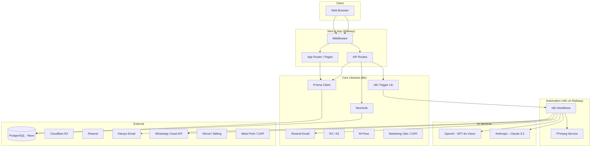
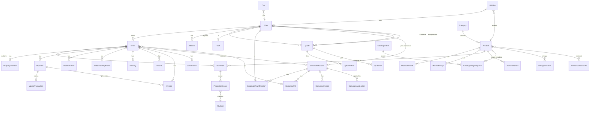

# PrintHub Africa — System Architecture & Documentation

**Product:** PrintHub — Large-format printing & 3D printing for Nairobi and Kenya  
**Company:** Ezana Group  
**Repository:** Printhub_Africa_ProdV1  
**Last updated:** March 21, 2026

---

## Table of Contents

1. [Overview](#1-overview)
2. [Tech Stack](#2-tech-stack)
3. [Directory Structure](#3-directory-structure)
4. [Data Model & Entity Relationships](#4-data-model--entity-relationships)
5. [API Layer](#5-api-layer)
6. [Authentication & Authorization](#6-authentication--authorization)
7. [Business Flows](#7-business-flows)
8. [External Integrations](#8-external-integrations)
9. [Deployment & Environment](#9-deployment--environment)

---

## 1. Overview

PrintHub is a **full-stack e-commerce and print-services platform** for:

- **Large-format printing** (banners, vinyl, canvas, signage)
- **3D printing** (FDM, resin; custom and ready-made)
- **Shop** (ready-made products, custom print, print-on-demand catalogue)
- **B2B** (corporate accounts, net terms, POs, team management)

### Architecture Summary

- **Single application:** Next.js 15 (App Router) monorepo — one codebase for web frontend and API (no separate mobile app).
- **Backend:** Next.js API Routes (running on Railway).
- **Database:** PostgreSQL via Prisma ORM (Neon in production).
- **Deployment:** Railway-oriented; local Docker for database and optional ERPNext.

### High-Level Architecture Diagram



---

## 2. Tech Stack

| Layer | Technology |
|-------|------------|
| **Framework** | Next.js 15 (App Router), React 18 |
| **Language** | TypeScript |
| **Styling** | Tailwind CSS, shadcn/ui (Radix), tailwindcss-animate |
| **State** | Zustand (cart, checkout) |
| **Backend** | Next.js API Routes (Railway) |
| **ORM / DB** | Prisma 7, PostgreSQL (Neon) |
| **Auth** | NextAuth.js 4 (JWT, Prisma adapter) |
| **Payments** | M-Pesa (Daraja), Pesapal, Flutterwave, Stripe |
| **File storage** | Cloudflare R2 (S3-compatible); fallback AWS S3 |
| **Email** | Resend |
| **SMS** | Africa's Talking (2FA, notifications) |
| **PDF** | @react-pdf/renderer (invoices, quote PDFs) |
| **AI / ML** | OpenAI (GPT-4o Vision), Anthropic (Claude 3.5 Sonnet) |
| **Multimedia** | FFmpeg (Sidecar service for n8n) |
| **Search** | Algolia (Optional) |
| **Analytics / monitoring** | Railway monitoring, Sentry; Meta Pixel, TikTok Pixel, GTM, GA4, X, Snapchat |
| **Automation** | **n8n** (Self-hosted on Railway) |
| **Marketing Automation** | Klaviyo (Email), WhatsApp Business Cloud API, Meta CAPI |
| **Live chat (optional)** | Tawk.to |
| **Content (optional)** | Sanity (env vars) |
| **External ERP** | ERPNext (Docker; finance, inventory, HR) |

---

## 3. Directory Structure

```
Printhub_Africa_ProdV1/
├── app/
│   ├── (public)/           # Customer-facing routes
│   │   ├── page.tsx        # Home
│   │   ├── shop/           # Shop, product [slug]
│   │   ├── services/       # Large-format, 3D printing, get-a-quote
│   │   ├── cart/           # Cart
│   │   ├── checkout/       # Checkout
│   │   ├── order-confirmation/[orderId]/
│   │   ├── pay/[orderId]   # Payment retry / payment link
│   │   ├── account/        # Profile, orders, quotes, support, settings, corporate
│   │   ├── quote/          # Quote forms (3d-print, etc.)
│   │   ├── get-a-quote/
│   │   ├── catalogue/      # POD catalogue
│   │   ├── corporate/      # Corporate apply, status
│   │   ├── careers/        # Job listings, apply
│   │   ├── contact/, faq/, about/
│   │   ├── upload/
│   │   └── [legalSlug]     # Legal pages
│   ├── (auth)/             # Auth routes
│   │   ├── login/          # Login, magic, verify, success
│   │   ├── register/
│   │   ├── forgot-password/, reset-password/
│   │   └── verify-email/
│   ├── (admin)/            # Admin dashboard
│   │   └── admin/
│   │       ├── dashboard/
│   │       ├── orders/, quotes/, deliveries/, production-queue/, refunds/
│   │       ├── products/, categories/, reviews/
│   │       ├── customers/
│   │       ├── finance/, invoices/
│   │       ├── inventory/         # Stock, substrates, materials, consumables
│   │       ├── inventory/hardware # Printers assets, maintenance
│   │       ├── catalogue/, coupons/
│   │       ├── staff/, departments/, corporate-accounts/, corporate/applications/
│   │       ├── careers/, support/, uploads/
│   │       ├── content/legal/
│   │       ├── settings/   # Business, payments, shipping, SEO, notifications, audit, users, danger
│   │       ├── reports/, sales/calculator/
│   │       └── access-denied/, accept-invite/
│   └── api/                # All API routes (see §5)
├── components/
│   ├── ui/                 # shadcn components
│   ├── layout/             # Header, Footer
│   ├── shop/, account/, admin/, services/, upload/, marketing/
│   ├── marketing/          # PixelTracker, ViewContentTracker
│   └── ...
├── lib/                    # Core services and utilities
│   ├── prisma.ts
│   ├── auth.ts             # NextAuth config
│   ├── email.ts, sms.ts
│   ├── s3.ts, r2.ts
│   ├── mpesa.ts, pesapal.ts, stripe/
│   ├── cart-calculations.ts, order-utils.ts, tracking.ts, production-queue.ts
│   ├── marketing/          # event-tracker.ts (client), conversions-api.ts (CAPI), klaviyo.ts, whatsapp.ts
│   ├── cache/              # unstable-cache (business metadata)
│   ├── admin-permissions.ts, admin-api-guard.ts, admin-route-guard.ts, admin-utils.ts
│   ├── twofa-token.ts, audit.ts, constants.ts, db-guard.ts, role-permissions.ts
│   ├── invoice-pdf.ts, quote-pdf.ts, virustotal.ts, backup-utils.ts
│   └── business-public.ts
├── hooks/                  # e.g. useLFRates
├── store/                  # Zustand: checkout-store, cart
├── n8n/                    # Automation infrastructure
│   ├── workflows/          # JSON exports of core n8n flows
│   ├── ffmpeg-service/     # Sidecar for media processing
│   ├── railway.toml        # n8n-specific deployment config
│   └── .env.example
├── prisma/
│   ├── schema.prisma       # Full DB schema
│   ├── seed.ts, seeds/
│   ├── migrations/
│   └── scripts/
├── scripts/                # erpnext-*, convert-to-webp, backfill, etc.
├── public/
├── middleware.ts           # Auth, CSRF-style origin check, route protection
├── instrumentation.ts     # Sentry
├── package.json
├── .env.example, .env.local.example
└── docker-compose*.yml     # db, erpnext
```

---

## 4. Data Model & Entity Relationships

The data model is defined in `prisma/schema.prisma`. Below is a structured summary by domain and key relationships.

### 4.1 Entity Relationship Overview (Mermaid)



### 4.2 Users & Auth

| Model | Description | Key Relations |
|-------|-------------|---------------|
| **User** | Core user: customer, staff, admin. Fields: name, **displayName**, email, **phone**, passwordHash, **role** (CUSTOMER, STAFF, ADMIN, SUPER_ADMIN), 2FA, **loyaltyPoints**, **smsMarketingOptIn**, **marketingConsent**, **isAnonymised**. | → Account[], Session[], Address[], Order[], Quote[], Staff?, CorporateAccount? (primary contact), CorporateTeamMember[], SupportTicket[], AuditLog[], SavedAddress[], SavedMpesaNumber[], SavedCard[], LoyaltyAccount?, UserPermission[] |
| **Account** | OAuth/linked accounts (NextAuth). | → User |
| **Session** | NextAuth session. | → User |
| **VerificationToken** | Email verification / magic link tokens. | — |
| **Address** | User address (label, street, city, county, etc.). | → User |

### 4.3 Products & Catalog

| Model | Description | Key Relations |
|-------|-------------|---------------|
| **Category** | Tree (parentId), slug, sortOrder, isActive. | → Category[] (children), Product[] |
| **Product** | name, slug, categoryId, **productType**, basePrice, comparePrice, costPrice, sku, stock, images, **27 Social Platform Export Flags** (exportToGoogle, Meta, TikTok, etc.), **AI Content Flags** (aiDescriptionGenerated, aiGeneratedAt). | → Category, ProductVariant[], ProductImage[], ProductReview[], OrderItem[], Wishlist[], Inventory[], CatalogueImportQueue?, AdCopyVariation[] |
| **ProductVariant** | name, sku, price, stock, attributes (JSON). | → Product, OrderItem[], Inventory[] |
| **ProductImage** | url, storageKey, altText, sortOrder, isPrimary. | → Product |
| **ProductReview** | rating, title, body, isVerified, isApproved. | → Product, User |
| **Wishlist** | User–Product link. | → User, Product |

### 4.4 3D & Large-Format Pricing (Calculator & Cost Engine)

| Model | Description | Key Relations |
|-------|-------------|---------------|
| **PrintMaterial** | 3D: type (PLA, ABS, PETG, RESIN, etc.), pricePerGram, density, leadTimeDays. | — |
| **PrintFinish** | 3D finish price modifier. | — |
| **PrintingMedium** | Large-format: name, pricePerSqMeter, min/max width/height. | — |
| **LaminationType** | Large-format lamination (pricePerSqm). | — |
| **LargeFormatFinishing** | Add-ons per unit (eyelets, hem, etc.). | — |
| **DesignServiceOption** | Design/artwork flat fee. | — |
| **TurnaroundOption** | Rush surcharge % (STD, EXPRESS_1, etc.). | — |
| **LFPrinterSettings** | Printer: speed, depreciation, electricity, ink (cost engine). | — |
| **LFBusinessSettings** | Labour, overhead, waste, profit, VAT (singleton). | — |
| **LFStockItem** | Substrates, lamination, finishing (cost flows to calculator). | → MaintenancePartUsed[] |
| **MachineType** | 3D hourly rate. | — |
| **ThreeDAddon** | 3D post-processing (support removal, finishing). | — |
| **PricingConfig** | Key/value JSON (e.g. vatRate, minOrder). | — |

### 4.5 Orders & Fulfilment

| Model | Description | Key Relations |
|-------|-------------|---------------|
| **Order** | orderNumber, userId?, **status** (PENDING→DELIVERED/CANCELLED/REFUNDED), **type** (SHOP, LARGE_FORMAT, THREE_D_PRINT, QUOTE, POD, CUSTOM_PRINT), totals, paymentMethod, paymentStatus, pickupCode, corporateId?, corporatePOId?, isNetTerms, paymentLinkToken, etc. | → User?, OrderItem[], ShippingAddress?, Delivery?, Payment[], Refund[], Invoice[], OrderTimeline[], OrderTrackingEvent[], Cancellation?, PickupLocation?, Courier?, DeliveryZone?, CorporateAccount?, CorporatePO?, CorporateInvoice? |
| **OrderItem** | productId?, variantId?, quantity, unitPrice, customizations, uploadedFileId?, instructions, **itemType** (PRINT_SERVICE, PRODUCT), **isDeposit**, **addInstallation**. | → Order, Product?, ProductVariant?, ProductionQueue[] |
| **OrderTimeline** | status, message, updatedBy. | → Order |
| **OrderTrackingEvent** | status, title, description, isPublic, location, courierRef. | → Order |
| **ShippingAddress** | 1:1 per order (fullName, email, phone, street, city, county, deliveryMethod). | → Order |
| **Delivery** | 1:1 per order when shipping: method (STANDARD/EXPRESS), status, assignedCourier, trackingNumber, proofPhotoKey. | → Order, DeliveryZone?, Courier? |
| **Refund** | amount, reason, status; M-Pesa B2C fields. | → Order |
| **Cancellation** | reason, cancelledBy. | → Order |
| **AdCopyVariation** | AI-generated marketing copy (Hook, Body, CTA) for specific platforms. | → Product |

### 4.6 Payments

| Model | Description | Key Relations |
|-------|-------------|---------------|
| **Payment** | provider (MPESA, PESAPAL, FLUTTERWAVE, STRIPE, etc.), amount, status, M-Pesa/card/manual/pickup fields. | → Order, MpesaTransaction?, Invoice[] |
| **MpesaTransaction** | STK/callback: phoneNumber, checkoutRequestId, resultCode, resultDesc, mpesaReceiptNumber. | → Payment |
| **Invoice** | orderId, paymentId?, invoiceNumber, pdfKey/pdfUrl, vatAmount, totalAmount, sentAt. | → Order, Payment? |
| **Counter** | Sequences (e.g. invoice, quote_pdf). | — |
| **SavedMpesaNumber** | User’s saved M-Pesa numbers. | → User |
| **SavedCard** | User’s saved card (Pesapal token, last4, brand). | → User |

### 4.7 Quotes (Unified “Get a Quote”)

| Model | Description | Key Relations |
|-------|-------------|---------------|
| **Quote** | quoteNumber, **type** (large_format, three_d_print, design_and_print), status (new→completed/cancelled), customerId?, assignedStaffId?, specifications (JSON), quotedAmount, quotePdfUrl, closedBy. | → User? (customer), User? (assignedStaff), UploadedFile[], QuoteCancellation[], QuotePdf[] |
| **QuoteCancellation** | Reason, cancelled by. | → Quote |
| **QuotePdf** | R2 key for generated PDF. | → Quote |

### 4.8 Uploads & Print Quotes

| Model | Description | Key Relations |
|-------|-------------|---------------|
| **UploadedFile** | userId?, quoteId?, orderId?, storageKey, bucket, **uploadContext** (CUSTOMER_3D_PRINT, CUSTOMER_QUOTE, ADMIN_CATALOGUE_STL, ADMIN_CATALOGUE_PHOTO, ADMIN_PRODUCT_IMAGE, etc.), fileType, status (UPLOADED→APPROVED/REJECTED), virusScanStatus. | → User?, Quote?, Order? (via OrderItem) |
| **PrintQuote** | Legacy 3D/large-format quote (links to uploads). | → User |

### 4.9 Corporate (B2B)

| Model | Description | Key Relations |
|-------|-------------|---------------|
| **CorporateAccount** | primaryUserId, companyName, kraPin, paymentTerms, creditLimit, status, tier. | → User (primary), CorporateTeamMember[], CorporatePO[], CorporateInvoice[], CorporateApplication[], CorporateBrandAsset[], CorporateNote[], CorporateInvite[], BulkQuote[] |
| **CorporateTeamMember** | userId, corporateId, **role** (OWNER, ADMIN, FINANCE, MEMBER), canPlaceOrders, canViewInvoices, canManageTeam. | → User, CorporateAccount |
| **CorporatePO** | PO reference, approval state. | → CorporateAccount, Order[] |
| **CorporateInvoice** | Billing for corporate orders. | → CorporateAccount, Order[] |
| **CorporateApplication** | Company details, contact (pre-approval). | → User, CorporateAccount? |
| **CorporateBrandAsset**, **CorporateNote**, **CorporateInvite**, **BulkQuote** | Supporting B2B data. | → CorporateAccount |

### 4.10 Inventory & Production

| Model | Description | Key Relations |
|-------|-------------|---------------|
| **Inventory** | product/variant, quantity, location. | → Product?, ProductVariant? |
| **ShopInventoryMovement** | Stock movements (shop). | → Product? |
| **ShopPurchaseOrder**, **ShopPurchaseOrderLine** | Purchase orders for shop stock. | → Product |
| **ProductionQueue** | orderItemId, status, assignedTo, machineId. | → OrderItem, Machine? |
| **Machine** | Machine used in production (links to PrinterAsset or logical). | → ProductionQueue[] |
| **PrinterAsset** | Physical printer: lifecycle (ACTIVE, IN_MAINTENANCE), maintenance. | → MaintenanceLog[], LFPrinterSettings? |
| **MaintenanceLog**, **MaintenancePartUsed** | Maintenance events and parts. | → PrinterAsset, LFStockItem? |
| **ThreeDConsumable**, **ThreeDConsumableMovement** | 3D consumables and movements. | → User? (performedBy) |
| **InventoryHardwareItem** | Hardware/maintenance/accessories for calculator. | — |

### 4.11 Staff & Admin

| Model | Description | Key Relations |
|-------|-------------|---------------|
| **Department** | Department name/code. | → Staff[] |
| **Staff** | userId, departmentId, permissions[], showOnAboutPage. | → User, Department, UserPermission[] |
| **UserPermission** | Granular per-user permission (e.g. orders_view, finance_edit). | → User |
| **AuditLog** | userId, action, entity, entityId, before/after JSON. | → User |

### 4.12 Settings (Singleton / Config)

| Model | Description |
|-------|-------------|
| **BusinessSettings** | Company info, paybill/till, Stripe enabled, etc. |
| **SeoSettings** | Default meta, OG. |
| **ShippingSettings** | Default delivery options. |
| **LoyaltySettings**, **ReferralSettings**, **DiscountSettings** | Loyalty, referral, discounts. |
| **SystemSettings** | App-wide flags/settings. |

### 4.13 Other Domains

| Model | Description | Key Relations |
|-------|-------------|---------------|
| **Cart** | userId?/sessionId, items (JSON), abandoned-cart recovery timestamps. | — |
| **Coupon**, **CouponUsage** | Discount codes. | → User |
| **Notification**, **UserNotificationPrefs** | In-app notifications and preferences. | → User |
| **SupportTicket**, **TicketMessage** | Customer support. | → User |
| **FaqCategory**, **Faq** | FAQ. | — |
| **LegalPage**, **LegalPageHistory** | Legal content and history. | — |
| **CatalogueCategory**, **CatalogueDesigner**, **CatalogueItem**, **CatalogueItemPhoto**, **CatalogueItemMaterial**, **CatalogueImportQueue** | POD catalogue. | — |
| **CatalogueImportQueue** | Metadata for AI-based catalogue ingestion (source URL, AI analysis status, recommended categories). | → Product?, CatalogueItem? |
| **ExternalModel** | Reference to external 3D models (Printables/Thingiverse) used for POD. | → Product?, Category? |
| **JobListing**, **JobApplication** | Careers. | JobListing → JobApplication[] |
| **DeliveryZone**, **Courier**, **PickupLocation** | Logistics. | → Order, Delivery |
| **LoyaltyAccount**, **LoyaltyTransaction**, **ReferralCode** | Loyalty and referrals. | → User |
| **SavedAddress** | User’s saved checkout addresses. | → User |

---

## 5. API Layer

All API routes live under `app/api/`. Protection is enforced by **middleware** and/or **getServerSession** / **requireAdminApi** in handlers.

### 5.1 Route Groups (by prefix)

| Prefix | Purpose | Auth |
|--------|---------|------|
| **/api/auth/** | register, verify-email, resend-verification, forgot-password, send-2fa-code, validate-login, magic (POST link) | Public / session |
| **/api/account/** | profile, settings (addresses, avatar, payment-methods, loyalty, referral, notifications, security, corporate), quotes, support/tickets, uploads, data/export, data/delete, refunds | Session required |
| **/api/user/** | **complete-profile** (POST), **verify-email** (demo, resend, change) | Session required |
| **/api/checkout/** | cart (PATCH), payment-methods (GET) | Optional session |
| **/api/orders/** | POST create, GET list; [id]: confirmation, invoice, payment-status | Session for list; order access for [id] |
| **/api/payments/** | mpesa (stkpush, callback, b2c-callback, status), pesapal (initiate, callback), flutterwave (initiate), stripe (create-intent), manual (POST), pickup (confirm) | Mixed (callbacks public with validation) |
| **/api/admin/** | Full admin: orders, quotes, deliveries, production-queue, refunds, products, categories, reviews, customers, finance, inventory, catalogue, coupons, staff, corporate, careers, support, content, settings, reports | STAFF/ADMIN/SUPER_ADMIN + permission checks |
| **/api/admin/channels** | View status of marketing feeds and pixel configurations | STAFF/ADMIN roles |
| **/api/admin/stats** | Dashboard statistics and analytical summaries | STAFF/ADMIN roles |
| **/api/admin/catalogue/[id]/stl** | POST/DELETE STL files for catalogue items | catalogue_edit |
| **/api/admin/inventory/hardware** | Assets, maintenance, hardware items for calculator | inventory_edit |
| **/api/admin/3d-consumables** | Filament, resin, and other 3D printer supplies | inventory_edit |
| **/api/admin/machines** | Machine types and hourly rates for 3D printing | settings_manage |
| **/api/admin/ai/generate-description** | Trigger AI description generation for products | products_edit |
| **/api/admin/catalogue/import** | Trigger AI scraping and analysis for new models | catalogue_edit |
| **/api/quotes/** | GET/POST quotes, upload, [id] GET/PATCH, [id]/pdf | Session for create/list; access by resource |
| **/api/quote/** | submit (contact-style), materials | Public / session |
| **/api/upload/** | presign (POST), confirm (POST), [id]/download | Session / context |
| **/api/branding/favicon** | Dynamic favicon with fallback and database caching | Public |
| **/api/invoices/[id]** | download, send | Order/invoice access |
| **/api/shipping/** | fee, pickup-locations, courier-locations | Public / session |
| **/api/calculator/** | rates (large-format, 3d-print) | Public |
| **/api/finance/calculator-config** | Config for calculator | Admin / public depending on route |
| **/api/catalogue/** | list, categories, featured, [slug] | Public allowed |
| **/api/corporate/** | apply, application/status, account/checkout | apply public; rest session + corporate |
| **/api/careers/** | list, [slug] GET, [slug]/apply POST | Public |
| **/api/contact** | POST (SupportTicket + email) | Public |
| **/api/faq**, **/api/settings/business-public** | Public | Public |
| **/api/coupons/validate** | Validate coupon code | Session / checkout |
| **/api/cron/abandoned-carts** | Abandoned cart emails | CRON_SECRET |
| **/api/health**, **/api/feeds/products** | Health, legacy feeds | Public |
| **/api/products/feed** | Universal JSON product feed for Meta/Pinterest | Public |
| **/api/products/google** | Google Product Feed (XML/RSS) | Public |
| **/api/products/tiktok** | TikTok Catalog Feed (JSON/CSV) | Public |
| **/api/products/[slug]/reviews** | Product reviews | Public |
| **/api/unsubscribe/abandoned-cart** | Opt-out | Public |

### 5.2 Order Creation Flow (API)

- **Customer:** `POST /api/orders` with cart, shipping, delivery method, coupon → creates Order (PENDING), OrderItems, ShippingAddress, optional Delivery; payment then via M-Pesa STK, Pesapal/Flutterwave/Stripe, or manual/pickup.
- **Admin:** `POST /api/admin/orders/create` for manual/phone orders.

---

## 6. Authentication & Authorization

### 6.1 Authentication

- **NextAuth.js 4** with **JWT** strategy; **Prisma adapter** for Account, Session, User.
- **Providers:** Credentials (email/password), Google, Facebook, Apple, **Email (Magic Link via Resend)**.
- **Onboarding & Completion:**
  - **Profile Completion Gate:** Mandatory interceptor modal for users missing `name` or `phone` (common for social sign-ins).
  - **Email Verification System:** Mandatory for `CUSTOMER` role. Enforced via a persistent warning banner and profile field locking until `emailVerified` is set.
  - **Verification Bypass:** Users with `STAFF`, `ADMIN`, or `SUPER_ADMIN` roles bypass verification requirements for immediate platform access.
- **Credentials:** bcrypt password check; optional 2FA (TOTP via otplib, or email/SMS one-time code). Lockout after 5 failed attempts (15 min). Staff invite status (INVITE_PENDING/DEACTIVATED) respected.
- **Session:** 30-day maxAge; JWT includes id, role, permissions (STAFF), isCorporate, corporateId, corporateRole, corporateTier, **emailVerified**, **displayName**, **phone**.
- **Staff permissions:** Cached in memory (5 min TTL); invalidated when admin changes staff.

### 6.2 Authorization (Roles & Permissions)

- **Roles:** CUSTOMER, STAFF, ADMIN, SUPER_ADMIN.
- **Middleware:**
  - `/admin/*`: must be STAFF, ADMIN, or SUPER_ADMIN.
  - `/account/*`: must be signed in.
  - `/corporate/*` (except apply/invite): must be signed in and have active corporate membership.
  - `/api/admin/*`: same admin roles; 401 if not.
  - `/api/account/*`, `/api/corporate/*`: 401 if no session.
- **Admin pages:** `requireAdminSection(sectionPath)` (lib/admin-route-guard) → redirect to /login or /admin/access-denied.
- **Admin API:** `requireAdminApi(context)` (lib/admin-api-guard) with **PermissionKey** (e.g. orders_view, orders_edit, products_view, products_edit, finance_view, finance_edit, inventory_view, inventory_edit, staff_manage, settings_manage). Route–permission map in lib/admin-permissions. ADMIN/SUPER_ADMIN bypass; STAFF checked via hasPermission / hasFinanceAccess.

### 6.3 Security

- **CSRF-style:** Mutation requests (POST/PUT/PATCH/DELETE) to `/api/*` check `Origin` against allowed origins (request host, NEXT_PUBLIC_APP_URL, NEXTAUTH_URL, localhost).
- **Cron:** `/api/cron/*` secured with CRON_SECRET.
- **Uploads:** Presign/confirm flow; optional VirusTotal scan; UploadedFile status (virus scan, review).

---

## 7. Business Flows

### 7.1 User Onboarding & Verification
1. **Signup:** User registers via `/api/auth/register` (Credentials) or OAuth (Google/Facebook/Apple).
2. **Email Verification:**
   - `CUSTOMER` role users are greeted by a persistent `EmailVerificationBanner`.
   - Backend restricts certain actions (like profile editing) until `emailVerified` is set in the DB.
   - Users can trigger a demo verification via `/api/user/verify-email/demo` or a real resend via `/api/user/verify-email/resend`.
   - `STAFF`/`ADMIN` roles bypass this process for internal efficiency.
3. **Profile Completion:**
   - Users missing `name` or `phone` (common in OAuth flows) are intercepted by the `ProfileCompletionGate` modal.
   - Data is POSTed to `/api/user/complete-profile` and synchronized with the session via an explicit `update()`.

### 7.2 Order Flow (Shop / Custom Print)

1. **Cart:** PATCH `/api/checkout/cart`; cart in DB (Cart) or client (Zustand).
2. **Checkout:** Customer enters shipping, delivery method (Standard/Express/Pickup), coupon. **POST /api/orders** creates Order (PENDING), OrderItems, ShippingAddress, optional Delivery; `createTrackingEvent(orderId, "PENDING")`.
3. **Payment** (one of):
   - **M-Pesa STK:** POST `/api/payments/mpesa/stkpush` → Daraja STK; callback POST `/api/payments/mpesa/callback` updates Payment and Order (paymentStatus CONFIRMED, status CONFIRMED, paidAt).
   - **Pesapal/Flutterwave:** Initiate → redirect → return to order-confirmation; IPN/callback updates payment/order.
   - **Stripe:** create-intent → client confirms → webhook or callback to confirm order.
   - **Manual:** Customer pays Paybill/Till; POST `/api/payments/manual`; admin can confirm-payment.
   - **Pay on pickup:** POST `/api/payments/pickup` (pickup code, confirm).
4. **Recovery:** Payment link (admin) or `/pay/[orderId]` for retry (e.g. resend STK).
5. **Fulfilment:** Order status → PROCESSING, PRINTING, READY_FOR_COLLECTION, SHIPPED, DELIVERED; ProductionQueue for items; Delivery for shipping; OrderTrackingEvent and optional email (lib/tracking).
6. **Marketing Triggers:** On `CONFIRMED` status, system triggers Klaviyo "Placed Order", Meta CAPI "Purchase", TikTok Events API, and WhatsApp confirmation. On `SHIPPED`, triggers WhatsApp update.

### 7.3 Quote Flow (Unified)

1. **Submit:** POST `/api/quotes` (type, customer info, specifications, reference files) or POST `/api/quote/submit` (contact-style).
2. **Uploads:** POST `/api/quotes/upload` (R2 presign/upload); files linked to quote.
3. **Admin:** Assign staff, set quotedAmount, quoteBreakdown, quotePdfUrl; send PDF; status quoted → accepted/rejected.

### 7.4 Catalogue, POD & AI Enrichment

1. **Import/Scrape:** Admin provides a URL (Printables/Thingiverse). `POST /api/admin/catalogue/import` triggers an n8n workflow.
2. **AI Analysis:** n8n uses **GPT-4o Vision** to analyze images and **Claude 3.5** to parse specifications, generating a structured `CatalogueImportQueue` entry.
3. **Review:** Admin reviews the AI-generated name, description, and suggested categories in the Admin Portal.
4. **Approval:** `/api/admin/import/[id]/approve` creates a `Product` with `isActive: true` and saves AI-generated `AdCopyVariations` for social marketing.
5. **STL Management:** `/api/admin/catalogue/[id]/stl` handles manual upload/replacement of 3D model files (STL, OBJ, 3MF, STEP) for approved items.

### 7.5 Production & Inventory

- **ProductionQueue:** Order items queued; status (Queued, In Progress, Printing, Quality Check, Done); assignedTo, machineId.
- **PrinterAsset:** Maintenance logs, parts (MaintenancePartUsed), lifecycle.
- **3D:** ThreeDConsumable movements; calculator uses materials, machine types, addons.
- **Large-format:** LFPrinterSettings, LFBusinessSettings, LFStockItem; calculator uses mediums, lamination, finishing, design options, turnaround.

### 7.6 Refunds & Cancellations

- Admin creates Refund; **process-b2c** for M-Pesa B2C (lib/mpesa-b2c); callback `/api/payments/mpesa/b2c-callback`. Order paymentStatus REFUNDED; status REFUNDED where applicable.

### 7.7 Corporate (B2B)

- **Apply:** POST `/api/corporate/apply` → CorporateApplication; admin approve/reject.
- **On approval:** CorporateAccount + CorporateTeamMember (OWNER); invite flow for team.
- **Checkout:** GET `/api/account/corporate/checkout`; orders can attach corporateId, poReference, corporatePOId, isNetTerms; CorporateInvoice for billing.

### 7.8 Marketing Automation & CAPI (100% Attribution)

1. **Client Events:** `PixelTracker.tsx` tracks `ViewContent`, `AddToCart`, and `InitiateCheckout` on the browser.
2. **Server Events (CAPI):** On successful payment (`CONFIRMED` status), `lib/marketing/conversions-api.ts` sends a server-side event to Meta and TikTok including hashed user data (email, phone, IP, User Agent).
3. **Lifecycle:** n8n triggers:
   - **WhatsApp (3h):** Abandoned cart recovery if checkout not completed.
   - **WhatsApp (Post-Purchase):** Order confirmation and shipping updates.
   - **Klaviyo:** Automated email flows for welcome, browse abandonment, and win-back.

### 7.9 Abandoned Cart (Next.js Cron)

- **Cron:** GET `/api/cron/abandoned-carts` (CRON_SECRET) → finds carts, sends recovery email (Resend); recoveryEmailSent1At / recoveryEmailSent2At; `/api/unsubscribe/abandoned-cart` for opt-out.


---

## 8. External Integrations

| Service | Purpose | Env / Config | Usage |
|--------|--------|--------------|--------|
| **PostgreSQL** | Primary DB | DATABASE_URL, DIRECT_URL | Prisma; migrations, seed. |
| **Cloudflare R2** | File storage | R2_* (endpoint, keys, buckets, public URL) | lib/r2.ts, lib/s3.ts; presign/confirm; quote files, product/catalogue images, invoices. |
| **AWS S3** | Fallback storage | AWS_* | lib/s3.ts when R2 not set. |
| **Resend** | Email | RESEND_API_KEY, FROM_EMAIL, FROM_NAME | lib/email.ts: verification, password reset, 2FA, order/quote/ticket/refund/cancel, abandoned cart, invoice. |
| **Africa's Talking** | SMS | AT_* | lib/sms.ts: 2FA SMS, test SMS. |
| **M-Pesa (Daraja)** | STK push, B2C refunds | MPESA_* (consumer key/secret, shortcode, passkey, callbacks; B2C initiator/security/queue) | lib/mpesa.ts; /api/payments/mpesa/*. |
| **Pesapal** | Card/redirect | PESAPAL_* | lib/pesapal.ts; /api/payments/pesapal/*. |
| **Flutterwave** | Card/redirect | FLUTTERWAVE_* | /api/payments/flutterwave/initiate. |
| **Stripe** | Cards, Apple/Google Pay, saved cards | NEXT_PUBLIC_STRIPE_*, STRIPE_*, STRIPE_WEBHOOK_SECRET | /api/payments/stripe/create-intent; BusinessSettings.stripeEnabled. |
| **Google / Facebook / Apple OAuth** | Social login | GOOGLE_*, FACEBOOK_*, APPLE_* | NextAuth in lib/auth.ts. |
| **Sentry** | Error tracking | NEXT_PUBLIC_SENTRY_DSN, SENTRY_* | instrumentation.ts. |
| **OpenAI** | AI Vision (catalogue) | OPENAI_API_KEY | n8n workflows (GPT-4o Vision). |
| **Anthropic** | AI Specifications (catalogue) | ANTHROPIC_API_KEY | n8n workflows (Claude 3.5). |
| **Algolia** | Search | NEXT_PUBLIC_ALGOLIA_*, ALGOLIA_* | Optional; Admin → Settings → Integrations. |
| **Meta** | Advertising & Tracking | NEXT_PUBLIC_META_*, META_ACCESS_TOKEN | PixelTracking.tsx, conversions-api.ts (CAPI). |
| **TikTok** | Advertising & Tracking | NEXT_PUBLIC_TIKTOK_*, TIKTOK_EVENTS_API_TOKEN | tiktok-pixel, TikTok Events API (CAPI). |
| **WhatsApp** | Order Updates | WHATSAPP_PHONE_NUMBER_ID, WHATSAPP_ACCESS_TOKEN | Cloud API messaging via n8n/lib. |
| **FFmpeg** | Media Processing | — | Sidecar service for AI-generated media. |
| **Tawk.to** | Live chat | NEXT_PUBLIC_TAWK_* | Optional; component. |
| **VirusTotal** | Upload scanning | VIRUSTOTAL_API_KEY | Optional; post-upload. |
| **ERPNext** | ERP (finance, inventory, HR) | ERPNEXT_* | Docker; scripts erpnext-setup, erpnext-migrate. |
| **Sanity** | CMS (optional) | NEXT_PUBLIC_SANITY_*, SANITY_* | Env only. |
| **Vercel** | Hosting / cron | VERCEL_* | Build, serverless, cron. |

Payment methods exposed at checkout: **GET /api/checkout/payment-methods** (mpesa, pesapal, flutterwave, stripe, applePay, googlePay, paybill/till from BusinessSettings + PricingConfig).

---

## 9. Deployment & Environment

### 9.1 Infrastructure Overview (Railway)

The platform is deployed as a **multi-service project** on Railway to ensure scalability and isolation:

1. **Next.js App (Service: `web`):**
   - Core storefront, admin portal, and backend API.
   - Connected to Neon (PostgreSQL) and Cloudflare R2.
2. **n8n Automation (Service: `n8n`):**
   - Self-hosted n8n instance for all asynchronous and AI-powered workflows.
   - Connected to the same PostgreSQL (different database/schema) for persistence.
   - Uses `n8n/railway.toml` for optimized healthchecks and startup.
3. **FFmpeg Sidecar (Service: `ffmpeg-service`):**
   - Express server providing an API for video/image manipulation.
   - Used by n8n workflows for generating social media assets.

### 9.2 Build & Runtime

- **Build:** `npm run build` runs `prisma generate` and `next build`.
- **Migrations:** Managed via `npx prisma migrate deploy` in the `web` service.
- **Env:** See `.env.example` in both the root and `n8n/` directories for required keys.
- **Default admin:** Seeded by `prisma/seed.ts`.
- **Currency:** KES (Kenya Shillings), 16% VAT.

---

## Related Documentation

- **README.md** — Getting started, scripts, project structure, ERPNext, deploy summary.
- **docs/DEPLOYMENT.md** — Referenced for full deployment (Vercel, Neon, R2, Resend, M-Pesa, OAuth, migrations, env).
- **docs/TEST_ACCOUNTS.md** — Referenced for roles and test accounts.
- **docs/R2_CORS.md** — Referenced for R2 CORS (browser uploads).

*End of System Architecture document.*
