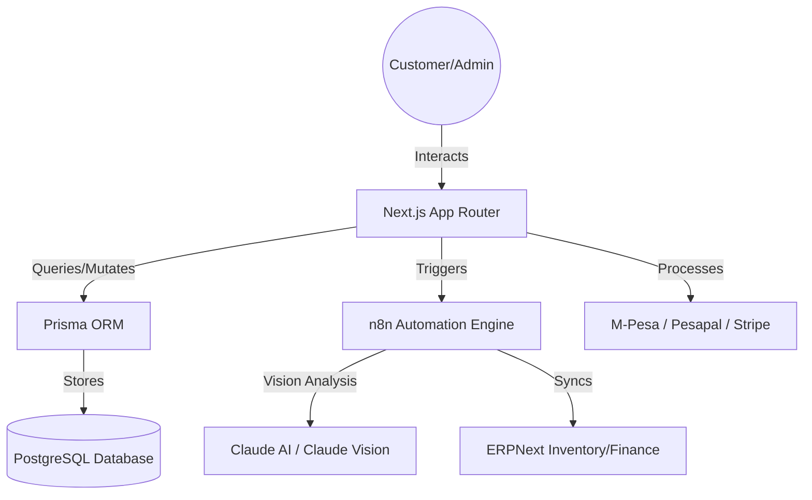
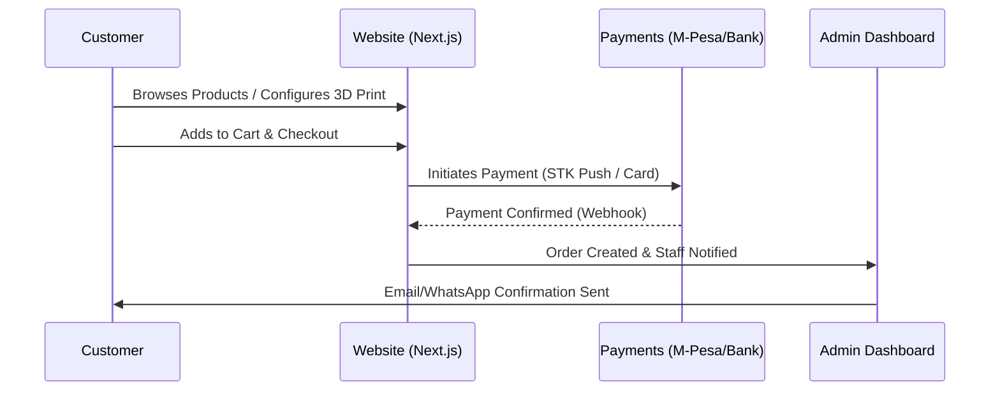
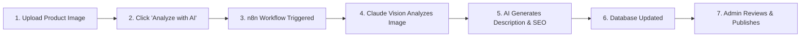
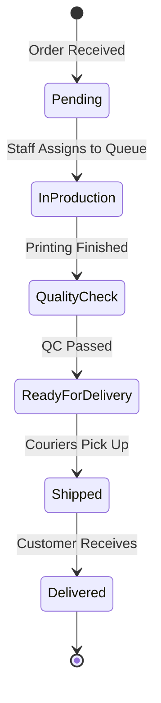

# PrintHub Africa — System Tutorial & Training Guide (V3.1)

Welcome to the official training guide for the PrintHub Africa platform. This document provides a complete overview of the system's architecture, customer journeys, and specialized workflows for administrators and staff.

---

## 1. High-Level System Ecosystem

PrintHub Africa is built on a modern, automated stack that connects high-speed frontend interfaces with intelligent background processing.

---

## 2. Customer Journey: The Ordering Process

From discovering a product to final delivery, the system manages every step of the transaction.

### Key Customer Actions:
- **Product Discovery**: Browsing pre-defined products (large format, 3D models).
- **Custom Quotes**: Requesting specific prices for unique print jobs.
- **Order Tracking**: Real-time updates on production status.

---

## 3. Admin Operations: Catalog & AI Automation

One of the most powerful features for administrators is the **AI-Driven Catalog Enrichment**.

### Flow: Adding a New Product with AI Vision
Instead of writing descriptions manually, the system can "see" your product image and generate content.

### Admin Checklist:
1.  **AI Control Centre**: Monitor active automations and manage AI usage credits.
2.  **Marketing Hub**: Generate ad copy and social media posts for any product in one click.
3.  **Review System**: Approve or moderate customer feedback before it goes live.

---

## 4. Staff Workflow: Production & Fulfillment

Staff members focus on the "Engine Room"—turning digital orders into physical prints.

### Production Tools:
- **Production Queue**: A dedicated board to manage daily print tasks.
- **Inventory Sync**: Any stock used in production is automatically deducted from **ERPNext**.
- **Quote Management**: Technical staff can review custom requests and provide accuracy metrics for 3D prints (filament weight, print time).

---

## 5. Financial & Automation "Under the Hood"

The platform ensures that every KES is tracked and every action is logged.

### Financial Sync Flow
1.  **Payment Event**: Customer pays via M-Pesa.
2.  **Webhook**: The payment provider notifies the PrintHub API.
3.  **ERPNext Sync**: n8n automatically creates a **Sales Invoice** and **Payment Entry** in ERPNext.
4.  **Audit Log**: Every status change is recorded for transparency.

---

## 6. Training Resources for Team Members

| Role | Primary Training Focus |
| :--- | :--- |
| **Catalog Admin** | Mastering **AI Vision** to populate the shop quickly. |
| **Sales Staff** | Managing **Quotes** and converting inquiries to orders. |
| **Production Staff** | Moving orders through the **Production Queue**. |
| **Finance Staff** | Reconciling **M-Pesa** payouts with **ERPNext** entries. |

> [!TIP]
> If an AI generation fails, check the **AI Status Hub** first. Most issues are caused by low-quality product images that the Vision model cannot process clearly.

---

*Prepared by Antigravity AI for PrintHub Africa.*
